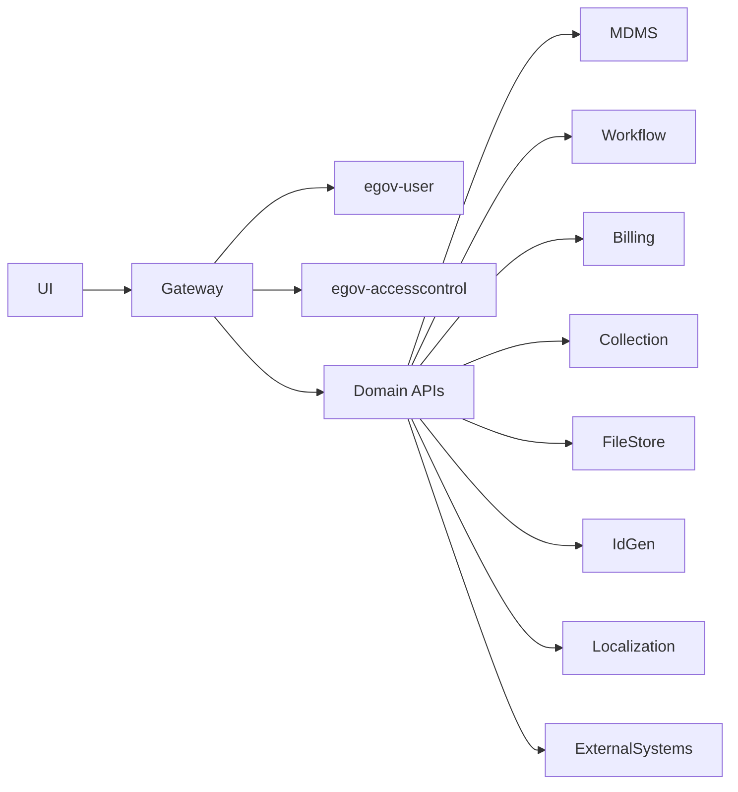

# API Documentation

## API Style

UPYOG services primarily follow the DIGIT API convention:

- Requests are usually `POST` even for searches.
- Endpoint suffixes include `/_create`, `/_search`, `/_update`, `/_delete`, `/_count`, `/_plainsearch`, `/_transition`, and `/_generate`.
- Payloads include `RequestInfo`; responses include `ResponseInfo`.
- Gateway-authenticated APIs receive user context through enriched headers such as `x-user-info`.
- Validation uses Bean Validation annotations, service validators, MDMS lookups, and workflow/business rules.

## API Contract Locations

- `core-services/docs/access-control-contract.yml`
- `core-services/docs/chatbot-contract.yml`
- `core-services/docs/common-contract.yml`
- `core-services/docs/common-contract_v1-1.yml`
- `core-services/docs/egov-document-uploader-contract.yml`
- `core-services/docs/egov-location-contract.yml`
- `core-services/docs/egov-otp-contract.yml`
- `core-services/docs/egov-pg-contract.yml`
- `core-services/docs/egov-user-contract.yml`
- `core-services/docs/enc-service-contract.yml`
- `core-services/docs/filestore-service-contract.yml`
- `core-services/docs/idgen-contract.yml`
- `core-services/docs/indexer-contract.yml`
- `core-services/docs/localisation-contract.yml`
- `core-services/docs/mdms-contract.yml`
- `core-services/docs/national-dashboard-ingest.yml`
- `core-services/docs/pdf-service-contract.yml`
- `core-services/docs/report-contract.yml`
- `core-services/docs/survey-service.yml`
- `core-services/docs/url-shortening_contract.yml`
- `core-services/docs/worfklow-2.0.yml`
- `municipal-services/docs/birth-death/birth-death.yml`
- `municipal-services/docs/bpa/bpa-calculator.yaml`
- `municipal-services/docs/bpa/bpa-service.yaml`
- `municipal-services/docs/e-Challan-v1.0.0.yaml`
- `municipal-services/docs/fire_noc_calculation_service.yaml`
- `municipal-services/docs/fire_noc_contract.yaml`
- `municipal-services/docs/fsm/Fsm_Apply_Contract-v1.1.0.yaml`
- `municipal-services/docs/fsm/Fsm_Apply_Contract.yaml`
- `municipal-services/docs/fsm/Vehicle_Registry_Contract-v1.1.0.yaml`
- `municipal-services/docs/fsm/Vehicle_Registry_Contract.yaml`
- `municipal-services/docs/fsm/Vendor_Registration_Contract-v1.1.0.yaml`
- `municipal-services/docs/fsm/Vendor_Registration_Contract.yaml`
- `municipal-services/docs/inbox.yml`
- `municipal-services/docs/noc-v-1.0.0.yaml`
- `municipal-services/docs/pgr-services.yml`
- `municipal-services/docs/property-services/Assessment.yml`
- `municipal-services/docs/property-services/property-calculation-service.yml`
- `municipal-services/docs/property-services/property-mutation-fees-calculator_API_Contract.yml`
- `municipal-services/docs/property-services/property-services.yml`
- `municipal-services/docs/property-services/pt-service-v2-contract.yml`
- `municipal-services/docs/rainmaker-pgr-contract.yml`
- `municipal-services/docs/tl-calculator.yml`
- `municipal-services/docs/tl-service.yml`
- `municipal-services/docs/user-events.yml`
- `municipal-services/docs/water-sewerage-services.yaml`
- `business-services/Docs/billingservice/BillAmendment/v1.0.yml`
- `business-services/Docs/billingservice/V-2.0.yml`
- `business-services/Docs/collection-services/V-2-0.yml`
- `business-services/Docs/dss-dashboard/DSS Analytics Dashboard YAML Spec 1.0.0.yaml`
- `business-services/Docs/dss-dashboard/DSS Ingest YAML Spec 1.0.0.yaml`
- `business-services/Docs/egf-master-v1.0.0 .yaml`
- `business-services/Docs/egov-apportion-service.yml`
- `business-services/Docs/hrms-v1.0.0.yaml`
- `utilities/docs/egov-pdf_contract.yml`
- `finance/docs/voucher_apis.yaml`

## Controller Inventory

| Service | Port | Detected mappings | Controllers |
| --- | --- | --- | --- |
| [MyCityApp](ServiceWiseDocumentation/mycityapp.md) | deployment-defined | 0 | No controllers detected |
| [billing-service](ServiceWiseDocumentation/billing-service.md) | 8081 | 19 | AmendmentController.java, BillController.java, BillControllerv2.java, BusinessServiceDetailController.java, DemandController.java, TaxHeadMasterController.java |
| [collection-services](ServiceWiseDocumentation/collection-services.md) | 8280 | 19 | BankAccountServiceMappingController.java, PaymentController.java, PreExistPaymentController.java, ReceiptControllerV2.java, RemittanceController.java |
| [dashboard-analytics](ServiceWiseDocumentation/dashboard-analytics.md) | 8289 | 3 | DashboardController.java |
| [dashboard-ingest](ServiceWiseDocumentation/dashboard-ingest.md) | 8080 | 6 | ProducerController.java, RestApiController.java |
| [egf-instrument](ServiceWiseDocumentation/egf-instrument.md) | 8480 | 18 | InstrumentAccountCodeController.java, InstrumentController.java, InstrumentTypeController.java, SurrenderReasonController.java |
| [egf-master](ServiceWiseDocumentation/egf-master.md) | 8280 | 66 | AccountCodePurposeController.java, AccountDetailKeyController.java, AccountDetailTypeController.java, AccountEntityController.java, BankAccountController.java, BankBranchController.java |
| [egov-apportion-service](ServiceWiseDocumentation/egov-apportion-service.md) | 8280 | 3 | ApportionController.java, ApportionControllerV2.java |
| [egov-hrms](ServiceWiseDocumentation/egov-hrms.md) | 9999 | 4 | EmployeeController.java |
| [employee-dashboard](ServiceWiseDocumentation/employee-dashboard.md) | 8080 | 1 | EmployeeDashaboardApiController.java |
| [finance-collections-voucher-consumer](ServiceWiseDocumentation/finance-collections-voucher-consumer.md) | deployment-defined | 0 | No controllers detected |
| [verification-service](ServiceWiseDocumentation/verification-service.md) | 8080 | 1 | VerificationServiceController.java |
| [audit-service](ServiceWiseDocumentation/audit-service.md) | 8280 | 4 | AuditServiceController.java |
| [chatbot](ServiceWiseDocumentation/chatbot.md) | 8012 | 3 | PreChatController.java, RemoveTestData.java |
| [egov-accesscontrol](ServiceWiseDocumentation/egov-accesscontrol.md) | 8091 | 12 | ActionController.java, RoleActionController.java, RoleController.java |
| [egov-common-masters](ServiceWiseDocumentation/egov-common-masters.md) | 8889 | 31 | BusinessCategoryController.java, BusinessDetailsController.java, CalendarYearController.java, CategoryController.java, CommunityController.java, DepartmentController.java |
| [egov-data-uploader](ServiceWiseDocumentation/egov-data-uploader.md) | 8082 | 4 | DataUploadController.java |
| [egov-document-uploader](ServiceWiseDocumentation/egov-document-uploader.md) | 8280 | 5 | DocumentController.java |
| [egov-enc-service](ServiceWiseDocumentation/egov-enc-service.md) | 1234 | 6 | CryptoApiController.java |
| [egov-filestore](ServiceWiseDocumentation/egov-filestore.md) | 8083 | 5 | StorageController.java |
| [egov-idgen](ServiceWiseDocumentation/egov-idgen.md) | 8088 | 1 | IdGenerationController.java |
| [egov-indexer](ServiceWiseDocumentation/egov-indexer.md) | 8095 | 3 | IndexerController.java |
| [egov-localization](ServiceWiseDocumentation/egov-localization.md) | 8087 | 8 | MessageController.java |
| [egov-location](ServiceWiseDocumentation/egov-location.md) | 8082 | 30 | BoundaryController.java, BoundaryTypeController.java, CityController.java, CreateBoundaryTypeController.java, CrossHierarchyController.java, GeographicalController.java |
| [egov-mdms-service](ServiceWiseDocumentation/egov-mdms-service.md) | 8094 | 2 | MDMSController.java |
| [egov-notification-mail](ServiceWiseDocumentation/egov-notification-mail.md) | deployment-defined | 0 | No controllers detected |
| [egov-notification-sms](ServiceWiseDocumentation/egov-notification-sms.md) | 8080 | 2 | CallbackAPI.java, TestController.java |
| [egov-otp](ServiceWiseDocumentation/egov-otp.md) | 8089 | 3 | OtpController.java |
| [egov-persister](ServiceWiseDocumentation/egov-persister.md) | 8082 | 0 | No controllers detected |
| [egov-pg-service](ServiceWiseDocumentation/egov-pg-service.md) | 9000 | 5 | RedirectController.java, TransactionsApiController.java |
| [egov-searcher](ServiceWiseDocumentation/egov-searcher.md) | 8093 | 1 | SearchController.java |
| [egov-survey-services](ServiceWiseDocumentation/egov-survey-services.md) | 8280 | 6 | SurveyController.java |
| [egov-telemetry](ServiceWiseDocumentation/egov-telemetry.md) | deployment-defined | 0 | No controllers detected |
| [egov-url-shortening](ServiceWiseDocumentation/egov-url-shortening.md) | 8091 | 2 | ShortenController.java |
| [egov-user](ServiceWiseDocumentation/egov-user.md) | 8081 | 20 | CustomAuthenticationController.java, LogoutController.java, PasswordController.java, UserController.java |
| [egov-workflow-v2](ServiceWiseDocumentation/egov-workflow-v2.md) | 8280 | 11 | BusinessServiceController.java, EscalationController.java, WorkflowController.java |
| [gateway](ServiceWiseDocumentation/gateway.md) | deployment-defined | 0 | No controllers detected |
| [gis-service](ServiceWiseDocumentation/gis-service.md) | 8291 | 3 | GisController.java |
| [individual](ServiceWiseDocumentation/individual.md) | 8080 | 7 | IndividualApiController.java |
| [mdms-v2](ServiceWiseDocumentation/mdms-v2.md) | 8288 | 7 | MDMSController.java, MDMSControllerV2.java, SchemaDefinitionController.java |
| [national-dashboard-ingest](ServiceWiseDocumentation/national-dashboard-ingest.md) | 8280 | 3 | EmailController.java, MasterDataIngestController.java, MetricIngestController.java |
| [national-dashboard-kafka-pipeline](ServiceWiseDocumentation/national-dashboard-kafka-pipeline.md) | 8281 | 0 | No controllers detected |
| [nlp-engine](ServiceWiseDocumentation/nlp-engine.md) | deployment-defined | 0 | No controllers detected |
| [pdf-service](ServiceWiseDocumentation/pdf-service.md) | deployment-defined | 0 | No controllers detected |
| [report](ServiceWiseDocumentation/report.md) | 8093 | 8 | ReportController.java |
| [service-request](ServiceWiseDocumentation/service-request.md) | 8280 | 6 | ServiceController.java, ServiceDefinitionController.java |
| [tenant](ServiceWiseDocumentation/tenant.md) | 8092 | 3 | TenantController.java |
| [user-otp](ServiceWiseDocumentation/user-otp.md) | 8090 | 1 | OtpController.java |
| [xstate-chatbot](ServiceWiseDocumentation/xstate-chatbot.md) | deployment-defined | 0 | No controllers detected |
| [zuul](ServiceWiseDocumentation/zuul.md) | deployment-defined | 0 | No controllers detected |
| [gis-dx-service](ServiceWiseDocumentation/gis-dx-service.md) | 8290 | 1 | GisDxController.java |
| [pt-services-dx](ServiceWiseDocumentation/pt-services-dx.md) | 8280 | 6 | DataExchangeController.java, UserController.java |
| [requester-services-dx](ServiceWiseDocumentation/requester-services-dx.md) | 8280 | 10 | DLRequestController.java, eMudraController.java |
| [edcr-client](ServiceWiseDocumentation/edcr-client.md) | deployment-defined | 0 | No controllers detected |
| [edcr-service](ServiceWiseDocumentation/edcr-service.md) | deployment-defined | 0 | No controllers detected |
| [finance](ServiceWiseDocumentation/finance.md) | deployment-defined | 0 | No controllers detected |
| [cnd-ui](ServiceWiseDocumentation/cnd-ui.md) | deployment-defined | 0 | No controllers detected |
| [micro-ui](ServiceWiseDocumentation/micro-ui.md) | deployment-defined | 0 | No controllers detected |
| [mono-ui](ServiceWiseDocumentation/mono-ui.md) | deployment-defined | 0 | No controllers detected |
| [sv-ui](ServiceWiseDocumentation/sv-ui.md) | deployment-defined | 0 | No controllers detected |
| [tqm-ui](ServiceWiseDocumentation/tqm-ui.md) | deployment-defined | 0 | No controllers detected |
| [upyog-ui](ServiceWiseDocumentation/upyog-ui.md) | deployment-defined | 0 | No controllers detected |
| [workbench-ui](ServiceWiseDocumentation/workbench-ui.md) | deployment-defined | 0 | No controllers detected |
| [mobile-app](ServiceWiseDocumentation/mobile-app.md) | deployment-defined | 0 | No controllers detected |
| [advertisement-service](ServiceWiseDocumentation/advertisement-service.md) | 8080 | 6 | AdvertisementServiceApiController.java |
| [asset-calculator](ServiceWiseDocumentation/asset-calculator.md) | 8077 | 2 | CalculatorController.java |
| [asset-services](ServiceWiseDocumentation/asset-services.md) | 8098 | 14 | AssetControllerV1.java, AssetDisposalController.java, AssetMaintenanceController.java |
| [birth-death-services](ServiceWiseDocumentation/birth-death-services.md) | 0 | 19 | BirthController.java, CommonController.java, DeathController.java |
| [bpa-calculator](ServiceWiseDocumentation/bpa-calculator.md) | 8092 | 2 | BPACalculatorController.java |
| [bpa-services](ServiceWiseDocumentation/bpa-services.md) | 8098 | 9 | BPAController.java, PreapprovedPlanController.java |
| [cnd-calculator](ServiceWiseDocumentation/cnd-calculator.md) | 8181 | 1 | CalculatorController.java |
| [cnd-service](ServiceWiseDocumentation/cnd-service.md) | 8080 | 3 | CNDController.java |
| [community-hall-booking](ServiceWiseDocumentation/community-hall-booking.md) | 8080 | 8 | CommunityHallBookingController.java |
| [echallan-calculator](ServiceWiseDocumentation/echallan-calculator.md) | 8078 | 1 | ChallanCalController.java |
| [echallan-services](ServiceWiseDocumentation/echallan-services.md) | 8079 | 5 | ChallanController.java |
| [egov-user-event](ServiceWiseDocumentation/egov-user-event.md) | 8088 | 5 | UserEventsController.java |
| [ewaste-services](ServiceWiseDocumentation/ewaste-services.md) | 8080 | 4 | EwasteController.java |
| [firenoc-calculator](ServiceWiseDocumentation/firenoc-calculator.md) | deployment-defined | 0 | No controllers detected |
| [firenoc-services](ServiceWiseDocumentation/firenoc-services.md) | deployment-defined | 0 | No controllers detected |
| [fsm](ServiceWiseDocumentation/fsm.md) | 9098 | 12 | FSMController.java, FSMInboxController.java, PlantMappingController.java |
| [fsm-calculator](ServiceWiseDocumentation/fsm-calculator.md) | 8099 | 7 | BillingSlabController.java, CalculatorController.java |
| [inbox](ServiceWiseDocumentation/inbox.md) | 9011 | 5 | InboxController.java, InboxV2Controller.java |
| [land-services](ServiceWiseDocumentation/land-services.md) | 8199 | 3 | LandController.java |
| [noc-services](ServiceWiseDocumentation/noc-services.md) | 8099 | 3 | NOCController.java |
| [pet-services](ServiceWiseDocumentation/pet-services.md) | 8080 | 5 | PetController.java |
| [pgr-ai-services](ServiceWiseDocumentation/pgr-ai-services.md) | 8080 | 10 | MigrationController.java, MockController.java, RequestsApiController.java |
| [pgr-services](ServiceWiseDocumentation/pgr-services.md) | 8280 | 10 | MigrationController.java, MockController.java, RequestsApiController.java |
| [pqm](ServiceWiseDocumentation/pqm.md) | 7008 | 9 | PlantUserController.java, PqmController.java |
| [pqm-anomaly-finder](ServiceWiseDocumentation/pqm-anomaly-finder.md) | 7009 | 3 | PqmAnomalyFinderController.java |
| [pqm-scheduler](ServiceWiseDocumentation/pqm-scheduler.md) | deployment-defined | 0 | No controllers detected |
| [property-services](ServiceWiseDocumentation/property-services.md) | 8280 | 13 | AssessmentController.java, PropertyController.java |
| [pt-calculator-v2](ServiceWiseDocumentation/pt-calculator-v2.md) | 8281 | 15 | AssessmentController.java, BillingSlabController.java, CalculationV2Controller.java, CalculatorController.java |
| [pt-services-v2](ServiceWiseDocumentation/pt-services-v2.md) | 8280 | 9 | DemandBasedController.java, DraftsController.java, PropertyController.java |
| [rainmaker-pgr](ServiceWiseDocumentation/rainmaker-pgr.md) | 8083 | 7 | MigrationController.java, ReportController.java, ServiceController.java |
| [request-service](ServiceWiseDocumentation/request-service.md) | 8080 | 6 | RequestServiceController.java |
| [street-vending](ServiceWiseDocumentation/street-vending.md) | 8080 | 7 | StreetVendingController.java |
| [sw-calculator](ServiceWiseDocumentation/sw-calculator.md) | 8084 | 7 | SWCalculationController.java |
| [sw-services](ServiceWiseDocumentation/sw-services.md) | 8091 | 5 | SewarageController.java |
| [tl-calculator](ServiceWiseDocumentation/tl-calculator.md) | 8085 | 6 | BillingslabController.java, CalculatorController.java |
| [tl-services](ServiceWiseDocumentation/tl-services.md) | 8079 | 7 | TradeLicenseController.java |
| [tp-services](ServiceWiseDocumentation/tp-services.md) | 8081 | 3 | TreePruningController.java |
| [turn-io-adapter](ServiceWiseDocumentation/turn-io-adapter.md) | 8084 | 1 | TransformController.java |
| [vehicle](ServiceWiseDocumentation/vehicle.md) | 8061 | 10 | VehicleController.java, VehicleInboxController.java, VehicleTripController.java |
| [vendor](ServiceWiseDocumentation/vendor.md) | 8070 | 7 | VendorController.java, VendorDriverContoller.java |
| [vendor-management](ServiceWiseDocumentation/vendor-management.md) | 8066 | 6 | VendorController.java |
| [ws-calculator](ServiceWiseDocumentation/ws-calculator.md) | 8083 | 10 | CalculatorController.java, MeterReadingController.java |
| [ws-services](ServiceWiseDocumentation/ws-services.md) | 8090 | 5 | WaterController.java |
| [btr-calculator](ServiceWiseDocumentation/btr-calculator.md) | 2345 | 2 | V1ApiController.java |
| [btr-services](ServiceWiseDocumentation/btr-services.md) | 8280 | 3 | V1ApiController.java |
| [apply-workflow](ServiceWiseDocumentation/apply-workflow.md) | 8095 | 1 | WorkflowController.java |
| [case-management](ServiceWiseDocumentation/case-management.md) | 8080 | 8 | CaseApiController.java, CovaApiController.java, EmployeeController.java, HealthdetailApiController.java |
| [data-upload](ServiceWiseDocumentation/data-upload.md) | 9001 | 1 | DataUploadController.java |
| [demo-utility](ServiceWiseDocumentation/demo-utility.md) | 8094 | 1 | DemoUtilityController.java |
| [egov-custom-consumer](ServiceWiseDocumentation/egov-custom-consumer.md) | deployment-defined | 0 | No controllers detected |
| [egov-pdf](ServiceWiseDocumentation/egov-pdf.md) | deployment-defined | 0 | No controllers detected |
| [egov-weekly-impact-notifier](ServiceWiseDocumentation/egov-weekly-impact-notifier.md) | 8094 | 0 | No controllers detected |
| [gateway-kubernetes-discovery](ServiceWiseDocumentation/gateway-kubernetes-discovery.md) | deployment-defined | 0 | No controllers detected |
| [kuberhealthy-checks](ServiceWiseDocumentation/kuberhealthy-checks.md) | deployment-defined | 0 | No controllers detected |
| [mdms-migration-toolkit](ServiceWiseDocumentation/mdms-migration-toolkit.md) | 8080 | 3 | DataApiController.java, SchemaApiController.java |
| [zuul-kubernetes-discovery](ServiceWiseDocumentation/zuul-kubernetes-discovery.md) | deployment-defined | 0 | No controllers detected |

## Authentication

- Public/open endpoints are configured in `core-services/zuul/src/main/resources/application.properties` and `core-services/gateway/src/main/resources/application.properties`.
- Protected endpoints rely on token validation through `egov-user` and RBAC/action lookup through `egov-accesscontrol`.
- Internal service-to-service calls commonly use `ServiceRequestRepository`/`RestTemplate` and cluster DNS host properties.

## Validation and Exceptions

- Use `@Valid` request models where available.
- Service validators enforce MDMS, tenant, workflow action, payment, and domain state constraints.
- Common exception handling comes from `core-services/libraries/tracer` with service-specific global handlers in selected modules.

## API Dependency Map

For endpoint-by-endpoint detail, open the service page in `ServiceWiseDocumentation/` and the matching Swagger YAML in the contract locations above.
