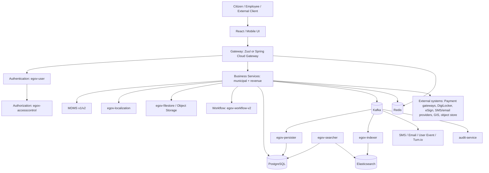
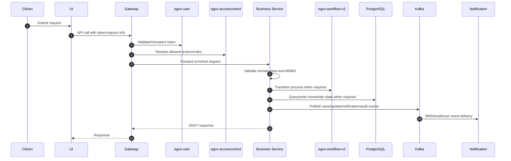
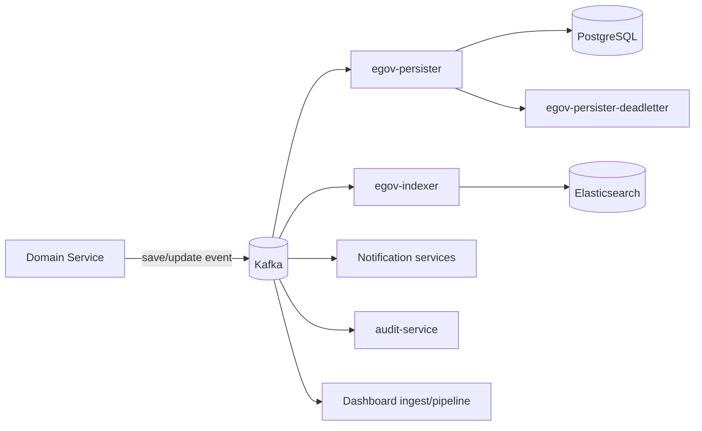
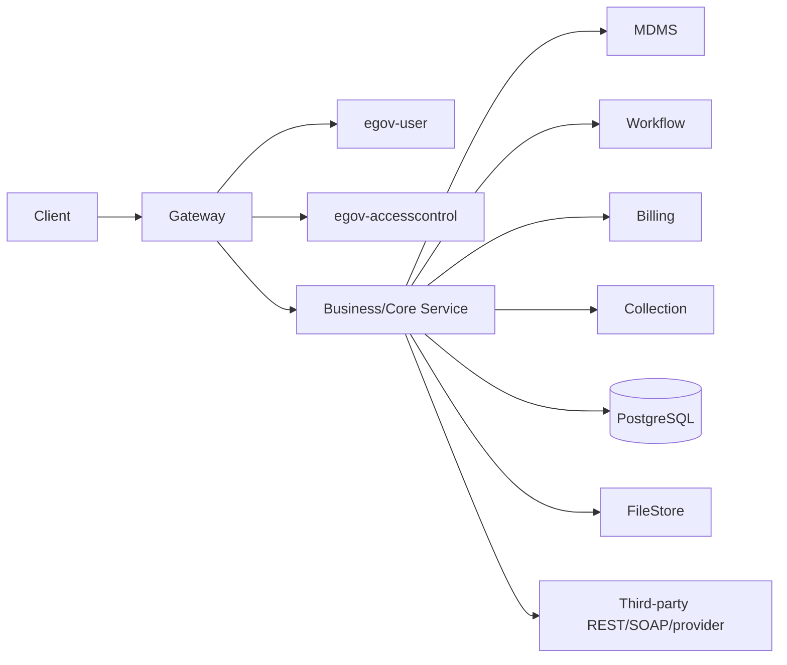
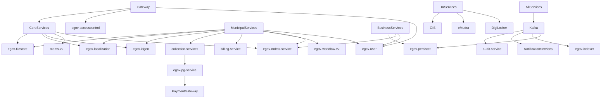
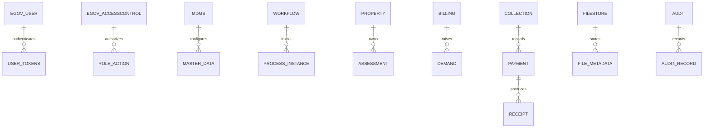
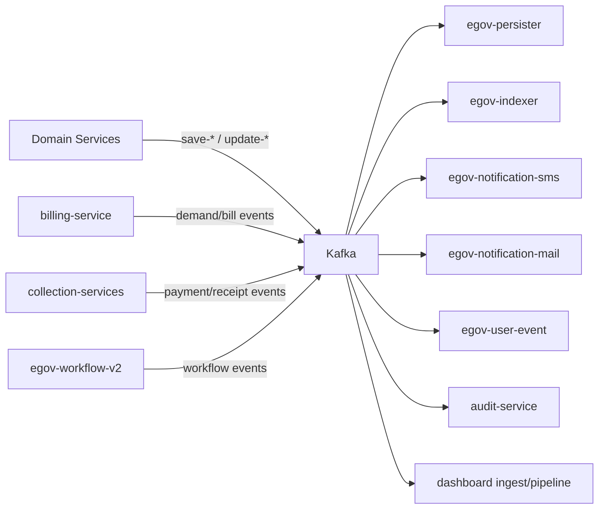
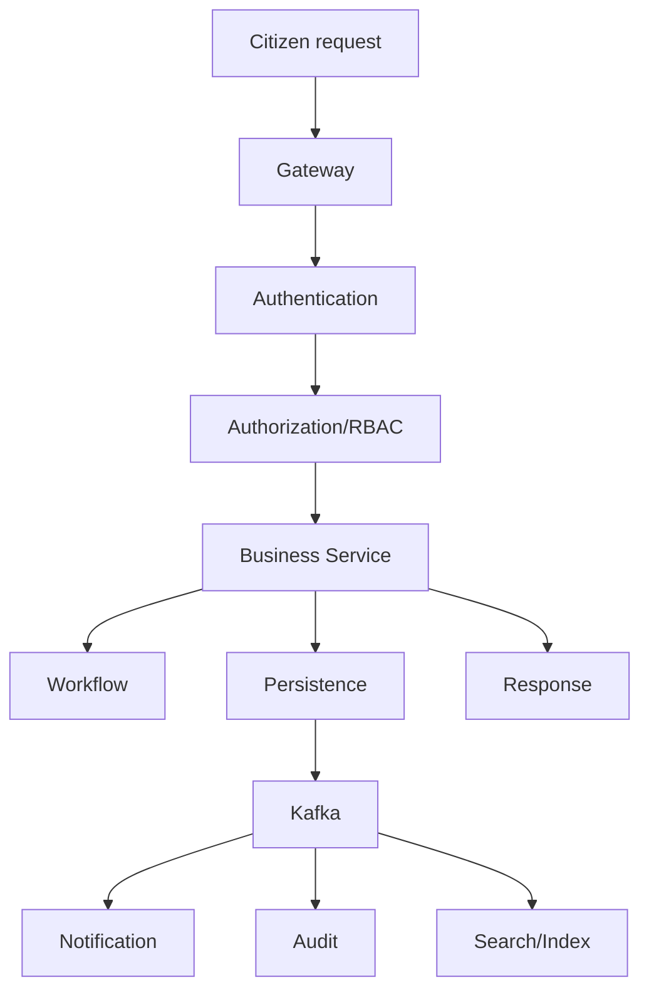

# Architecture

## 1. Project Overview

### Purpose of the platform

UPYOG provides reusable digital public infrastructure for municipal governance. It combines identity, access control, master data, workflow, billing, collections, payment, notification, audit, search, dashboards, and domain-specific municipal services into a modular microservice platform.

### Overall architecture

The repository contains several generations of implementation:

1. **Modern Spring Boot microservices** under `core-services`, `municipal-services`, `business-services`, `dx-services`, `utilities`, and `tutorials`.
2. **Node.js deployables** for PDF generation, chatbot/NLP, Firenoc services, and similar utilities.
3. **React frontends** under `frontend` served by nginx containers.
4. **Legacy WildFly applications** under `finance` and `edcr`.
5. **Shared libraries** under `core-services/libraries` used by many Java services.

### High-level workflow

A citizen or employee request enters the gateway, is authenticated/enriched, routed to a business service, validated against master data, optionally transitioned through workflow, persisted to PostgreSQL directly or through Kafka/persister, indexed/searchable through Elasticsearch, and emits notification/audit/dashboard events.

### Technologies used

See the root README technology table. Runtime services are primarily Spring Boot + PostgreSQL + Kafka with Redis, Elasticsearch, and object storage integrations. Legacy modules use Java 8 and WildFly.

## 2. Repository Structure

| Folder | Why it exists |
| --- | --- |
| /core-services | Core platform services: gateway, user, access control, MDMS, workflow, persister, indexer, searcher, notifications, filestore, ID generation, localization, audit, dashboard ingest, shared libraries. |
| /municipal-services | Municipal domain services: PT, PGR, water, sewerage, trade license, building approvals, NOC, FSM, e-challan, assets, street vending, community hall booking, CND, e-waste, user events, Turn.io adapter. |
| /business-services | Revenue and enterprise services: billing, collections, HRMS, EGF masters/instruments, apportioning, dashboards, verification, finance voucher consumer. |
| /dx-services | Data exchange integrations for DigiLocker, eSign, property-tax exchange, and GIS exchange. |
| /utilities | Operational utilities, migration tools, custom consumers, PDF generation, weekly impact notifier, workflow helper, demo/data upload utilities. |
| /finance | Legacy eGov finance coexistence application built as WildFly EAR with collection, EGF, EIS, portal, commons, config, and database modules. |
| /edcr | Electronic Development Control Regulations service/client; WildFly style scrutiny, extraction, and BPA integration modules. |
| /frontend | React UI applications: micro-ui, mono-ui, workbench-ui, upyog-ui, cnd-ui, sv-ui, tqm-ui. |
| /mobile-app and /MyCityApp | Android mobile applications. |
| /build | Master Jenkins build registry mapping jobs to service work directories, image names, and Dockerfiles. |
| /docs and service docs folders | Swagger/OpenAPI YAML contracts and generated documentation. Root documentation links to service-specific markdown under ServiceWiseDocumentation. |
| /tutorials | Backend developer guide/reference Birth Registration services and calculator modules. |

## 3. Overall System Architecture



### Request flow



### Asynchronous flow



### Synchronous flow



## 4. Service Inventory

See [ServiceWiseDocumentation/INDEX.md](ServiceWiseDocumentation/INDEX.md). The generated inventory includes every detected deployable/component with purpose, port, database signal, API surface, and dependencies.

## 5. Shared Libraries

| Library | Path | Purpose |
| --- | --- | --- |
| digit-models | core-services/libraries/digit-models | Digit Models |
| enc-client | core-services/libraries/enc-client | Shared Java library used by platform services. |
| mdms-client | core-services/libraries/mdms-client | Shared Java library used by platform services. |
| services-common | core-services/libraries/services-common | Shared Java library used by platform services. |
| tracer | core-services/libraries/tracer | Tracer |

### Common shared capabilities

- `services-common`: request/response contracts, RequestInfo/ResponseInfo, error models.
- `tracer`: request tracing, correlation IDs, Kafka logging, common exception advice.
- `enc-client`: client and ABAC support for encryption service integration.
- `mdms-client`: shared client for MDMS lookups.
- `digit-models`: reusable domain model artifacts.
- Frontend shared packages: React components, common modules, CSS, libraries under each micro-UI workspace.

## 6. API Dependency Map



## 7. Database Dependency Map



Service-owned tables are listed in each service page under **Database**. Shared schemas commonly include tenant, audit metadata, workflow references, and payment/receipt identifiers; cross-service relationships are often logical rather than enforced with foreign keys because services communicate via APIs/events.

## 8. Event Flow



## 9. Request Lifecycle



## 10. Architecture Decision Records

### ADR-001: Monorepo with independently deployable services

- **Decision:** Keep core, municipal, business, frontend, utilities, and legacy modules in one repository.
- **Pros:** Shared visibility, unified CI registry, easier cross-service contract discovery.
- **Cons:** Large checkout/build surface, duplicated patterns, slower global scans.
- **Alternatives:** Multi-repo per domain or per service; would improve isolation but increase dependency/version coordination overhead.

### ADR-002: Gateway-mediated security

- **Decision:** Centralize token validation, endpoint whitelisting, request enrichment, and RBAC at Zuul/Spring Cloud Gateway.
- **Pros:** Consistent edge control and simplified service implementations.
- **Cons:** Direct service exposure is risky; whitelist mistakes can become auth bypasses.
- **Alternatives:** Enforce Spring Security and RBAC in every service; stronger defense-in-depth but more duplication.

### ADR-003: Kafka-backed async persistence and side effects

- **Decision:** Many services publish save/update events consumed by persister/indexer/notification/audit services.
- **Pros:** Decouples write side effects, supports replay/indexing, reduces synchronous latency.
- **Cons:** Eventual consistency, topic/schema drift, harder debugging.
- **Alternatives:** Direct synchronous writes and synchronous side effects; simpler but less scalable/resilient.

### ADR-004: PostgreSQL as primary operational store

- **Decision:** Use PostgreSQL and Flyway for most service persistence.
- **Pros:** Mature relational model, strong query capability, repeatable migrations.
- **Cons:** Requires careful ownership boundaries and indexing; large services can create cross-schema coupling.
- **Alternatives:** Per-service polyglot storage; higher operational burden.

### ADR-005: Coexistence with legacy WildFly finance/eDCR

- **Decision:** Retain legacy WildFly/EAR applications for finance and eDCR while modern services evolve.
- **Pros:** Protects existing business functionality and integrations.
- **Cons:** Java 8/runtime split, different deployment/testing/security model.
- **Alternatives:** Rewrite/migrate to Boot services; high business and regression risk.

## 11. Scalability Analysis

- **Gateway:** Rate limiting Redis and auth/RBAC calls are critical path; cache access-control metadata and tune connection pools.
- **Database:** Query builders, missing indexes, and large table scans are common bottlenecks. Add indexes for tenantId, business identifiers, workflow state, audit dates, and payment references.
- **Kafka:** Monitor consumer lag for persister, indexer, notifications, dashboard pipelines, and finance voucher consumer.
- **Workflow:** Central workflow service can become a hotspot for high-volume domain transitions; tune DB indexes and concurrency.
- **External systems:** Payment gateway, SMS/email providers, DigiLocker/eSign, object storage, and GIS calls require timeouts, retries, circuit breakers, and idempotency.
- **Frontend:** Multiple parallel UI workspaces duplicate code and increase bundle/build complexity.

## 12. Deployment Diagram

```mermaid
flowchart TB
    subgraph Kubernetes Cluster
      Ingress --> GatewayPod[Gateway Pods]
      GatewayPod --> CorePods[Core Service Pods]
      GatewayPod --> MunicipalPods[Municipal Service Pods]
      GatewayPod --> BusinessPods[Business Service Pods]
      CorePods --> KafkaSvc[Kafka]
      MunicipalPods --> KafkaSvc
      BusinessPods --> KafkaSvc
      CorePods --> PgSvc[(PostgreSQL)]
      MunicipalPods --> PgSvc
      BusinessPods --> PgSvc
      CorePods --> RedisSvc[(Redis)]
      CorePods --> Elastic[(Elasticsearch)]
      KafkaSvc --> PersisterPods[Persister Pods]
      KafkaSvc --> IndexerPods[Indexer Pods]
      KafkaSvc --> NotificationPods[Notification Pods]
    end
    CI[Jenkins/GitHub Actions] --> Registry[Container Registry]
    Registry --> Kubernetes Cluster
    Kubernetes Cluster --> External[Payment/SMS/Email/DigiLocker/eSign/GIS/Object Store]
```
