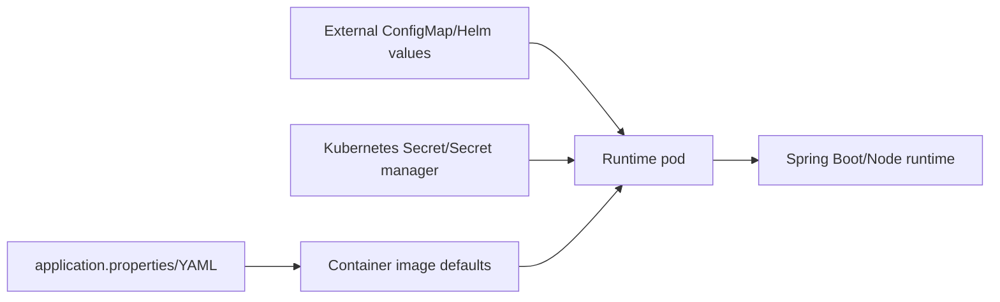

# Configuration Guide

## Configuration Model

UPYOG services mostly use checked-in `application.properties` files plus deployment-time overrides. YAML files are used for selected services such as persister, indexer, searcher, and MDMS v2 mappings. Spring profiles are uncommon; environment separation is normally handled by Kubernetes/Helm/external config overrides.

## Key Configuration Sources

| Source | Purpose |
|---|---|
| `src/main/resources/application.properties` | Service port, context path, datasource, Kafka, Redis, inter-service URLs, feature flags |
| `src/main/resources/application.yml` | Service-specific structured config where present |
| `*-persister.yml` | Kafka topic to SQL persistence mappings |
| `*-indexer.yml` | Kafka topic to Elasticsearch indexing mappings |
| `egov-searcher` YAML files | Search query definitions |
| `build/build-config.yml` | Jenkins job to work-dir/image/Dockerfile mapping |
| External Helm/Kubernetes values | Environment-specific config, secrets, resources, ingress, probes |

## Common Property Categories

- `server.port`, `server.servlet.context-path`: service HTTP binding.
- `spring.datasource.*`: PostgreSQL connection.
- `flyway.*` or `spring.flyway.*`: migration behavior.
- `kafka.config.*`, `spring.kafka.*`, `*.topic`: Kafka brokers, topics, consumer groups.
- `spring.redis.*` / `spring.data.redis.*`: Redis host/port/pool/rate-limit config.
- `egov.*.host`, `*.search.endpoint`, `*.create.endpoint`: internal service dependencies.
- Provider-specific properties: SMS, email, payment gateway, DigiLocker, eSign, GIS, object storage.

## Environment Variables

| Variable | Purpose |
|---|---|
| `JAVA_OPTS` | JVM heap and runtime options |
| `JAVA_ARGS` | Extra Java application arguments |
| `JAVA_ENABLE_DEBUG`, `JAVA_DEBUG_PORT` | Remote debugging controls |
| `DB_URL` | Flyway migration JDBC URL |
| `FLYWAY_USER`, `FLYWAY_PASSWORD` | Flyway credentials |
| `FLYWAY_LOCATIONS` | Migration locations |
| `SCHEMA_TABLE` | Flyway schema history table |
| `NODE_OPTIONS`, `GENERATE_SOURCEMAP` | Frontend/Node build behavior |

## Secrets

Secrets must not be stored in source or ConfigMaps. Use Kubernetes Secrets or an external secret manager for database credentials, OAuth clients, API keys, SMS/email passwords, payment credentials, eSign/DigiLocker secrets, object-store keys, encryption material, and license files.

## Config Server

A dedicated Spring Cloud Config Server is not evident in this repository. If one is used in an environment, document its property precedence and source repository in the external deployment documentation.

## Configuration Flow

