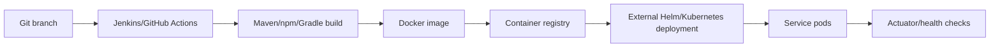

# Deployment Guide

## Deployment Model

The repository builds container images for independently deployable services. Kubernetes manifests and Helm values are not present in this repository; they are managed by external deployment infrastructure. This repository provides service source, Dockerfiles, Flyway migration images, Jenkins build registry files, and selected GitHub Actions.

## Build Artifacts

- Spring Boot services produce executable JAR containers.
- Flyway DB migration images are built from `src/main/resources/db` where configured.
- React apps produce static assets served by nginx containers.
- Finance and eDCR legacy apps produce WildFly EAR deployments.
- Node services produce Node container images.

## Build Configurations

- `build/build-config.yml`
- `business-services/build/build-config.yml`
- `core-services/build/build-config.yml`
- `finance/build/build-config.yml`
- `municipal-services/build/build-config.yml`
- `utilities/build/build-config.yml`

## Dockerfiles

Detected Dockerfiles: **134**. Representative examples:

- `Chatbot/Dockerfile`
- `finance/Dockerfile`
- `build/maven/Dockerfile`
- `business-services/billing-service/src/main/resources/db/Dockerfile`
- `business-services/build/maven/Dockerfile`
- `business-services/collection-services/src/main/resources/db/Dockerfile`
- `business-services/egf-instrument/src/main/resources/db/Dockerfile`
- `business-services/egf-master/src/main/resources/db/Dockerfile`
- `business-services/egov-apportion-service/src/main/resources/db/Dockerfile`
- `business-services/egov-hrms/src/main/resources/db/Dockerfile`
- `business-services/egov-hrms/src/test/resources/db/Dockerfile`
- `business-services/employee-dashboard/src/main/resources/db/Dockerfile`
- `business-services/finance-collections-voucher-consumer/src/main/resources/db/Dockerfile`
- `business-services/verification-service/src/main/resources/db/Dockerfile`
- `core-services/nlp-engine/Dockerfile`
- `core-services/pdf-service/Dockerfile`
- `core-services/audit-service/src/main/resources/db/Dockerfile`
- `core-services/build/maven/Dockerfile`
- `core-services/chatbot/src/main/resources/db/Dockerfile`
- `core-services/egov-accesscontrol/src/main/resources/db/Dockerfile`
- `core-services/egov-common-masters/src/main/resources/db/Dockerfile`
- `core-services/egov-data-uploader/src/main/resources/db/Dockerfile`
- `core-services/egov-document-uploader/src/main/resources/db/Dockerfile`
- `core-services/egov-enc-service/src/main/resources/db/Dockerfile`
- `core-services/egov-filestore/src/main/resources/db/Dockerfile`
- `core-services/egov-idgen/src/main/resources/db/Dockerfile`
- `core-services/egov-indexer/src/main/resources/db/Dockerfile`
- `core-services/egov-localization/src/main/resources/db/Dockerfile`
- `core-services/egov-location/src/main/resources/db/Dockerfile`
- `core-services/egov-otp/src/main/resources/db/Dockerfile`
- `core-services/egov-pg-service/src/main/resources/db/Dockerfile`
- `core-services/egov-survey-services/src/main/resources/db/Dockerfile`
- `core-services/egov-telemetry/egov-telemetry-batch-process/Dockerfile`
- `core-services/egov-telemetry/egov-telemetry-kafka-streams/Dockerfile`
- `core-services/egov-telemetry/telemetry/Dockerfile`
- `core-services/egov-url-shortening/src/main/resources/db/Dockerfile`
- `core-services/egov-user/src/main/resources/db/Dockerfile`
- `core-services/egov-workflow-v2/src/main/resources/db/Dockerfile`
- `core-services/gis-service/src/main/resources/db/Dockerfile`
- `core-services/individual/src/main/resources/db/Dockerfile`
- `core-services/libraries/digit-models/Dockerfile`
- `core-services/libraries/enc-client/Dockerfile`
- `core-services/mdms-v2/src/main/resources/db/Dockerfile`
- `core-services/national-dashboard-ingest/src/main/resources/db/Dockerfile`
- `core-services/pdf-service/migration/Dockerfile`
- `core-services/service-request/src/main/resources/db/Dockerfile`
- `core-services/tenant/src/main/resources/db/Dockerfile`
- `core-services/xstate-chatbot/nodejs/Dockerfile`
- `core-services/xstate-chatbot/nodejs/db/Dockerfile`
- `dx-services/requester-services-dx/Dockerfile`
- `dx-services/gis-dx-service/src/main/resources/db/Dockerfile`
- `dx-services/requester-services-dx/src/main/resources/db/Dockerfile`
- `edcr/client/Dockerfile`
- `edcr/service/Dockerfile`
- `frontend/cnd-ui/web/docker/Dockerfile`
- `frontend/micro-ui/web/docker/Dockerfile`
- `frontend/micro-ui/web/micro-ui-internals/packages/react-components/docker/Dockerfile`
- `frontend/mono-ui/web/ui-uploader/Dockerfile`
- `frontend/mono-ui/web/dss-dashboard/docker/Dockerfile`
- `frontend/mono-ui/web/rainmaker/dev-packages/egov-ui-kit-dev/Dockerfile`
- `frontend/mono-ui/web/rainmaker/docker/citizen/Dockerfile`
- `frontend/mono-ui/web/rainmaker/docker/employee/Dockerfile`
- `frontend/mono-ui/web/rainmaker/docker/employee-mcs/Dockerfile`
- `frontend/mono-ui/web/rainmaker/docker/localization/Dockerfile`
- `frontend/sv-ui/web/docker/Dockerfile`
- `frontend/tqm-ui/web/docker/Dockerfile`
- `frontend/tqm-ui/web/micro-ui-internals/packages/react-components/docker/Dockerfile`
- `frontend/upyog-ui/web/docker/Dockerfile`
- `frontend/upyog-ui/web/micro-ui-internals/packages/react-components/docker/Dockerfile`
- `frontend/workbench-ui/web/core/Dockerfile`
- `frontend/workbench-ui/web/docker/Dockerfile`
- `frontend/workbench-ui/web/workbench/Dockerfile`
- `frontend/workbench-ui/web/micro-ui-internals/packages/react-components/docker/Dockerfile`
- `frontend/workbench-ui/web/micro-ui-internals/packages/svg-components/docker/Dockerfile`
- `municipal-services/echallan-calculator/Dockerfile`
- `municipal-services/echallan-services/Dockerfile`
- `municipal-services/egov-user-event/Dockerfile`
- `municipal-services/firenoc-calculator/Dockerfile`
- `municipal-services/firenoc-services/Dockerfile`
- `municipal-services/pqm-scheduler/Dockerfile`
- ...and 54 more

## CI/CD

### Jenkins

Jenkinsfiles use the shared `ci-libs` library and `buildPipeline(configFile: './build/build-config.yml')` pattern.

- `Jenkinsfile`
- `business-services/Jenkinsfile`
- `core-services/Jenkinsfile`
- `dx-services/Jenkinsfile`
- `finance/Jenkinsfile`
- `municipal-services/Jenkinsfile`
- `utilities/Jenkinsfile`
- `edcr/client/Jenkinsfile`
- `edcr/service/Jenkinsfile`
- `frontend/cnd-ui/Jenkinsfile`
- `frontend/micro-ui/Jenkinsfile`
- `frontend/mono-ui/Jenkinsfile`
- `frontend/sv-ui/Jenkinsfile`
- `frontend/tqm-ui/Jenkinsfile`
- `frontend/upyog-ui/Jenkinsfile`
- `frontend/workbench-ui/Jenkinsfile`

### GitHub Actions

- `.github/workflows/ISSUE_TEMPLATE`
- `.github/workflows/ai-pr-review.yml`
- `.github/workflows/build_egov-mdms-services.yml`
- `.github/workflows/cnd-ui-build.yml`
- `.github/workflows/publishAllPackages.yml`

## Local Docker Build Pattern

```bash
# Example service build
cd core-services/egov-user
mvn clean package

# Example Docker build using a service Dockerfile or shared build Dockerfile
# docker build -t egov-user -f core-services/build/maven/Dockerfile --build-arg WORK_DIR=core-services/egov-user .
```

## Database Migration Containers

Flyway migration containers use environment variables:

| Variable | Purpose |
|---|---|
| `DB_URL` | JDBC URL for target PostgreSQL database |
| `FLYWAY_USER` | Migration database user |
| `FLYWAY_PASSWORD` | Migration database password, supplied as secret |
| `FLYWAY_LOCATIONS` | Migration file locations |
| `SCHEMA_TABLE` | Flyway schema history table |

## Kubernetes Expectations

Although manifests are external, production deployment should define for each service:

- Deployment/StatefulSet, Service, and Ingress/Gateway route.
- ConfigMap for non-sensitive properties.
- Secret for passwords, tokens, OAuth clients, SMTP/SMS credentials, object-store credentials, DB credentials, and signing material.
- Resource requests/limits and JVM `JAVA_OPTS`.
- Readiness/liveness probes, usually actuator `/health`.
- HPA rules based on CPU, memory, request rate, or Kafka lag.
- Network policies limiting direct service exposure.
- Pod disruption budgets for critical services.

## Helm Values

No Helm charts or values files were detected in this repository. External Helm values should map service properties to environment variables and mount ConfigMaps/Secrets. Keep generated documentation synchronized with the external infra repository.

## Deployment Flow



## Legacy Finance/eDCR Deployment

- Finance builds an EAR and deploys to WildFly using `finance/Dockerfile` or legacy Make/Ansible scripts.
- eDCR service/client have separate Dockerfiles and WildFly-style modules.
- Java 8 and WildFly-specific configuration must be kept separate from Java 17/Spring Boot services.
