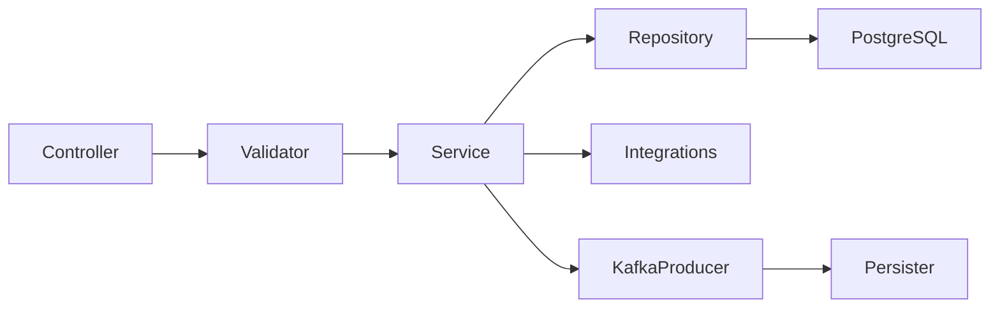

# Developer Guide

## Required Software

| Tool | Use |
|---|---|
| JDK 17 | Modern Spring Boot 3 services |
| JDK 8 | Legacy/transitional Spring Boot 1/2 services, finance, eDCR |
| Maven | Java service builds |
| Node.js/npm/yarn | React and Node service builds; many frontend packages expect Node >=14 |
| Docker | Container builds and local dependencies |
| PostgreSQL | Primary database |
| Kafka/ZooKeeper or compatible Kafka distribution | Async persistence/events |
| Redis | Gateway rate limiting and selected caches |
| Elasticsearch | Index/search flows |

## Repository Navigation

- Start with [Architecture.md](Architecture.md) for system context.
- Use [ServiceWiseDocumentation/INDEX.md](ServiceWiseDocumentation/INDEX.md) to find a service page.
- For APIs, check [API.md](API.md) and the Swagger YAML contract paths.
- For operations, use [OperationsGuide.md](OperationsGuide.md).

## Building a Java Service

```bash
cd core-services/egov-user
mvn clean test
mvn clean package
java -jar target/*.jar
```

If the service is Java 8/Spring Boot 1/2 or WildFly, switch to the appropriate JDK before building.

## Running Locally

1. Start PostgreSQL, Kafka, Redis, and Elasticsearch as needed.
2. Create the `upyog` database or service-specific database.
3. Run service Flyway migrations.
4. Override service properties using env vars, command-line args, or local property files.
5. Start dependent services in order: gateway/user/accesscontrol/MDMS/workflow/idgen/localization, then domain services.

## Common Development Pattern



## Adding or Updating an API

- Add request/response models with validation annotations.
- Add controller endpoint following DIGIT naming conventions.
- Add service/validator logic and tests.
- Add repository/query builder or Kafka event mapping.
- Update Swagger/OpenAPI contract YAML.
- Update service documentation if endpoint ownership or behavior changes.

## Adding a Database Change

- Add Flyway migration under `src/main/resources/db/migration/main` or service convention.
- Ensure migration is idempotent where platform convention requires it.
- Add/adjust repository/query builder and tests.
- Update service page database notes when table ownership changes.

## Adding Kafka Events

- Add topic configuration property.
- Add producer/consumer logic and idempotency safeguards.
- Add persister/indexer YAML if event persists/indexes data.
- Document retry and DLQ expectations.

## Testing Guidance

- Unit-test validators, query builders, service decisions, and mappers.
- Mock `ServiceRequestRepository` for external service calls.
- Integration-test Flyway + repository operations for schema changes.
- Contract-test critical gateway/business APIs.
- For Kafka, test serialization schema and idempotent consumers.
