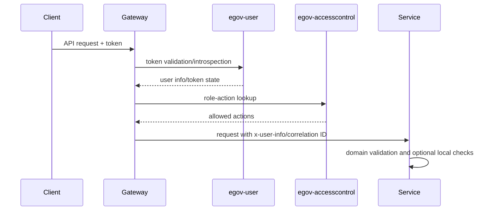

# Security Review

## Security Architecture

- Edge security is enforced primarily by Zuul/Spring Cloud Gateway.
- `egov-user` handles OAuth/token/user flows.
- `egov-accesscontrol` supplies RBAC role-action mappings.
- Services often assume gateway-enriched user context rather than enforcing complete local authorization.
- Sensitive values should be externalized into Kubernetes secrets/config server and never committed.

## Findings

| Severity | Finding | Risk | Recommendation |
|---|---|---|---|
| Critical | Hardcoded secrets and credentials exist in several `application.properties` files and license/config artifacts | Credential leakage and unauthorized third-party/API access | Rotate exposed secrets, remove literals from git history where feasible, load from secret manager/Kubernetes Secrets |
| High | Some user/password/profile endpoints are configured as open or mixed-mode at gateway/service level | Authentication bypass or unintended anonymous operations | Review gateway whitelist and service `permitAll` rules; require internal authentication/mTLS for internal-only APIs |
| High | Dynamic SQL string concatenation exists in some legacy/common repositories/query builders | SQL injection and data corruption | Replace with parameterized queries and strict allowlists for table/field names |
| High | Frontend chatbot components render HTML with `dangerouslySetInnerHTML` | XSS if chatbot or API returns crafted content | Render text safely or sanitize with an approved HTML sanitizer |
| High | Payment integration logging includes sensitive fields in legacy code | Secret leakage in logs | Remove password/token logging; mask sensitive fields centrally |
| Medium | CSRF disabled in multiple services | Browser-origin request risk for directly exposed endpoints | Keep services behind gateway, use stateless APIs, and enable CSRF where browser sessions/cookies apply |
| Medium | Polymorphic Jackson class metadata is used in legacy Elasticsearch entities | Deserialization/gadget risk if untrusted JSON reaches those models | Replace `Id.CLASS` with allowlisted `Id.NAME` or remove polymorphic deserialization |
| Medium | Service-local authorization is inconsistent | Direct pod/service access could bypass gateway controls | Add defense-in-depth filters/interceptors or network policies preventing direct public exposure |
| Medium | Validation is uneven across request models | Invalid state, abuse, or injection through weakly checked fields | Add Bean Validation, service validators, and centralized validation test cases |

## Authentication and Authorization Flow

## Secret Handling Standard

- Store DB passwords, OAuth client secrets, eSign/DigiLocker/SMS/email credentials, object-store credentials, encryption keys, and license files outside source.
- Use Kubernetes Secrets or a secret manager; mount as env vars/files.
- Keep local development defaults obviously non-production.
- Add secret scanning to CI and block new committed credentials.

## SQL Injection Controls

- Parameterize all SQL values.
- Do not concatenate table names/field names unless selected from an enum/allowlist.
- Add tests for query builders with special characters and multiple list values.

## XSS/CSRF Controls

- Avoid `dangerouslySetInnerHTML`; when unavoidable, sanitize and restrict allowed tags/attributes.
- Use CSRF controls for cookie/session browser endpoints.
- Set secure headers at gateway/nginx: CSP, X-Frame-Options/frame-ancestors, X-Content-Type-Options, Referrer-Policy.

## Serialization Controls

- Avoid default typing and `JsonTypeInfo.Id.CLASS` for untrusted payloads.
- Use DTOs at API boundaries.
- Keep Kafka topics private/trusted and validate consumed event schema.

## Operational Security

- Restrict direct access to service pods; expose only gateway/ingress.
- Enable TLS at ingress and between sensitive services where supported.
- Protect actuator endpoints; expose only health/readiness publicly.
- Monitor auth failures, RBAC denials, anomalous user creation/update, payment callbacks, and privilege changes.
