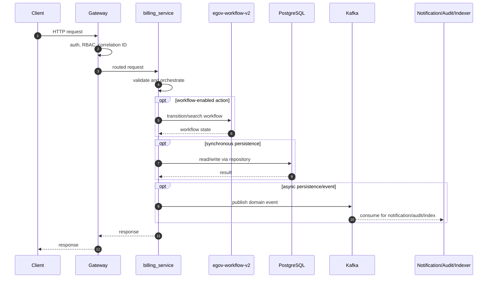
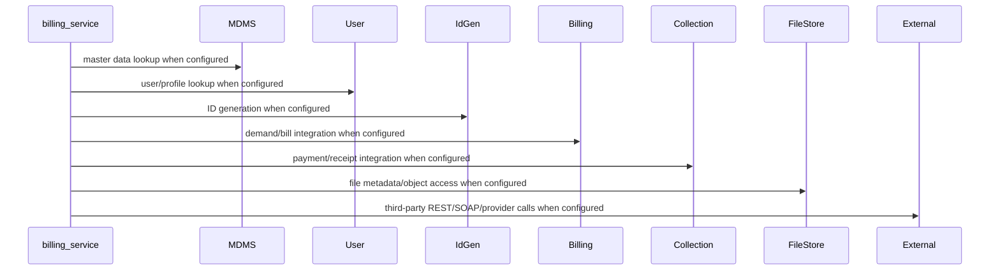

# billing-service

> Generated from repository path `business-services/billing-service`. This page documents detected runtime configuration and source-code structure. Validate deployment-specific values against the environment/Helm chart used outside this repository.

## Purpose

Demand, bill, tax head, and tax period service.

## Responsibilities

- Own the `billing-service` business or platform capability within the UPYOG ecosystem.
- Expose synchronous APIs when controllers are present and publish/consume asynchronous events when Kafka configuration is present.
- Persist service-owned state through PostgreSQL/Flyway or delegate persistence through `egov-persister` YAML mappings.
- Integrate with common platform services such as gateway, user, MDMS, workflow, ID generation, localization, billing, collection, notification, audit, indexer, and searcher as configured.

## Features

- Stack: **Java/Spring Boot**
- Java version: **17**
- Spring Boot version: **service-specific**
- HTTP port: **8081**
- Servlet/context path: **/billing-service**
- Detected controllers/API mappings: **19**
- Detected migrations: **48**
- Detected tests: **80** files

## Packages

| Package area | Files | Role |
| --- | --- | --- |
| config | 2 source file(s) | Spring beans, properties, and runtime configuration. |
| consumer | 2 source file(s) | Kafka/event consumers. |
| contract | 19 source file(s) | Package area detected from source tree. |
| controller | 7 source file(s) | HTTP endpoints and request/response orchestration. |
| demand | 1 source file(s) | Package area detected from source tree. |
| enums | 8 source file(s) | Package area detected from source tree. |
| factory | 1 source file(s) | Package area detected from source tree. |
| helper | 4 source file(s) | Package area detected from source tree. |
| mapper | 5 source file(s) | DTO/entity conversion. |
| migration | 1 source file(s) | Package area detected from source tree. |
| model | 50 source file(s) | Request, response, DTO, and domain models. |
| notification | 1 source file(s) | Package area detected from source tree. |
| producer | 1 source file(s) | Kafka/event producers. |
| querybuilder | 6 source file(s) | Package area detected from source tree. |
| repository | 10 source file(s) | Database or remote-service data access. |
| service | 10 source file(s) | Business orchestration and domain logic. |
| util | 4 source file(s) | Reusable helpers and cross-cutting functions. |
| validation | 2 source file(s) | Package area detected from source tree. |
| validator | 4 source file(s) | Input and domain validation. |

## Folder Structure

- `business-services/billing-service`: service root.
- `src/main/java`: Java source, package areas listed above when present.
- `src/main/resources`: application configuration, Flyway migrations, persister/indexer/searcher YAML, message resources.
- `src/test`: automated tests when present.
- `migration` or `db/migration`: Node/legacy SQL migrations when present.
- Dockerfiles are listed in the Deployment section.

## Entry Points

- `business-services/billing-service/src/main/java/org/egov/demand/BillingServiceApplication.java`

## APIs

| Method | Endpoint | Controller | Input | Output | Authentication | Exceptions |
| --- | --- | --- | --- | --- | --- | --- |
| POST | /amendment/_search | AmendmentController.java | Request body follows service model/Swagger contract; validation is typically Bean Validation plus service validators. | Response follows DIGIT ResponseInfo pattern or service-specific model. | Gateway-authenticated unless listed in gateway open/mixed whitelist or explicitly anonymous. | Controller/service/repository/custom validation exceptions propagate through tracer/global handlers. |
| POST | /amendment/_create | AmendmentController.java | Request body follows service model/Swagger contract; validation is typically Bean Validation plus service validators. | Response follows DIGIT ResponseInfo pattern or service-specific model. | Gateway-authenticated unless listed in gateway open/mixed whitelist or explicitly anonymous. | Controller/service/repository/custom validation exceptions propagate through tracer/global handlers. |
| POST | /amendment/_update | AmendmentController.java | Request body follows service model/Swagger contract; validation is typically Bean Validation plus service validators. | Response follows DIGIT ResponseInfo pattern or service-specific model. | Gateway-authenticated unless listed in gateway open/mixed whitelist or explicitly anonymous. | Controller/service/repository/custom validation exceptions propagate through tracer/global handlers. |
| POST | /bill/_search | BillController.java | Request body follows service model/Swagger contract; validation is typically Bean Validation plus service validators. | Response follows DIGIT ResponseInfo pattern or service-specific model. | Gateway-authenticated unless listed in gateway open/mixed whitelist or explicitly anonymous. | Controller/service/repository/custom validation exceptions propagate through tracer/global handlers. |
| POST | /bill/_generate | BillController.java | Request body follows service model/Swagger contract; validation is typically Bean Validation plus service validators. | Response follows DIGIT ResponseInfo pattern or service-specific model. | Gateway-authenticated unless listed in gateway open/mixed whitelist or explicitly anonymous. | Controller/service/repository/custom validation exceptions propagate through tracer/global handlers. |
| POST | /bill/_fetchbill | BillController.java | Request body follows service model/Swagger contract; validation is typically Bean Validation plus service validators. | Response follows DIGIT ResponseInfo pattern or service-specific model. | Gateway-authenticated unless listed in gateway open/mixed whitelist or explicitly anonymous. | Controller/service/repository/custom validation exceptions propagate through tracer/global handlers. |
| POST | /bill/_create | BillController.java | Request body follows service model/Swagger contract; validation is typically Bean Validation plus service validators. | Response follows DIGIT ResponseInfo pattern or service-specific model. | Gateway-authenticated unless listed in gateway open/mixed whitelist or explicitly anonymous. | Controller/service/repository/custom validation exceptions propagate through tracer/global handlers. |
| POST | /bill/v2/_search | BillControllerv2.java | Request body follows service model/Swagger contract; validation is typically Bean Validation plus service validators. | Response follows DIGIT ResponseInfo pattern or service-specific model. | Gateway-authenticated unless listed in gateway open/mixed whitelist or explicitly anonymous. | Controller/service/repository/custom validation exceptions propagate through tracer/global handlers. |
| POST | /bill/v2/_fetchbill | BillControllerv2.java | Request body follows service model/Swagger contract; validation is typically Bean Validation plus service validators. | Response follows DIGIT ResponseInfo pattern or service-specific model. | Gateway-authenticated unless listed in gateway open/mixed whitelist or explicitly anonymous. | Controller/service/repository/custom validation exceptions propagate through tracer/global handlers. |
| POST | /bill/v2/_generate | BillControllerv2.java | Request body follows service model/Swagger contract; validation is typically Bean Validation plus service validators. | Response follows DIGIT ResponseInfo pattern or service-specific model. | Gateway-authenticated unless listed in gateway open/mixed whitelist or explicitly anonymous. | Controller/service/repository/custom validation exceptions propagate through tracer/global handlers. |
| POST | /bill/v2/_create | BillControllerv2.java | Request body follows service model/Swagger contract; validation is typically Bean Validation plus service validators. | Response follows DIGIT ResponseInfo pattern or service-specific model. | Gateway-authenticated unless listed in gateway open/mixed whitelist or explicitly anonymous. | Controller/service/repository/custom validation exceptions propagate through tracer/global handlers. |
| POST | /bill/v2/_cancelbill | BillControllerv2.java | Request body follows service model/Swagger contract; validation is typically Bean Validation plus service validators. | Response follows DIGIT ResponseInfo pattern or service-specific model. | Gateway-authenticated unless listed in gateway open/mixed whitelist or explicitly anonymous. | Controller/service/repository/custom validation exceptions propagate through tracer/global handlers. |
| POST | /businessservices/_search | BusinessServiceDetailController.java | Request body follows service model/Swagger contract; validation is typically Bean Validation plus service validators. | Response follows DIGIT ResponseInfo pattern or service-specific model. | Gateway-authenticated unless listed in gateway open/mixed whitelist or explicitly anonymous. | Controller/service/repository/custom validation exceptions propagate through tracer/global handlers. |
| POST | /demand/_create | DemandController.java | Request body follows service model/Swagger contract; validation is typically Bean Validation plus service validators. | Response follows DIGIT ResponseInfo pattern or service-specific model. | Gateway-authenticated unless listed in gateway open/mixed whitelist or explicitly anonymous. | Controller/service/repository/custom validation exceptions propagate through tracer/global handlers. |
| POST | /demand/_update | DemandController.java | Request body follows service model/Swagger contract; validation is typically Bean Validation plus service validators. | Response follows DIGIT ResponseInfo pattern or service-specific model. | Gateway-authenticated unless listed in gateway open/mixed whitelist or explicitly anonymous. | Controller/service/repository/custom validation exceptions propagate through tracer/global handlers. |
| POST | /demand/_search | DemandController.java | Request body follows service model/Swagger contract; validation is typically Bean Validation plus service validators. | Response follows DIGIT ResponseInfo pattern or service-specific model. | Gateway-authenticated unless listed in gateway open/mixed whitelist or explicitly anonymous. | Controller/service/repository/custom validation exceptions propagate through tracer/global handlers. |
| POST | /demand/_migratetov1 | DemandController.java | Request body follows service model/Swagger contract; validation is typically Bean Validation plus service validators. | Response follows DIGIT ResponseInfo pattern or service-specific model. | Gateway-authenticated unless listed in gateway open/mixed whitelist or explicitly anonymous. | Controller/service/repository/custom validation exceptions propagate through tracer/global handlers. |
| POST | /taxheads/_search | TaxHeadMasterController.java | Request body follows service model/Swagger contract; validation is typically Bean Validation plus service validators. | Response follows DIGIT ResponseInfo pattern or service-specific model. | Gateway-authenticated unless listed in gateway open/mixed whitelist or explicitly anonymous. | Controller/service/repository/custom validation exceptions propagate through tracer/global handlers. |
| POST | /taxperiods/_search | TaxPeriodController.java | Request body follows service model/Swagger contract; validation is typically Bean Validation plus service validators. | Response follows DIGIT ResponseInfo pattern or service-specific model. | Gateway-authenticated unless listed in gateway open/mixed whitelist or explicitly anonymous. | Controller/service/repository/custom validation exceptions propagate through tracer/global handlers. |

### API conventions

- Most backend services use DIGIT-style POST endpoints ending in `/_create`, `/_search`, `/_update`, `/_delete`, `/_count`, or `/_plainsearch`.
- Request payloads normally include `RequestInfo`; responses normally include `ResponseInfo` and one or more domain payload arrays/objects.
- Authentication is generally enforced at the gateway. Service-level security varies by service and must be checked before exposing routes directly.

## Business Flow

1. Client or another service reaches this service through Zuul/Spring Cloud Gateway or an internal cluster URL.
2. Gateway validates token state, enriches request headers such as user/correlation information, and performs RBAC checks where configured.
3. Controller validates the request and calls service-layer orchestration.
4. Service layer loads MDMS/configuration, performs domain validation, calls workflow/billing/idgen/user/location/localization/file-store integrations as required, and writes through repositories or Kafka topics.
5. Persistence events are consumed by `egov-persister`; indexing events are consumed by `egov-indexer`; notification events go to SMS/mail/user-event services.
6. The service returns a DIGIT-style response or publishes an asynchronous completion event.

## Database

- **Tables detected from migrations:** EGBS_AMENDMENT, EGBS_AMENDMENT_TAXDETAIL, egbs_bill, egbs_bill_v1, egbs_billaccountdetail, egbs_billaccountdetail_v1, egbs_billdetail, egbs_billdetail_v1, egbs_business_service_details, egbs_collectedreceipts, egbs_demand, egbs_demand_v1, egbs_demand_v1_audit, egbs_demanddetail, egbs_demanddetail_v1, egbs_demanddetail_v1_audit, egbs_document, egbs_glcodemaster, egbs_payment_backupdate_audit, egbs_taxheadmaster, egbs_taxperiod, public.egbs_glcodemaster, public.egbs_taxheadmaster
- **Migration files:** 48
- **Repositories/JDBC classes:** 12
- **Entity/table-mapped classes:** 0

### Migration locations

- `business-services/billing-service/src/main/resources/db/migration`
- `business-services/billing-service/src/main/resources/db/migration/main`
- `business-services/billing-service/src/main/resources/db/migration/seed`

### Repository locations

- `business-services/billing-service/src/main/java/org/egov/demand/repository/AmendmentRepository.java`
- `business-services/billing-service/src/main/java/org/egov/demand/repository/BillRepository.java`
- `business-services/billing-service/src/main/java/org/egov/demand/repository/BillRepositoryV2.java`
- `business-services/billing-service/src/main/java/org/egov/demand/repository/BusinessServiceDetailRepository.java`
- `business-services/billing-service/src/main/java/org/egov/demand/repository/DemandRepository.java`
- `business-services/billing-service/src/main/java/org/egov/demand/repository/IdGenRepo.java`
- `business-services/billing-service/src/main/java/org/egov/demand/repository/PayerRepository.java`
- `business-services/billing-service/src/main/java/org/egov/demand/repository/ServiceRequestRepository.java`
- `business-services/billing-service/src/main/java/org/egov/demand/repository/TaxHeadMasterRepository.java`
- `business-services/billing-service/src/main/java/org/egov/demand/repository/TaxPeriodRepository.java`
- `business-services/billing-service/src/main/java/org/egov/demand/util/SequenceGenService.java`
- `business-services/billing-service/src/main/java/org/egov/demand/util/migration/DemandMigration.java`

### Entity mapping locations

- Not present in this repository or not detected.

## Kafka

| Kafka/property | Topic or value |
| --- | --- |
| kafka.config.bootstrap_server_config | localhost:9092 |
| spring.kafka.consumer.value-deserializer | org.egov.tracer.kafka.deserializer.HashMapDeserializer |
| spring.kafka.consumer.key-deserializer | <secret-value> |
| spring.kafka.consumer.group-id | bs-persist |
| spring.kafka.producer.key-serializer | <secret-value> |
| spring.kafka.producer.value-serializer | org.springframework.kafka.support.serializer.JsonSerializer |
| spring.kafka.listener.missing-topics-fatal | false |
| spring.kafka.consumer.properties.spring.json.use.type.headers | false |
| kafka.topics.save.bill | save-bill-db |
| kafka.topics.update.bill | update-bill-db |
| kafka.topics.save.bill.key | <secret-value> |
| kafka.topics.update.bill.key | <secret-value> |
| kafka.topics.save.demand | save-demand |
| kafka.topics.update.demand | update-demand |
| kafka.topics.updateMIS.demand | updateMIS-Demand |
| kafka.topics.receipt.update.collecteReceipt | egov-save-collected-receipt |
| kafka.topics.demandBill.update.name | demand-bill-update |
| kafka.topics.receipt.update.demand.v2 | egov.collection.payment-create |
| kafka.topics.receipt.cancel.name.v2 | egov.collection.payment-cancel |
| kafka.topics.receipt.update.demand | egov.collection.receipt-create |
| kafka.topics.receipt.cancel.name | egov.collection.receipt-cancel |
| kafka.topics.receipt.cancel.key | <secret-value> |
| kafka.topics.bulk.bill.generation | bulk-bill-generator |
| kafka.topics.bulk.bill.generation.audit | bulk-bill-generation-audit |
| kafka.topics.demand.index.name | create-demand-index-v1 |
| kafka.consumer.config.auto_commit | true |
| kafka.consumer.config.auto_commit_interval | 100 |
| kafka.consumer.config.session_timeout | 15000 |
| kafka.consumer.config.group_id | bs-masters-group1 |
| kafka.consumer.config.auto_offset_reset | earliest |
| kafka.producer.config.retries_config | 0 |
| kafka.producer.config.batch_size_config | 16384 |
| kafka.producer.config.linger_ms_config | 1 |
| kafka.producer.config.buffer_memory_config | 33554432 |
| kafka.topics.billgen.topic.name | billing-billgen-topic-name |
| kafka.topics.cancel.bill.topic.name | bill-cancel-topic-name |
| kafka.topics.notification.sms | egov.core.notification.sms |
| kafka.topics.notification.sms.key | <secret-value> |

### Producers

- `business-services/billing-service/src/main/java/org/egov/demand/consumer/BulkBillGenerationConsumer.java`
- `business-services/billing-service/src/main/java/org/egov/demand/producer/Producer.java`
- `business-services/billing-service/src/main/java/org/egov/demand/service/BillService.java`
- `business-services/billing-service/src/main/java/org/egov/demand/service/BillServicev2.java`
- `business-services/billing-service/src/main/java/org/egov/demand/consumer/notification/NotificationConsumer.java`

### Consumers

- `business-services/billing-service/src/main/java/org/egov/demand/consumer/BillingServiceConsumer.java`
- `business-services/billing-service/src/main/java/org/egov/demand/consumer/BulkBillGenerationConsumer.java`
- `business-services/billing-service/src/main/java/org/egov/demand/consumer/notification/NotificationConsumer.java`

### Retry and dead-letter handling

- Standard services rely on Spring Kafka retry/container settings or the platform `tracer` library.
- `egov-persister` has an explicit dead-letter pattern (`egov-persister-deadletter`). Service-specific DLQ topics should be configured in deployment properties if required.

## Redis

- No explicit Redis configuration detected.

Cache strategy, TTLs, and key naming are normally configured in code/properties. When Redis is absent above, the service does not advertise a direct Redis dependency in its checked-in config.

## Workflow

Workflow integration is indicated by workflow packages/classes or egov-workflow-v2 host configuration.

Typical workflow-enabled services use `WorkflowIntegrator` or call `/egov-wf/process/_transition` with tenant, business service, action, assignee, and audit information. States/actions/transitions are owned centrally by `egov-workflow-v2` business service definitions.

## External Integrations

| Config key | Endpoint/host |
| --- | --- |
| user.service.hostname | http://egov-user:8080/ |
| egov.idgen.hostname | http://egov-idgen:8080/ |
| egov.idgen.uri | egov-idgen/id/_generate |
| egov.localization.host | https://dev.digit.org/ |
| egov.localization.search.endpoint | localization/messages/v1/_search |
| egov.apportion.host | http://localhost:8091/ |
| egov.apportion.endpoint | apportion-service/v2/demand/_apportion |
| bs.businesscode.demand.updateurl | {"PT":"http://pt-calculator-v2:8080/pt-calculator-v2/propertytax/_updatedemand","WS":"http://ws-calculator.egov:8080/... |
| egov.mdms.host | https://dev.digit.org/ |
| egov.mdms.search.endpoint | egov-mdms-service/v1/_search |
| spring.flyway.url | jdbc:postgresql://localhost:5432/postgres |
| workflow.host | http://egov-workflow-v2:8080/ |

## Security

- Authentication is primarily gateway-mediated using OAuth/JWT/opaque-token flows and `x-user-info` request enrichment.
- Authorization uses RBAC metadata from `egov-accesscontrol`; endpoint whitelists exist in `zuul`/`gateway` properties.
- Validate whether this service has local security configuration before direct exposure; several services assume gateway isolation.
- Sensitive properties must be supplied through Kubernetes secrets or external config, not committed literal values.

## Configuration

- `business-services/billing-service/src/main/resources/application.properties`

### Key properties

| Property | Value / meaning |
| --- | --- |
| migration.batch.value | 100 |
| spring.datasource.driver-class-name | org.postgresql.Driver |
| spring.datasource.url | jdbc:postgresql://localhost:5432/postgres |
| spring.datasource.username | postgres |
| spring.datasource.password | <secret-value> |
| server.context-path | /billing-service |
| server.servlet.context-path | /billing-service |
| server.port | 8081 |
| user.service.hostname | http://egov-user:8080/ |
| user.service.searchpath | user/_search |
| egov.user.create.user | user/users/_createnovalidate |
| demand.is.user.create.enabled | true |
| kafka.config.bootstrap_server_config | localhost:9092 |
| spring.kafka.consumer.value-deserializer | org.egov.tracer.kafka.deserializer.HashMapDeserializer |
| spring.kafka.consumer.key-deserializer | org.apache.kafka.common.serialization.StringDeserializer |
| spring.kafka.consumer.group-id | bs-persist |
| spring.kafka.producer.key-serializer | org.apache.kafka.common.serialization.StringSerializer |
| spring.kafka.producer.value-serializer | org.springframework.kafka.support.serializer.JsonSerializer |
| spring.kafka.listener.missing-topics-fatal | false |
| spring.kafka.consumer.properties.spring.json.use.type.headers | false |
| kafka.topics.save.bill | save-bill-db |
| kafka.topics.update.bill | update-bill-db |
| kafka.topics.save.bill.key | save-bill |
| kafka.topics.update.bill.key | update-bill |
| kafka.topics.save.demand | save-demand |
| kafka.topics.update.demand | update-demand |
| kafka.topics.updateMIS.demand | updateMIS-Demand |
| kafka.topics.receipt.update.collecteReceipt | egov-save-collected-receipt |
| kafka.topics.demandBill.update.name | demand-bill-update |
| kafka.topics.receipt.update.demand.v2 | egov.collection.payment-create |
| kafka.topics.receipt.cancel.name.v2 | egov.collection.payment-cancel |
| kafka.topics.receipt.update.demand | egov.collection.receipt-create |
| kafka.topics.receipt.cancel.name | egov.collection.receipt-cancel |
| kafka.topics.receipt.cancel.key | receipt-cancel |
| kafka.topics.bulk.bill.generation | bulk-bill-generator |

## Logging

- Platform services use Spring logging plus `tracer` for correlation IDs and structured exception responses.
- Gateway filters are responsible for request correlation; services should propagate correlation/user headers downstream.
- Audit events are emitted to Kafka/audit-service where configured.

## Exception Handling

- Common pattern: validation errors become `CustomException`/domain exceptions and are rendered by `tracer` or service-specific `GlobalExceptionHandler`.
- Controller-level `@Valid` handles Bean Validation for request models where annotations exist.
- Kafka consumers should be monitored for poison messages and retry loops.

## Testing

- Test files detected: **80**.
- Unit tests typically cover validators, services, query builders, and controllers.
- Integration tests require PostgreSQL, Kafka, Redis, and dependent services or mocks.

## Deployment

- `business-services/billing-service/src/main/resources/db/Dockerfile`

- Most Java services are built as executable JAR containers using Maven and the shared `core-services/build/maven/Dockerfile` pattern.
- Database migrations are packaged separately where `src/main/resources/db/Dockerfile` exists and run Flyway with `DB_URL`, `FLYWAY_USER`, `FLYWAY_PASSWORD`, `FLYWAY_LOCATIONS`, and `SCHEMA_TABLE`.
- Kubernetes/Helm manifests are not checked into this repository; deployment values are managed externally.

## Monitoring

- Health endpoints are usually Spring Actuator-backed, frequently exposed at `/health` because many services set `management.endpoints.web.base-path=/`.
- Gateway has additional OpenTelemetry/Jaeger-related configuration.
- Production deployments should scrape actuator/Prometheus endpoints, Kafka consumer lag, DB pool metrics, and JVM metrics.

## Performance

- Primary bottlenecks are database query complexity, Kafka consumer lag, synchronous inter-service calls, external provider latency, and JVM heap limits.
- Prefer indexed search columns, bounded page sizes, connection pool sizing, Redis for hot reference data, and async publication for slow side effects.
- Check thread pools and Kafka concurrency for write-heavy services.

## Common Problems

- Missing dependent service host property or DNS entry.
- Flyway migration order/table mismatch.
- Kafka topic not created or wrong consumer group.
- Gateway whitelist/RBAC misconfiguration.
- Redis/PostgreSQL connectivity issues.
- Java 17 services run with Java 8 images or legacy Java 8 services run with Java 17 images.

## Improvement Suggestions

- Add/refresh OpenAPI contracts for controllers that lack contract YAML.
- Add integration tests around workflow, billing, collection, and persister events.
- Externalize all secrets and remove defaults from deployment overlays.
- Standardize health, metrics, logging, and correlation-ID propagation.
- Normalize package names and remove duplicate/legacy code where the service has modern equivalents.
