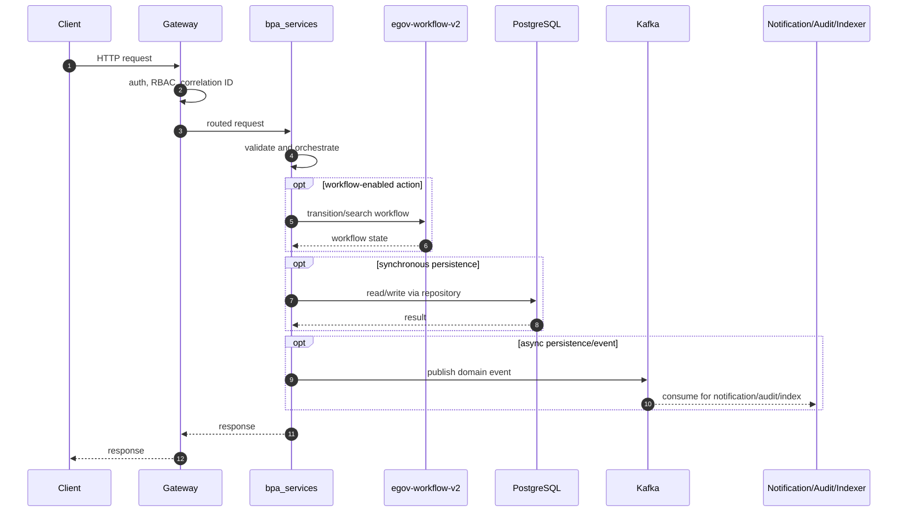
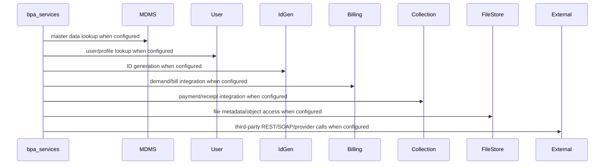

# bpa-services

> Generated from repository path `municipal-services/bpa-services`. This page documents detected runtime configuration and source-code structure. Validate deployment-specific values against the environment/Helm chart used outside this repository.

## Purpose

Building plan approval application service.

## Responsibilities

- Own the `bpa-services` business or platform capability within the UPYOG ecosystem.
- Expose synchronous APIs when controllers are present and publish/consume asynchronous events when Kafka configuration is present.
- Persist service-owned state through PostgreSQL/Flyway or delegate persistence through `egov-persister` YAML mappings.
- Integrate with common platform services such as gateway, user, MDMS, workflow, ID generation, localization, billing, collection, notification, audit, indexer, and searcher as configured.

## Features

- Stack: **Java/Spring Boot**
- Java version: **17**
- Spring Boot version: **3.2.2**
- HTTP port: **8098**
- Servlet/context path: **/bpa-services**
- Detected controllers/API mappings: **9**
- Detected migrations: **3**
- Detected tests: **0** files

## Packages

| Package area | Files | Role |
| --- | --- | --- |
| bpa | 1 source file(s) | Package area detected from source tree. |
| collection | 8 source file(s) | Package area detected from source tree. |
| config | 1 source file(s) | Spring beans, properties, and runtime configuration. |
| consumer | 2 source file(s) | Kafka/event consumers. |
| controller | 2 source file(s) | HTTP endpoints and request/response orchestration. |
| edcr | 2 source file(s) | Package area detected from source tree. |
| enums | 2 source file(s) | Package area detected from source tree. |
| idgen | 4 source file(s) | Package area detected from source tree. |
| landinfo | 18 source file(s) | Package area detected from source tree. |
| mapper | 2 source file(s) | DTO/entity conversion. |
| model | 24 source file(s) | Request, response, DTO, and domain models. |
| noc | 9 source file(s) | Package area detected from source tree. |
| notification | 2 source file(s) | Package area detected from source tree. |
| producer | 2 source file(s) | Kafka/event producers. |
| querybuilder | 2 source file(s) | Package area detected from source tree. |
| repository | 4 source file(s) | Database or remote-service data access. |
| service | 10 source file(s) | Business orchestration and domain logic. |
| user | 3 source file(s) | Package area detected from source tree. |
| util | 5 source file(s) | Reusable helpers and cross-cutting functions. |
| validator | 2 source file(s) | Input and domain validation. |
| workflow | 9 source file(s) | Workflow transition/search integration and state handling. |

## Folder Structure

- `municipal-services/bpa-services`: service root.
- `src/main/java`: Java source, package areas listed above when present.
- `src/main/resources`: application configuration, Flyway migrations, persister/indexer/searcher YAML, message resources.
- `src/test`: automated tests when present.
- `migration` or `db/migration`: Node/legacy SQL migrations when present.
- Dockerfiles are listed in the Deployment section.

## Entry Points

- `municipal-services/bpa-services/src/main/java/org/egov/bpa/BPAApplication.java`

## APIs

| Method | Endpoint | Controller | Input | Output | Authentication | Exceptions |
| --- | --- | --- | --- | --- | --- | --- |
| POST | /v1/bpa/_create | BPAController.java | Request body follows service model/Swagger contract; validation is typically Bean Validation plus service validators. | Response follows DIGIT ResponseInfo pattern or service-specific model. | Gateway-authenticated unless listed in gateway open/mixed whitelist or explicitly anonymous. | Controller/service/repository/custom validation exceptions propagate through tracer/global handlers. |
| POST | /v1/bpa/_update | BPAController.java | Request body follows service model/Swagger contract; validation is typically Bean Validation plus service validators. | Response follows DIGIT ResponseInfo pattern or service-specific model. | Gateway-authenticated unless listed in gateway open/mixed whitelist or explicitly anonymous. | Controller/service/repository/custom validation exceptions propagate through tracer/global handlers. |
| POST | /v1/bpa/_search | BPAController.java | Request body follows service model/Swagger contract; validation is typically Bean Validation plus service validators. | Response follows DIGIT ResponseInfo pattern or service-specific model. | Gateway-authenticated unless listed in gateway open/mixed whitelist or explicitly anonymous. | Controller/service/repository/custom validation exceptions propagate through tracer/global handlers. |
| POST | /v1/bpa/_permitorderedcr | BPAController.java | Request body follows service model/Swagger contract; validation is typically Bean Validation plus service validators. | Response follows DIGIT ResponseInfo pattern or service-specific model. | Gateway-authenticated unless listed in gateway open/mixed whitelist or explicitly anonymous. | Controller/service/repository/custom validation exceptions propagate through tracer/global handlers. |
| POST | /v1/bpa/_plainsearch | BPAController.java | Request body follows service model/Swagger contract; validation is typically Bean Validation plus service validators. | Response follows DIGIT ResponseInfo pattern or service-specific model. | Gateway-authenticated unless listed in gateway open/mixed whitelist or explicitly anonymous. | Controller/service/repository/custom validation exceptions propagate through tracer/global handlers. |
| POST | /v1/bpa/_estimate | BPAController.java | Request body follows service model/Swagger contract; validation is typically Bean Validation plus service validators. | Response follows DIGIT ResponseInfo pattern or service-specific model. | Gateway-authenticated unless listed in gateway open/mixed whitelist or explicitly anonymous. | Controller/service/repository/custom validation exceptions propagate through tracer/global handlers. |
| POST | /v1/preapprovedplan/_create | PreapprovedPlanController.java | Request body follows service model/Swagger contract; validation is typically Bean Validation plus service validators. | Response follows DIGIT ResponseInfo pattern or service-specific model. | Gateway-authenticated unless listed in gateway open/mixed whitelist or explicitly anonymous. | Controller/service/repository/custom validation exceptions propagate through tracer/global handlers. |
| POST | /v1/preapprovedplan/_search | PreapprovedPlanController.java | Request body follows service model/Swagger contract; validation is typically Bean Validation plus service validators. | Response follows DIGIT ResponseInfo pattern or service-specific model. | Gateway-authenticated unless listed in gateway open/mixed whitelist or explicitly anonymous. | Controller/service/repository/custom validation exceptions propagate through tracer/global handlers. |
| POST | /v1/preapprovedplan/_update | PreapprovedPlanController.java | Request body follows service model/Swagger contract; validation is typically Bean Validation plus service validators. | Response follows DIGIT ResponseInfo pattern or service-specific model. | Gateway-authenticated unless listed in gateway open/mixed whitelist or explicitly anonymous. | Controller/service/repository/custom validation exceptions propagate through tracer/global handlers. |

### API conventions

- Most backend services use DIGIT-style POST endpoints ending in `/_create`, `/_search`, `/_update`, `/_delete`, `/_count`, or `/_plainsearch`.
- Request payloads normally include `RequestInfo`; responses normally include `ResponseInfo` and one or more domain payload arrays/objects.
- Authentication is generally enforced at the gateway. Service-level security varies by service and must be checked before exposing routes directly.

## Business Flow

1. Client or another service reaches this service through Zuul/Spring Cloud Gateway or an internal cluster URL.
2. Gateway validates token state, enriches request headers such as user/correlation information, and performs RBAC checks where configured.
3. Controller validates the request and calls service-layer orchestration.
4. Service layer loads MDMS/configuration, performs domain validation, calls workflow/billing/idgen/user/location/localization/file-store integrations as required, and writes through repositories or Kafka topics.
5. Persistence events are consumed by `egov-persister`; indexing events are consumed by `egov-indexer`; notification events go to SMS/mail/user-event services.
6. The service returns a DIGIT-style response or publishes an asynchronous completion event.

## Database

- **Tables detected from migrations:** eg_bpa_buildingplan, public.eg_bpa_auditdetails, public.eg_bpa_document, public.eg_bpa_preapprovedplan, public.eg_bpa_preapprovedplan_documents
- **Migration files:** 3
- **Repositories/JDBC classes:** 4
- **Entity/table-mapped classes:** 0

### Migration locations

- `municipal-services/bpa-services/src/main/resources/db/migration`
- `municipal-services/bpa-services/src/main/resources/db/migration/main`

### Repository locations

- `municipal-services/bpa-services/src/main/java/org/egov/bpa/repository/BPARepository.java`
- `municipal-services/bpa-services/src/main/java/org/egov/bpa/repository/IdGenRepository.java`
- `municipal-services/bpa-services/src/main/java/org/egov/bpa/repository/PreapprovedPlanRepository.java`
- `municipal-services/bpa-services/src/main/java/org/egov/bpa/repository/ServiceRequestRepository.java`

### Entity mapping locations

- Not present in this repository or not detected.

## Kafka

| Kafka/property | Topic or value |
| --- | --- |
| kafka.config.bootstrap_server_config | localhost:9092 |
| spring.kafka.consumer.value-deserializer | org.egov.tracer.kafka.deserializer.HashMapDeserializer |
| spring.kafka.consumer.key-deserializer | <secret-value> |
| spring.kafka.consumer.group-id | egov-bpa-services |
| spring.kafka.producer.key-serializer | <secret-value> |
| spring.kafka.producer.value-serializer | org.springframework.kafka.support.serializer.JsonSerializer |
| spring.kafka.consumer.properties.spring.json.use.type.headers | false |
| spring.kafka.listener.missing-topics-fatal | false |
| kafka.consumer.config.auto_commit | true |
| kafka.consumer.config.auto_commit_interval | 100 |
| kafka.consumer.config.session_timeout | 15000 |
| kafka.consumer.config.auto_offset_reset | earliest |
| kafka.producer.config.retries_config | 0 |
| kafka.producer.config.batch_size_config | 16384 |
| kafka.producer.config.linger_ms_config | 1 |
| kafka.producer.config.buffer_memory_config | 33554432 |
| persister.save.buildingplan.topic | save-bpa-buildingplan |
| persister.update.buildingplan.topic | update-bpa-buildingplan |
| persister.update.buildingplan.workflow.topic | update-bpa-workflow |
| persister.update.buildingplan.adhoc.topic | update-bpa-adhoc-buildingplan |
| persister.save.landinfo.topic | save-landinfo |
| persister.update.landinfo.topic | update-landinfo |
| persister.save.preapprovedplan.topic | save-preapproved-plan |
| persister.update.preapprovedplan.topic | update-preapproved-plan |
| kafka.topics.receipt.create | egov.collection.payment-create |
| kafka.topics.receipt.create.pattern | ((^[a-zA-Z]+-)?egov.collection.payment-create) |
| kafka.topics.notification.sms | egov.core.notification.sms |
| kafka.topics.notification.email | egov.core.notification.email |
| egov.usr.events.create.topic | persist-user-events-async |
| municipal-services/bpa-services/src/main/resources/bpa-persister.yml topic | save-bpa-buildingplan |
| municipal-services/bpa-services/src/main/resources/bpa-persister.yml topic | update-bpa-buildingplan |
| municipal-services/bpa-services/src/main/resources/bpa-persister.yml topic | update-bpa-workflow |
| municipal-services/bpa-services/src/main/resources/bpa-persister.yml topic | save-preapproved-plan |
| municipal-services/bpa-services/src/main/resources/bpa-persister.yml topic | update-preapproved-plan |
| municipal-services/bpa-services/src/main/resources/bpa-persister.yml topic | save-bpa-buildingplan |
| municipal-services/bpa-services/src/main/resources/bpa-persister.yml topic | update-bpa-buildingplan |
| municipal-services/bpa-services/src/main/resources/bpa-persister.yml topic | update-bpa-workflow |
| municipal-services/bpa-services/src/main/resources/bpa-persister.yml topic | save-preapproved-plan |
| municipal-services/bpa-services/src/main/resources/bpa-persister.yml topic | update-preapproved-plan |

### Producers

- `municipal-services/bpa-services/src/main/java/org/egov/bpa/producer/PreApprovedProducer.java`
- `municipal-services/bpa-services/src/main/java/org/egov/bpa/producer/Producer.java`

### Consumers

- `municipal-services/bpa-services/src/main/java/org/egov/bpa/consumer/BPAConsumer.java`
- `municipal-services/bpa-services/src/main/java/org/egov/bpa/consumer/ReceiptConsumer.java`

### Retry and dead-letter handling

- Standard services rely on Spring Kafka retry/container settings or the platform `tracer` library.
- `egov-persister` has an explicit dead-letter pattern (`egov-persister-deadletter`). Service-specific DLQ topics should be configured in deployment properties if required.

## Redis

- No explicit Redis configuration detected.

Cache strategy, TTLs, and key naming are normally configured in code/properties. When Redis is absent above, the service does not advertise a direct Redis dependency in its checked-in config.

## Workflow

Workflow integration is indicated by workflow packages/classes or egov-workflow-v2 host configuration.

Typical workflow-enabled services use `WorkflowIntegrator` or call `/egov-wf/process/_transition` with tenant, business service, action, assignee, and audit information. States/actions/transitions are owned centrally by `egov-workflow-v2` business service definitions.

## External Integrations

| Config key | Endpoint/host |
| --- | --- |
| spring.flyway.url | jdbc:postgresql://localhost:5432/demodb |
| management.endpoints.web.base-path | / |
| egov.location.host | https://dev.digit.org/ |
| egov.location.endpoint | boundarys/_search |
| egov.user.host | https://dev.digit.org/ |
| egov.idgen.host | https://dev.digit.org/ |
| egov.mdms.host | https://dev.digit.org/ |
| egov.mdms.search.endpoint | egov-mdms-service/v1/_search |
| egov.edcr.host | https://dev.digit.org/ |
| egov.edcr.getPlan.endpoint | edcr/rest/dcr/scrutinydetails |
| egov.property.service.host | https://dev.digit.org/ |
| egov.property.endpoint | /_search |
| egov.landinfo.host | https://dev.digit.org/ |
| egov.landinfo.create.endpoint | land-services/v1/land/_create |
| egov.landinfo.update.endpoint | land-services/v1/land/_update |
| egov.landinfo.search.endpoint | land-services/v1/land/_search |
| egov.bpa.calculator.host | http://localhost:8090/ |
| egov.bpa.calculator.calculate.endpoint | bpa-calculator/_calculate |
| egov.bpa.calculator.estimate.endpoint | bpa-calculator/_estimate |
| egov.billingservice.host | https://dev.digit.org/ |
| egov.demand.search.endpoint | billing-service/demand/_search |
| egov.localization.host | https://dev.digit.org/ |
| egov.localization.search.endpoint | _search |
| notification.url | https://dev.digit.org/ |
| egov.ui.app.host.map | {"in":"https://central-instance.digit.org/","in.statea":"https://statea.digit.org/","pb":"https://dev.digit.org/"} |
| egov.collection.service.host | https://dev.digit.org/ |
| egov.collection.service.search.endpoint | collection-services/payments/BPA/_search |
| egov.noc.service.host | https://dev.digit.org/ |
| egov.noc.create.endpoint | noc-services/v1/noc/_create |
| egov.noc.update.endpoint | noc-services/v1/noc/_update |

## Security

- Authentication is primarily gateway-mediated using OAuth/JWT/opaque-token flows and `x-user-info` request enrichment.
- Authorization uses RBAC metadata from `egov-accesscontrol`; endpoint whitelists exist in `zuul`/`gateway` properties.
- Validate whether this service has local security configuration before direct exposure; several services assume gateway isolation.
- Sensitive properties must be supplied through Kubernetes secrets or external config, not committed literal values.

## Configuration

- `municipal-services/bpa-services/src/main/resources/application.properties`
- `municipal-services/bpa-services/src/main/resources/bpa-persister.yml`

### Key properties

| Property | Value / meaning |
| --- | --- |
| server.context-path | /bpa-services |
| server.servlet.context-path | /bpa-services |
| server.port | 8098 |
| app.timezone | UTC |
| spring.datasource.driver-class-name | org.postgresql.Driver |
| spring.datasource.url | jdbc:postgresql://localhost:5432/demodb |
| spring.datasource.username | postgres |
| spring.datasource.password | <secret-value> |
| spring.datasource.platform | postgresql |
| spring.flyway.url | jdbc:postgresql://localhost:5432/demodb |
| spring.flyway.user | postgres |
| spring.flyway.password | <secret-value> |
| spring.flyway.table | public |
| spring.flyway.baseline-on-migrate | true |
| spring.flyway.outOfOrder | true |
| spring.flyway.locations | classpath:/db/migration/main |
| spring.flyway.enabled | true |
| management.endpoints.web.base-path | / |
| kafka.config.bootstrap_server_config | localhost:9092 |
| spring.kafka.consumer.value-deserializer | org.egov.tracer.kafka.deserializer.HashMapDeserializer |
| spring.kafka.consumer.key-deserializer | org.apache.kafka.common.serialization.StringDeserializer |
| spring.kafka.consumer.group-id | egov-bpa-services |
| spring.kafka.producer.key-serializer | org.apache.kafka.common.serialization.StringSerializer |
| spring.kafka.producer.value-serializer | org.springframework.kafka.support.serializer.JsonSerializer |
| spring.kafka.consumer.properties.spring.json.use.type.headers | false |
| spring.kafka.listener.missing-topics-fatal | false |
| kafka.consumer.config.auto_commit | true |
| kafka.consumer.config.auto_commit_interval | 100 |
| kafka.consumer.config.session_timeout | 15000 |
| kafka.consumer.config.auto_offset_reset | earliest |
| kafka.producer.config.retries_config | 0 |
| kafka.producer.config.batch_size_config | 16384 |
| kafka.producer.config.linger_ms_config | 1 |
| kafka.producer.config.buffer_memory_config | 33554432 |
| persister.save.buildingplan.topic | save-bpa-buildingplan |

## Logging

- Platform services use Spring logging plus `tracer` for correlation IDs and structured exception responses.
- Gateway filters are responsible for request correlation; services should propagate correlation/user headers downstream.
- Audit events are emitted to Kafka/audit-service where configured.

## Exception Handling

- Common pattern: validation errors become `CustomException`/domain exceptions and are rendered by `tracer` or service-specific `GlobalExceptionHandler`.
- Controller-level `@Valid` handles Bean Validation for request models where annotations exist.
- Kafka consumers should be monitored for poison messages and retry loops.

## Testing

- Test files detected: **0**.
- Unit tests typically cover validators, services, query builders, and controllers.
- Integration tests require PostgreSQL, Kafka, Redis, and dependent services or mocks.

## Deployment

- `municipal-services/bpa-services/src/main/resources/db/Dockerfile`

- Most Java services are built as executable JAR containers using Maven and the shared `core-services/build/maven/Dockerfile` pattern.
- Database migrations are packaged separately where `src/main/resources/db/Dockerfile` exists and run Flyway with `DB_URL`, `FLYWAY_USER`, `FLYWAY_PASSWORD`, `FLYWAY_LOCATIONS`, and `SCHEMA_TABLE`.
- Kubernetes/Helm manifests are not checked into this repository; deployment values are managed externally.

## Monitoring

- Health endpoints are usually Spring Actuator-backed, frequently exposed at `/health` because many services set `management.endpoints.web.base-path=/`.
- Gateway has additional OpenTelemetry/Jaeger-related configuration.
- Production deployments should scrape actuator/Prometheus endpoints, Kafka consumer lag, DB pool metrics, and JVM metrics.

## Performance

- Primary bottlenecks are database query complexity, Kafka consumer lag, synchronous inter-service calls, external provider latency, and JVM heap limits.
- Prefer indexed search columns, bounded page sizes, connection pool sizing, Redis for hot reference data, and async publication for slow side effects.
- Check thread pools and Kafka concurrency for write-heavy services.

## Common Problems

- Missing dependent service host property or DNS entry.
- Flyway migration order/table mismatch.
- Kafka topic not created or wrong consumer group.
- Gateway whitelist/RBAC misconfiguration.
- Redis/PostgreSQL connectivity issues.
- Java 17 services run with Java 8 images or legacy Java 8 services run with Java 17 images.

## Improvement Suggestions

- Add/refresh OpenAPI contracts for controllers that lack contract YAML.
- Add integration tests around workflow, billing, collection, and persister events.
- Externalize all secrets and remove defaults from deployment overlays.
- Standardize health, metrics, logging, and correlation-ID propagation.
- Normalize package names and remove duplicate/legacy code where the service has modern equivalents.
