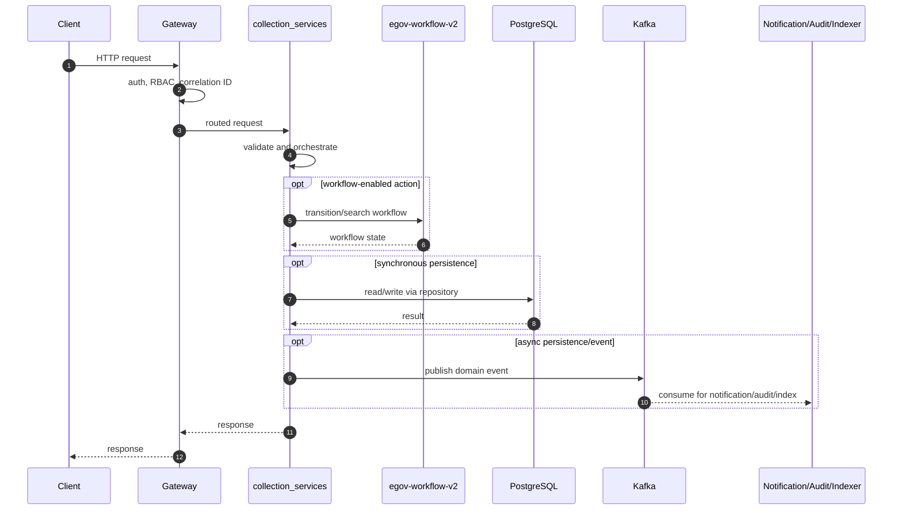
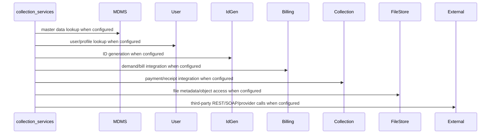

# collection-services

> Generated from repository path `business-services/collection-services`. This page documents detected runtime configuration and source-code structure. Validate deployment-specific values against the environment/Helm chart used outside this repository.

## Purpose

Payment collection, receipt, and remittance service.

## Responsibilities

- Own the `collection-services` business or platform capability within the UPYOG ecosystem.
- Expose synchronous APIs when controllers are present and publish/consume asynchronous events when Kafka configuration is present.
- Persist service-owned state through PostgreSQL/Flyway or delegate persistence through `egov-persister` YAML mappings.
- Integrate with common platform services such as gateway, user, MDMS, workflow, ID generation, localization, billing, collection, notification, audit, indexer, and searcher as configured.

## Features

- Stack: **Java/Spring Boot**
- Java version: **17**
- Spring Boot version: **service-specific**
- HTTP port: **8280**
- Servlet/context path: **/collection-services**
- Detected controllers/API mappings: **19**
- Detected migrations: **27**
- Detected tests: **103** files

## Packages

| Package area | Files | Role |
| --- | --- | --- |
| collection | 1 source file(s) | Package area detected from source tree. |
| config | 3 source file(s) | Spring beans, properties, and runtime configuration. |
| consumer | 5 source file(s) | Kafka/event consumers. |
| contract | 69 source file(s) | Package area detected from source tree. |
| controller | 5 source file(s) | HTTP endpoints and request/response orchestration. |
| enums | 12 source file(s) | Package area detected from source tree. |
| factory | 2 source file(s) | Package area detected from source tree. |
| mapper | 5 source file(s) | DTO/entity conversion. |
| model | 43 source file(s) | Request, response, DTO, and domain models. |
| producer | 1 source file(s) | Kafka/event producers. |
| querybuilder | 5 source file(s) | Package area detected from source tree. |
| repository | 11 source file(s) | Database or remote-service data access. |
| service | 11 source file(s) | Business orchestration and domain logic. |
| util | 7 source file(s) | Reusable helpers and cross-cutting functions. |
| v1 | 13 source file(s) | Package area detected from source tree. |
| validation | 2 source file(s) | Package area detected from source tree. |

## Folder Structure

- `business-services/collection-services`: service root.
- `src/main/java`: Java source, package areas listed above when present.
- `src/main/resources`: application configuration, Flyway migrations, persister/indexer/searcher YAML, message resources.
- `src/test`: automated tests when present.
- `migration` or `db/migration`: Node/legacy SQL migrations when present.
- Dockerfiles are listed in the Deployment section.

## Entry Points

- `business-services/collection-services/src/main/java/org/egov/collection/CollectionServicesApplication.java`

## APIs

| Method | Endpoint | Controller | Input | Output | Authentication | Exceptions |
| --- | --- | --- | --- | --- | --- | --- |
| POST | /bankAccountServiceMapping/_create | BankAccountServiceMappingController.java | Request body follows service model/Swagger contract; validation is typically Bean Validation plus service validators. | Response follows DIGIT ResponseInfo pattern or service-specific model. | Gateway-authenticated unless listed in gateway open/mixed whitelist or explicitly anonymous. | Controller/service/repository/custom validation exceptions propagate through tracer/global handlers. |
| POST | /bankAccountServiceMapping/_search | BankAccountServiceMappingController.java | Request body follows service model/Swagger contract; validation is typically Bean Validation plus service validators. | Response follows DIGIT ResponseInfo pattern or service-specific model. | Gateway-authenticated unless listed in gateway open/mixed whitelist or explicitly anonymous. | Controller/service/repository/custom validation exceptions propagate through tracer/global handlers. |
| POST | /payments/_search | PaymentController.java | Request body follows service model/Swagger contract; validation is typically Bean Validation plus service validators. | Response follows DIGIT ResponseInfo pattern or service-specific model. | Gateway-authenticated unless listed in gateway open/mixed whitelist or explicitly anonymous. | Controller/service/repository/custom validation exceptions propagate through tracer/global handlers. |
| POST | /payments/_create | PaymentController.java | Request body follows service model/Swagger contract; validation is typically Bean Validation plus service validators. | Response follows DIGIT ResponseInfo pattern or service-specific model. | Gateway-authenticated unless listed in gateway open/mixed whitelist or explicitly anonymous. | Controller/service/repository/custom validation exceptions propagate through tracer/global handlers. |
| POST | /payments/{moduleName}/_workflow | PaymentController.java | Request body follows service model/Swagger contract; validation is typically Bean Validation plus service validators. | Response follows DIGIT ResponseInfo pattern or service-specific model. | Gateway-authenticated unless listed in gateway open/mixed whitelist or explicitly anonymous. | Controller/service/repository/custom validation exceptions propagate through tracer/global handlers. |
| POST | /payments/_update | PaymentController.java | Request body follows service model/Swagger contract; validation is typically Bean Validation plus service validators. | Response follows DIGIT ResponseInfo pattern or service-specific model. | Gateway-authenticated unless listed in gateway open/mixed whitelist or explicitly anonymous. | Controller/service/repository/custom validation exceptions propagate through tracer/global handlers. |
| POST | /payments/_validate | PaymentController.java | Request body follows service model/Swagger contract; validation is typically Bean Validation plus service validators. | Response follows DIGIT ResponseInfo pattern or service-specific model. | Gateway-authenticated unless listed in gateway open/mixed whitelist or explicitly anonymous. | Controller/service/repository/custom validation exceptions propagate through tracer/global handlers. |
| POST | /payments/_migrate | PaymentController.java | Request body follows service model/Swagger contract; validation is typically Bean Validation plus service validators. | Response follows DIGIT ResponseInfo pattern or service-specific model. | Gateway-authenticated unless listed in gateway open/mixed whitelist or explicitly anonymous. | Controller/service/repository/custom validation exceptions propagate through tracer/global handlers. |
| POST | /payments/_plainsearch | PaymentController.java | Request body follows service model/Swagger contract; validation is typically Bean Validation plus service validators. | Response follows DIGIT ResponseInfo pattern or service-specific model. | Gateway-authenticated unless listed in gateway open/mixed whitelist or explicitly anonymous. | Controller/service/repository/custom validation exceptions propagate through tracer/global handlers. |
| POST | /preexistpayments/_update | PreExistPaymentController.java | Request body follows service model/Swagger contract; validation is typically Bean Validation plus service validators. | Response follows DIGIT ResponseInfo pattern or service-specific model. | Gateway-authenticated unless listed in gateway open/mixed whitelist or explicitly anonymous. | Controller/service/repository/custom validation exceptions propagate through tracer/global handlers. |
| POST | /v2/receipts/_search | ReceiptControllerV2.java | Request body follows service model/Swagger contract; validation is typically Bean Validation plus service validators. | Response follows DIGIT ResponseInfo pattern or service-specific model. | Gateway-authenticated unless listed in gateway open/mixed whitelist or explicitly anonymous. | Controller/service/repository/custom validation exceptions propagate through tracer/global handlers. |
| POST | /v2/receipts/_create | ReceiptControllerV2.java | Request body follows service model/Swagger contract; validation is typically Bean Validation plus service validators. | Response follows DIGIT ResponseInfo pattern or service-specific model. | Gateway-authenticated unless listed in gateway open/mixed whitelist or explicitly anonymous. | Controller/service/repository/custom validation exceptions propagate through tracer/global handlers. |
| POST | /v2/receipts/_workflow | ReceiptControllerV2.java | Request body follows service model/Swagger contract; validation is typically Bean Validation plus service validators. | Response follows DIGIT ResponseInfo pattern or service-specific model. | Gateway-authenticated unless listed in gateway open/mixed whitelist or explicitly anonymous. | Controller/service/repository/custom validation exceptions propagate through tracer/global handlers. |
| POST | /v2/receipts/_update | ReceiptControllerV2.java | Request body follows service model/Swagger contract; validation is typically Bean Validation plus service validators. | Response follows DIGIT ResponseInfo pattern or service-specific model. | Gateway-authenticated unless listed in gateway open/mixed whitelist or explicitly anonymous. | Controller/service/repository/custom validation exceptions propagate through tracer/global handlers. |
| POST | /v2/receipts/_validate | ReceiptControllerV2.java | Request body follows service model/Swagger contract; validation is typically Bean Validation plus service validators. | Response follows DIGIT ResponseInfo pattern or service-specific model. | Gateway-authenticated unless listed in gateway open/mixed whitelist or explicitly anonymous. | Controller/service/repository/custom validation exceptions propagate through tracer/global handlers. |
| POST | /v2/receipts/_migratetov1 | ReceiptControllerV2.java | Request body follows service model/Swagger contract; validation is typically Bean Validation plus service validators. | Response follows DIGIT ResponseInfo pattern or service-specific model. | Gateway-authenticated unless listed in gateway open/mixed whitelist or explicitly anonymous. | Controller/service/repository/custom validation exceptions propagate through tracer/global handlers. |
| POST | /remittances/_create | RemittanceController.java | Request body follows service model/Swagger contract; validation is typically Bean Validation plus service validators. | Response follows DIGIT ResponseInfo pattern or service-specific model. | Gateway-authenticated unless listed in gateway open/mixed whitelist or explicitly anonymous. | Controller/service/repository/custom validation exceptions propagate through tracer/global handlers. |
| POST | /remittances/_search | RemittanceController.java | Request body follows service model/Swagger contract; validation is typically Bean Validation plus service validators. | Response follows DIGIT ResponseInfo pattern or service-specific model. | Gateway-authenticated unless listed in gateway open/mixed whitelist or explicitly anonymous. | Controller/service/repository/custom validation exceptions propagate through tracer/global handlers. |
| POST | /remittances/_update | RemittanceController.java | Request body follows service model/Swagger contract; validation is typically Bean Validation plus service validators. | Response follows DIGIT ResponseInfo pattern or service-specific model. | Gateway-authenticated unless listed in gateway open/mixed whitelist or explicitly anonymous. | Controller/service/repository/custom validation exceptions propagate through tracer/global handlers. |

### API conventions

- Most backend services use DIGIT-style POST endpoints ending in `/_create`, `/_search`, `/_update`, `/_delete`, `/_count`, or `/_plainsearch`.
- Request payloads normally include `RequestInfo`; responses normally include `ResponseInfo` and one or more domain payload arrays/objects.
- Authentication is generally enforced at the gateway. Service-level security varies by service and must be checked before exposing routes directly.

## Business Flow

1. Client or another service reaches this service through Zuul/Spring Cloud Gateway or an internal cluster URL.
2. Gateway validates token state, enriches request headers such as user/correlation information, and performs RBAC checks where configured.
3. Controller validates the request and calls service-layer orchestration.
4. Service layer loads MDMS/configuration, performs domain validation, calls workflow/billing/idgen/user/location/localization/file-store integrations as required, and writes through repositories or Kafka topics.
5. Persistence events are consumed by `egov-persister`; indexing events are consumed by `egov-indexer`; notification events go to SMS/mail/user-event services.
6. The service returns a DIGIT-style response or publishes an asynchronous completion event.

## Database

- **Tables detected from migrations:** EGCL_RECEIPTINSTRUMENT, egcl_bankaccountservicemapping, egcl_bill, egcl_billAccountDetail, egcl_bill_audit, egcl_billdetial, egcl_billdetial_audit, egcl_instrumentheader, egcl_instrumentheader_v1, egcl_instrumentheader_v1_history, egcl_payment, egcl_paymentDetail, egcl_paymentDetail_audit, egcl_payment_audit, egcl_receiptdetails, egcl_receiptdetails_v1, egcl_receiptdetails_v1_history, egcl_receiptheader, egcl_receiptheader_v1, egcl_receiptheader_v1_history, egcl_receiptinstrument_v1, egcl_remittance, egcl_remittancedetails, egcl_remittanceinstrument, egcl_remittancereceipt
- **Migration files:** 27
- **Repositories/JDBC classes:** 13
- **Entity/table-mapped classes:** 0

### Migration locations

- `business-services/collection-services/src/main/resources/db/migration`
- `business-services/collection-services/src/main/resources/db/migration/dev`
- `business-services/collection-services/src/main/resources/db/migration/main`

### Repository locations

- `business-services/collection-services/src/main/java/org/egov/collection/repository/BankAccountMappingRepository.java`
- `business-services/collection-services/src/main/java/org/egov/collection/repository/BillingServiceRepository.java`
- `business-services/collection-services/src/main/java/org/egov/collection/repository/ChartOfAccountsRepository.java`
- `business-services/collection-services/src/main/java/org/egov/collection/repository/CollectionRepository.java`
- `business-services/collection-services/src/main/java/org/egov/collection/repository/EmployeeRepository.java`
- `business-services/collection-services/src/main/java/org/egov/collection/repository/IdGenRepository.java`
- `business-services/collection-services/src/main/java/org/egov/collection/repository/InstrumentRepository.java`
- `business-services/collection-services/src/main/java/org/egov/collection/repository/PaymentRepository.java`
- `business-services/collection-services/src/main/java/org/egov/collection/repository/RemittanceRepository.java`
- `business-services/collection-services/src/main/java/org/egov/collection/repository/ServiceRequestRepository.java`
- `business-services/collection-services/src/main/java/org/egov/collection/repository/UserRepository.java`
- `business-services/collection-services/src/main/java/org/egov/collection/service/MigrationService.java`
- `business-services/collection-services/src/main/java/org/egov/collection/service/v1/CollectionService_v1.java`

### Entity mapping locations

- Not present in this repository or not detected.

## Kafka

| Kafka/property | Topic or value |
| --- | --- |
| spring.kafka.bootstrap.servers | localhost:9092 |
| kafka.topics.receipt.create.name | egov.collection.receipt-create-v2 |
| kafka.topics.receipt.create.key | <secret-value> |
| kafka.topics.collection.migrate.name | egov-collection-migration-batch |
| kafka.topics.collection.migrate.key | <secret-value> |
| kafka.topics.receipt.cancel.name | egov.collection.receipt-cancel-v2 |
| kafka.topics.receipt.cancel.key | <secret-value> |
| kafka.topics.receipt.update.name | egov.collection.receipt-update |
| kafka.topics.receipt.update.key | <secret-value> |
| kafka.topics.update.receipt.workflowdetails | egov.collection.update.workflowdetails |
| kafka.topics.update.receipt.workflowdetails.key | <secret-value> |
| kafka.topics.bankaccountservicemapping.create.name | egov.collectionmasters.bankaccountservicemapping-create |
| kafka.topics.bankaccountservicemapping.create.key | <secret-value> |
| kafka.topics.notification.sms | egov.core.notification.sms |
| kafka.topics.notification.sms.key | <secret-value> |
| kafka.topics.payment.receiptlink.name | coll.payment.receiptlink.topic.name |
| kafka.topics.payment.receiptlink.key | <secret-value> |
| spring.kafka.consumer.enable-auto-commit | true |
| spring.kafka.consumer.auto-commit-interval | 100 |
| spring.kafka.consumer.auto-offset-reset | earliest |
| spring.kafka.consumer.value-deserializer | org.egov.collection.consumer.HashMapDeserializer |
| spring.kafka.consumer.key-deserializer | <secret-value> |
| spring.kafka.consumer.group-id | collection-persist |
| spring.kafka.listener.missing-topics-fatal | false |
| spring.kafka.consumer.properties.spring.json.use.type.headers | false |
| spring.kafka.producer.retries | 0 |
| spring.kafka.producer.batch-size | 16384 |
| spring.kafka.producer.buffer-memory | 33554432 |
| spring.kafka.producer.key-serializer | <secret-value> |
| spring.kafka.producer.value-serializer | org.springframework.kafka.support.serializer.JsonSerializer |
| kafka.topics.payment.create.name | egov.collection.payment-create |
| kafka.topics.payment.create.key | <secret-value> |
| kafka.topics.payment.cancel.name | egov.collection.payment-cancel |
| kafka.topics.payment.cancel.key | <secret-value> |
| kafka.topics.payment.update.name | egov.collection.payment-update |
| kafka.topics.payment.update.key | <secret-value> |
| kafka.topics.filestore | PDF_GEN_CREATE |

### Producers

- `business-services/collection-services/src/main/java/org/egov/collection/producer/CollectionProducer.java`
- `business-services/collection-services/src/main/java/org/egov/collection/service/BankAccountMappingService.java`

### Consumers

- `business-services/collection-services/src/main/java/org/egov/collection/consumer/CollectionConsumer.java`
- `business-services/collection-services/src/main/java/org/egov/collection/consumer/CollectionNotificationConsumer.java`
- `business-services/collection-services/src/main/java/org/egov/collection/consumer/FileStoreConsumer.java`
- `business-services/collection-services/src/main/java/org/egov/collection/notification/consumer/NotificationConsumer.java`

### Retry and dead-letter handling

- Standard services rely on Spring Kafka retry/container settings or the platform `tracer` library.
- `egov-persister` has an explicit dead-letter pattern (`egov-persister-deadletter`). Service-specific DLQ topics should be configured in deployment properties if required.

## Redis

- No explicit Redis configuration detected.

Cache strategy, TTLs, and key naming are normally configured in code/properties. When Redis is absent above, the service does not advertise a direct Redis dependency in its checked-in config.

## Workflow

Workflow integration is indicated by workflow packages/classes or egov-workflow-v2 host configuration.

Typical workflow-enabled services use `WorkflowIntegrator` or call `/egov-wf/process/_transition` with tenant, business service, action, assignee, and audit information. States/actions/transitions are owned centrally by `egov-workflow-v2` business service definitions.

## External Integrations

| Config key | Endpoint/host |
| --- | --- |
| spring.flyway.url | jdbc:postgresql://localhost:5432/collections |
| egov.services.hostname | http://pdf-service.egov:8080/ |
| egov.idgen.hostname | https://dev.digit.org/ |
| rcptno.gen.uri | egov-idgen/id/_generate |
| egov.egfcommonmasters.hostname | https://dev.digit.org/ |
| buisnessdetails.search.uri | egov-common-masters/businessDetails/_search |
| egov.egfmasters.hostname | https://dev.digit.org/ |
| coa.search.uri | egf-master/chartofaccounts/_search?tenantId={tenantId}&glcodes={chartOfAccountCodes} |
| egov.instrument.hostname | https://dev.digit.org/ |
| create.instrument.uri | egf-instrument/instruments/_create |
| search.instrument.uri | egf-instrument/instruments/_search?ids={instrumentheader} |
| search.instrumentbypaymentmode.uri | egf-instrument/instruments/_search?instrumentTypes={instrumentType}&tenantId={tenantId} |
| search.accountcodes.uri | egf-instrument/instrumentaccountcodes/_search |
| egov.apportion.service.host | http://localhost:8085/ |
| egov.apportion.apportion.endpoint | apportion-service/v2/bill/_apportion |
| egov.egfmaster.service.host | https://dev.digit.org/ |
| egov.services.billing_service.hostname | http://localhost:8096/ |
| coll.notification.ui.host | https://dev.digit.org/ |
| coll.notification.ui.redirect.url | uc-citizen/smsViewReceipt |
| egov.localization.host | http://egov-localization:8080/ |
| egov.localization.search.endpoint | localization/messages/v1/_search |
| egov.mdms.host | http://egov-mdms-service:8080/ |
| egov.mdms.search.endpoint | egov-mdms-service/v1/_search |
| user.service.host | https://dev.digit.org/ |
| is.payment.search.uri.modulename.mandatory | true |
| egov.url.shortner.host | http://egov-url-shortening.egov:8080/ |
| egov.url.shortner.endpoint | egov-url-shortening/shortener |
| egov.razorpay.url | https://ifsc.razorpay.com/ |

## Security

- Authentication is primarily gateway-mediated using OAuth/JWT/opaque-token flows and `x-user-info` request enrichment.
- Authorization uses RBAC metadata from `egov-accesscontrol`; endpoint whitelists exist in `zuul`/`gateway` properties.
- Validate whether this service has local security configuration before direct exposure; several services assume gateway isolation.
- Sensitive properties must be supplied through Kubernetes secrets or external config, not committed literal values.

## Configuration

- `business-services/collection-services/src/main/resources/application.properties`

### Key properties

| Property | Value / meaning |
| --- | --- |
| server.workDir-path | /collection-services |
| server.port | 8280 |
| server.context-path | /collection-services |
| server.servlet.context-path | /collection-services |
| logging.level.org.egov | DEBUG |
| collection.receipts.search.paginate | true |
| collection.receipts.search.default.size | 30 |
| collection.receipts.search.max.size | 200 |
| collection.is.user.create.enabled | true |
| spring.datasource.url | jdbc:postgresql://localhost:5432/collections |
| spring.datasource.driver-class-name | org.postgresql.Driver |
| spring.datasource.username | postgres |
| spring.datasource.password | <secret-value> |
| spring.jackson.serialization.write-dates-as-timestamps | false |
| spring.flyway.user | postgres |
| spring.flyway.password | <secret-value> |
| spring.flyway.outOfOrder | true |
| spring.flyway.table | collection_services_schema_version |
| spring.flyway.baseline-on-migrate | true |
| spring.flyway.url | jdbc:postgresql://localhost:5432/collections |
| spring.flyway.locations | classpath:db/migration/main |
| spring.flyway.enabled | true |
| spring.flyway.validateOnMigrate | false |
| spring.jpa.show-sql | true |
| spring.kafka.bootstrap.servers | localhost:9092 |
| logging.pattern.console | %clr(%X{CORRELATION_ID:-}) %clr(%d{yyyy-MM-dd HH:mm:ss.SSS}){faint} %clr(${LOG_LEVEL_PATTERN:-%5p}) %clr(${PID:- }){m... |
| kafka.topics.receipt.create.name | egov.collection.receipt-create-v2 |
| kafka.topics.receipt.create.key | receipt-create |
| kafka.topics.collection.migrate.name | egov-collection-migration-batch |
| kafka.topics.collection.migrate.key | collection-migration |
| kafka.topics.receipt.cancel.name | egov.collection.receipt-cancel-v2 |
| kafka.topics.receipt.cancel.key | receipt-cancel |
| kafka.topics.receipt.update.name | egov.collection.receipt-update |
| kafka.topics.receipt.update.key | receipt-update |
| kafka.topics.update.receipt.workflowdetails | egov.collection.update.workflowdetails |

## Logging

- Platform services use Spring logging plus `tracer` for correlation IDs and structured exception responses.
- Gateway filters are responsible for request correlation; services should propagate correlation/user headers downstream.
- Audit events are emitted to Kafka/audit-service where configured.

## Exception Handling

- Common pattern: validation errors become `CustomException`/domain exceptions and are rendered by `tracer` or service-specific `GlobalExceptionHandler`.
- Controller-level `@Valid` handles Bean Validation for request models where annotations exist.
- Kafka consumers should be monitored for poison messages and retry loops.

## Testing

- Test files detected: **103**.
- Unit tests typically cover validators, services, query builders, and controllers.
- Integration tests require PostgreSQL, Kafka, Redis, and dependent services or mocks.

## Deployment

- `business-services/collection-services/src/main/resources/db/Dockerfile`

- Most Java services are built as executable JAR containers using Maven and the shared `core-services/build/maven/Dockerfile` pattern.
- Database migrations are packaged separately where `src/main/resources/db/Dockerfile` exists and run Flyway with `DB_URL`, `FLYWAY_USER`, `FLYWAY_PASSWORD`, `FLYWAY_LOCATIONS`, and `SCHEMA_TABLE`.
- Kubernetes/Helm manifests are not checked into this repository; deployment values are managed externally.

## Monitoring

- Health endpoints are usually Spring Actuator-backed, frequently exposed at `/health` because many services set `management.endpoints.web.base-path=/`.
- Gateway has additional OpenTelemetry/Jaeger-related configuration.
- Production deployments should scrape actuator/Prometheus endpoints, Kafka consumer lag, DB pool metrics, and JVM metrics.

## Performance

- Primary bottlenecks are database query complexity, Kafka consumer lag, synchronous inter-service calls, external provider latency, and JVM heap limits.
- Prefer indexed search columns, bounded page sizes, connection pool sizing, Redis for hot reference data, and async publication for slow side effects.
- Check thread pools and Kafka concurrency for write-heavy services.

## Common Problems

- Missing dependent service host property or DNS entry.
- Flyway migration order/table mismatch.
- Kafka topic not created or wrong consumer group.
- Gateway whitelist/RBAC misconfiguration.
- Redis/PostgreSQL connectivity issues.
- Java 17 services run with Java 8 images or legacy Java 8 services run with Java 17 images.

## Improvement Suggestions

- Add/refresh OpenAPI contracts for controllers that lack contract YAML.
- Add integration tests around workflow, billing, collection, and persister events.
- Externalize all secrets and remove defaults from deployment overlays.
- Standardize health, metrics, logging, and correlation-ID propagation.
- Normalize package names and remove duplicate/legacy code where the service has modern equivalents.
