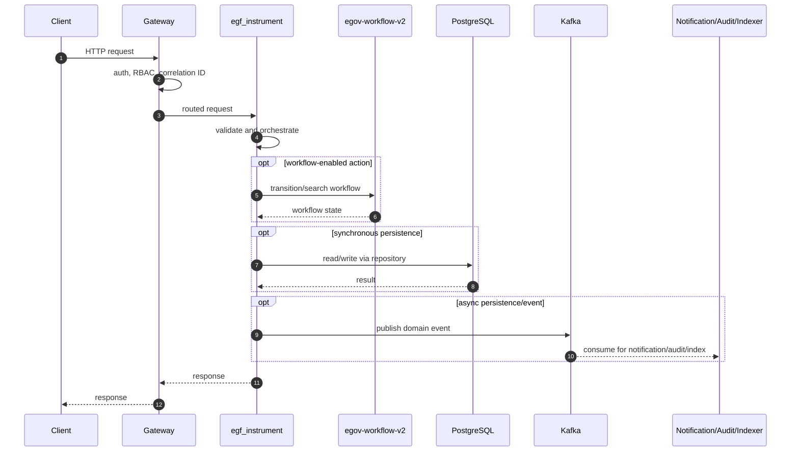
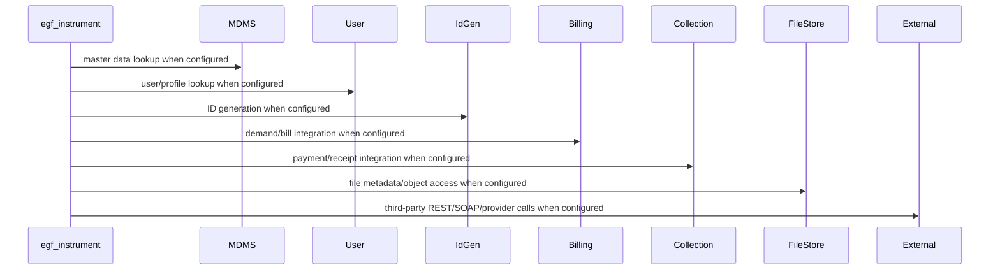

# egf-instrument

> Generated from repository path `business-services/egf-instrument`. This page documents detected runtime configuration and source-code structure. Validate deployment-specific values against the environment/Helm chart used outside this repository.

## Purpose

Financial instrument service.

## Responsibilities

- Own the `egf-instrument` business or platform capability within the UPYOG ecosystem.
- Expose synchronous APIs when controllers are present and publish/consume asynchronous events when Kafka configuration is present.
- Persist service-owned state through PostgreSQL/Flyway or delegate persistence through `egov-persister` YAML mappings.
- Integrate with common platform services such as gateway, user, MDMS, workflow, ID generation, localization, billing, collection, notification, audit, indexer, and searcher as configured.

## Features

- Stack: **Java/Spring Boot**
- Java version: **17**
- Spring Boot version: **3.2.2**
- HTTP port: **8480**
- Servlet/context path: **/egf-instrument**
- Detected controllers/API mappings: **18**
- Detected migrations: **20**
- Detected tests: **97** files

## Packages

| Package area | Files | Role |
| --- | --- | --- |
| advice | 1 source file(s) | Package area detected from source tree. |
| config | 1 source file(s) | Spring beans, properties, and runtime configuration. |
| contract | 13 source file(s) | Package area detected from source tree. |
| controller | 4 source file(s) | HTTP endpoints and request/response orchestration. |
| egov | 1 source file(s) | Package area detected from source tree. |
| entity | 13 source file(s) | Database/table mapped domain state. |
| mapper | 5 source file(s) | DTO/entity conversion. |
| model | 15 source file(s) | Request, response, DTO, and domain models. |
| queue | 3 source file(s) | Package area detected from source tree. |
| repository | 27 source file(s) | Database or remote-service data access. |
| requests | 9 source file(s) | Package area detected from source tree. |
| service | 4 source file(s) | Business orchestration and domain logic. |

## Folder Structure

- `business-services/egf-instrument`: service root.
- `src/main/java`: Java source, package areas listed above when present.
- `src/main/resources`: application configuration, Flyway migrations, persister/indexer/searcher YAML, message resources.
- `src/test`: automated tests when present.
- `migration` or `db/migration`: Node/legacy SQL migrations when present.
- Dockerfiles are listed in the Deployment section.

## Entry Points

- `business-services/egf-instrument/src/main/java/org/egov/EgfInstrumentApplication.java`

## APIs

| Method | Endpoint | Controller | Input | Output | Authentication | Exceptions |
| --- | --- | --- | --- | --- | --- | --- |
| POST | /instrumentaccountcodes/_create | InstrumentAccountCodeController.java | Request body follows service model/Swagger contract; validation is typically Bean Validation plus service validators. | Response follows DIGIT ResponseInfo pattern or service-specific model. | Gateway-authenticated unless listed in gateway open/mixed whitelist or explicitly anonymous. | Controller/service/repository/custom validation exceptions propagate through tracer/global handlers. |
| POST | /instrumentaccountcodes/_update | InstrumentAccountCodeController.java | Request body follows service model/Swagger contract; validation is typically Bean Validation plus service validators. | Response follows DIGIT ResponseInfo pattern or service-specific model. | Gateway-authenticated unless listed in gateway open/mixed whitelist or explicitly anonymous. | Controller/service/repository/custom validation exceptions propagate through tracer/global handlers. |
| POST | /instrumentaccountcodes/_delete | InstrumentAccountCodeController.java | Request body follows service model/Swagger contract; validation is typically Bean Validation plus service validators. | Response follows DIGIT ResponseInfo pattern or service-specific model. | Gateway-authenticated unless listed in gateway open/mixed whitelist or explicitly anonymous. | Controller/service/repository/custom validation exceptions propagate through tracer/global handlers. |
| POST | /instrumentaccountcodes/_search | InstrumentAccountCodeController.java | Request body follows service model/Swagger contract; validation is typically Bean Validation plus service validators. | Response follows DIGIT ResponseInfo pattern or service-specific model. | Gateway-authenticated unless listed in gateway open/mixed whitelist or explicitly anonymous. | Controller/service/repository/custom validation exceptions propagate through tracer/global handlers. |
| POST | /instruments/_create | InstrumentController.java | Request body follows service model/Swagger contract; validation is typically Bean Validation plus service validators. | Response follows DIGIT ResponseInfo pattern or service-specific model. | Gateway-authenticated unless listed in gateway open/mixed whitelist or explicitly anonymous. | Controller/service/repository/custom validation exceptions propagate through tracer/global handlers. |
| POST | /instruments/_update | InstrumentController.java | Request body follows service model/Swagger contract; validation is typically Bean Validation plus service validators. | Response follows DIGIT ResponseInfo pattern or service-specific model. | Gateway-authenticated unless listed in gateway open/mixed whitelist or explicitly anonymous. | Controller/service/repository/custom validation exceptions propagate through tracer/global handlers. |
| POST | /instruments/_delete | InstrumentController.java | Request body follows service model/Swagger contract; validation is typically Bean Validation plus service validators. | Response follows DIGIT ResponseInfo pattern or service-specific model. | Gateway-authenticated unless listed in gateway open/mixed whitelist or explicitly anonymous. | Controller/service/repository/custom validation exceptions propagate through tracer/global handlers. |
| POST | /instruments/_search | InstrumentController.java | Request body follows service model/Swagger contract; validation is typically Bean Validation plus service validators. | Response follows DIGIT ResponseInfo pattern or service-specific model. | Gateway-authenticated unless listed in gateway open/mixed whitelist or explicitly anonymous. | Controller/service/repository/custom validation exceptions propagate through tracer/global handlers. |
| POST | /instruments/_deposit | InstrumentController.java | Request body follows service model/Swagger contract; validation is typically Bean Validation plus service validators. | Response follows DIGIT ResponseInfo pattern or service-specific model. | Gateway-authenticated unless listed in gateway open/mixed whitelist or explicitly anonymous. | Controller/service/repository/custom validation exceptions propagate through tracer/global handlers. |
| POST | /instruments/_dishonor | InstrumentController.java | Request body follows service model/Swagger contract; validation is typically Bean Validation plus service validators. | Response follows DIGIT ResponseInfo pattern or service-specific model. | Gateway-authenticated unless listed in gateway open/mixed whitelist or explicitly anonymous. | Controller/service/repository/custom validation exceptions propagate through tracer/global handlers. |
| POST | /instrumenttypes/_create | InstrumentTypeController.java | Request body follows service model/Swagger contract; validation is typically Bean Validation plus service validators. | Response follows DIGIT ResponseInfo pattern or service-specific model. | Gateway-authenticated unless listed in gateway open/mixed whitelist or explicitly anonymous. | Controller/service/repository/custom validation exceptions propagate through tracer/global handlers. |
| POST | /instrumenttypes/_update | InstrumentTypeController.java | Request body follows service model/Swagger contract; validation is typically Bean Validation plus service validators. | Response follows DIGIT ResponseInfo pattern or service-specific model. | Gateway-authenticated unless listed in gateway open/mixed whitelist or explicitly anonymous. | Controller/service/repository/custom validation exceptions propagate through tracer/global handlers. |
| POST | /instrumenttypes/_delete | InstrumentTypeController.java | Request body follows service model/Swagger contract; validation is typically Bean Validation plus service validators. | Response follows DIGIT ResponseInfo pattern or service-specific model. | Gateway-authenticated unless listed in gateway open/mixed whitelist or explicitly anonymous. | Controller/service/repository/custom validation exceptions propagate through tracer/global handlers. |
| POST | /instrumenttypes/_search | InstrumentTypeController.java | Request body follows service model/Swagger contract; validation is typically Bean Validation plus service validators. | Response follows DIGIT ResponseInfo pattern or service-specific model. | Gateway-authenticated unless listed in gateway open/mixed whitelist or explicitly anonymous. | Controller/service/repository/custom validation exceptions propagate through tracer/global handlers. |
| POST | /surrenderreasons/_create | SurrenderReasonController.java | Request body follows service model/Swagger contract; validation is typically Bean Validation plus service validators. | Response follows DIGIT ResponseInfo pattern or service-specific model. | Gateway-authenticated unless listed in gateway open/mixed whitelist or explicitly anonymous. | Controller/service/repository/custom validation exceptions propagate through tracer/global handlers. |
| POST | /surrenderreasons/_update | SurrenderReasonController.java | Request body follows service model/Swagger contract; validation is typically Bean Validation plus service validators. | Response follows DIGIT ResponseInfo pattern or service-specific model. | Gateway-authenticated unless listed in gateway open/mixed whitelist or explicitly anonymous. | Controller/service/repository/custom validation exceptions propagate through tracer/global handlers. |
| POST | /surrenderreasons/_delete | SurrenderReasonController.java | Request body follows service model/Swagger contract; validation is typically Bean Validation plus service validators. | Response follows DIGIT ResponseInfo pattern or service-specific model. | Gateway-authenticated unless listed in gateway open/mixed whitelist or explicitly anonymous. | Controller/service/repository/custom validation exceptions propagate through tracer/global handlers. |
| POST | /surrenderreasons/_search | SurrenderReasonController.java | Request body follows service model/Swagger contract; validation is typically Bean Validation plus service validators. | Response follows DIGIT ResponseInfo pattern or service-specific model. | Gateway-authenticated unless listed in gateway open/mixed whitelist or explicitly anonymous. | Controller/service/repository/custom validation exceptions propagate through tracer/global handlers. |

### API conventions

- Most backend services use DIGIT-style POST endpoints ending in `/_create`, `/_search`, `/_update`, `/_delete`, `/_count`, or `/_plainsearch`.
- Request payloads normally include `RequestInfo`; responses normally include `ResponseInfo` and one or more domain payload arrays/objects.
- Authentication is generally enforced at the gateway. Service-level security varies by service and must be checked before exposing routes directly.

## Business Flow

1. Client or another service reaches this service through Zuul/Spring Cloud Gateway or an internal cluster URL.
2. Gateway validates token state, enriches request headers such as user/correlation information, and performs RBAC checks where configured.
3. Controller validates the request and calls service-layer orchestration.
4. Service layer loads MDMS/configuration, performs domain validation, calls workflow/billing/idgen/user/location/localization/file-store integrations as required, and writes through repositories or Kafka topics.
5. Persistence events are consumed by `egov-persister`; indexing events are consumed by `egov-indexer`; notification events go to SMS/mail/user-event services.
6. The service returns a DIGIT-style response or publishes an asynchronous completion event.

## Database

- **Tables detected from migrations:** egf_instrument, egf_instrumentaccountcode, egf_instrumentdishonor, egf_instrumentstatus, egf_instrumenttype, egf_instrumenttypeproperty, egf_instrumentvoucher, egf_surrenderreason
- **Migration files:** 20
- **Repositories/JDBC classes:** 26
- **Entity/table-mapped classes:** 13

### Migration locations

- `business-services/egf-instrument/src/main/resources/db/migration`
- `business-services/egf-instrument/src/main/resources/db/migration/main`
- `business-services/egf-instrument/src/main/resources/db/migration/seed`

### Repository locations

- `business-services/egf-instrument/src/main/java/org/egov/egf/instrument/domain/repository/DishonorReasonRepository.java`
- `business-services/egf-instrument/src/main/java/org/egov/egf/instrument/domain/repository/InstrumentAccountCodeESRepository.java`
- `business-services/egf-instrument/src/main/java/org/egov/egf/instrument/domain/repository/InstrumentAccountCodeRepository.java`
- `business-services/egf-instrument/src/main/java/org/egov/egf/instrument/domain/repository/InstrumentESRepository.java`
- `business-services/egf-instrument/src/main/java/org/egov/egf/instrument/domain/repository/InstrumentRepository.java`
- `business-services/egf-instrument/src/main/java/org/egov/egf/instrument/domain/repository/InstrumentTypeESRepository.java`
- `business-services/egf-instrument/src/main/java/org/egov/egf/instrument/domain/repository/InstrumentTypePropertyRepository.java`
- `business-services/egf-instrument/src/main/java/org/egov/egf/instrument/domain/repository/InstrumentTypeRepository.java`
- `business-services/egf-instrument/src/main/java/org/egov/egf/instrument/domain/repository/InstrumentVoucherRepository.java`
- `business-services/egf-instrument/src/main/java/org/egov/egf/instrument/domain/repository/SurrenderReasonESRepository.java`
- `business-services/egf-instrument/src/main/java/org/egov/egf/instrument/domain/repository/SurrenderReasonRepository.java`
- `business-services/egf-instrument/src/main/java/org/egov/egf/instrument/persistence/repository/DishonorReasonJdbcRepository.java`
- `business-services/egf-instrument/src/main/java/org/egov/egf/instrument/persistence/repository/InstrumentAccountCodeJdbcRepository.java`
- `business-services/egf-instrument/src/main/java/org/egov/egf/instrument/persistence/repository/InstrumentJdbcRepository.java`
- `business-services/egf-instrument/src/main/java/org/egov/egf/instrument/persistence/repository/InstrumentTypeJdbcRepository.java`
- `business-services/egf-instrument/src/main/java/org/egov/egf/instrument/persistence/repository/InstrumentTypePropertyJdbcRepository.java`
- `business-services/egf-instrument/src/main/java/org/egov/egf/instrument/persistence/repository/InstrumentVoucherJdbcRepository.java`
- `business-services/egf-instrument/src/main/java/org/egov/egf/instrument/persistence/repository/SurrenderReasonJdbcRepository.java`
- `business-services/egf-instrument/src/main/java/org/egov/egf/instrument/persistence/queue/repository/InstrumentAccountCodeQueueRepository.java`
- `business-services/egf-instrument/src/main/java/org/egov/egf/instrument/persistence/queue/repository/InstrumentQueueRepository.java`
- ...and 6 more

### Entity mapping locations

- `business-services/egf-instrument/src/main/java/org/egov/egf/instrument/persistence/entity/DishonorReasonEntity.java`
- `business-services/egf-instrument/src/main/java/org/egov/egf/instrument/persistence/entity/DishonorReasonSearchEntity.java`
- `business-services/egf-instrument/src/main/java/org/egov/egf/instrument/persistence/entity/InstrumentAccountCodeEntity.java`
- `business-services/egf-instrument/src/main/java/org/egov/egf/instrument/persistence/entity/InstrumentAccountCodeSearchEntity.java`
- `business-services/egf-instrument/src/main/java/org/egov/egf/instrument/persistence/entity/InstrumentEntity.java`
- `business-services/egf-instrument/src/main/java/org/egov/egf/instrument/persistence/entity/InstrumentSearchEntity.java`
- `business-services/egf-instrument/src/main/java/org/egov/egf/instrument/persistence/entity/InstrumentTypeEntity.java`
- `business-services/egf-instrument/src/main/java/org/egov/egf/instrument/persistence/entity/InstrumentTypePropertyEntity.java`
- `business-services/egf-instrument/src/main/java/org/egov/egf/instrument/persistence/entity/InstrumentTypeSearchEntity.java`
- `business-services/egf-instrument/src/main/java/org/egov/egf/instrument/persistence/entity/InstrumentVoucherEntity.java`
- `business-services/egf-instrument/src/main/java/org/egov/egf/instrument/persistence/entity/InstrumentVoucherSearchEntity.java`
- `business-services/egf-instrument/src/main/java/org/egov/egf/instrument/persistence/entity/SurrenderReasonEntity.java`
- `business-services/egf-instrument/src/main/java/org/egov/egf/instrument/persistence/entity/SurrenderReasonSearchEntity.java`

## Kafka

| Kafka/property | Topic or value |
| --- | --- |
| persist.through.kafka | yes |
| spring.kafka.consumer.properties.spring.json.use.type.headers | false |
| spring.kafka.listener.missing-topics-fatal | false |
| kafka.topics.egf.instrument.validated.topic | egov.egf.instrument.validated.topic |
| kafka.topics.egf.instrument.validated.group | egov.egf.instrument.validated.group |
| kafka.topics.egf.instrument.validated.id | egov.egf.instrument.validated.id |
| kafka.topics.egf.instrument.completed.topic | egov.egf.instrument.completed |
| kafka.topics.egf.instrument.completed.group | egov.egf.instrument.completed.group |
| kafka.topics.egf.instrument.instrument.accountcode.validated.key | <secret-value> |
| kafka.topics.egf.instrument.instrument.validated.key | <secret-value> |
| kafka.topics.egf.instrument.instrument.type.validated.key | <secret-value> |
| kafka.topics.egf.instrument.surrender.reason.validated.key | <secret-value> |
| kafka.topics.egf.instrument.instrument.accountcode.completed.key | <secret-value> |
| kafka.topics.egf.instrument.instrument.completed.key | <secret-value> |
| kafka.topics.egf.instrument.instrument.type.completed.key | <secret-value> |
| kafka.topics.egf.instrument.surrender.reason.completed.key | <secret-value> |
| spring.kafka.consumer.value-deserializer | org.egov.common.queue.HashMapDeserializer |
| spring.kafka.consumer.key-deserializer | <secret-value> |
| spring.kafka.consumer.group-id | egf-instrument |
| spring.kafka.producer.key-serializer | <secret-value> |
| spring.kafka.producer.value-serializer | org.springframework.kafka.support.serializer.JsonSerializer |

### Producers

- `business-services/egf-instrument/src/main/java/org/egov/egf/instrument/persistence/queue/FinancialInstrumentProducer.java`

### Consumers

- `business-services/egf-instrument/src/main/java/org/egov/egf/instrument/persistence/queue/FinancialInstrumentListener.java`

### Retry and dead-letter handling

- Standard services rely on Spring Kafka retry/container settings or the platform `tracer` library.
- `egov-persister` has an explicit dead-letter pattern (`egov-persister-deadletter`). Service-specific DLQ topics should be configured in deployment properties if required.

## Redis

- No explicit Redis configuration detected.

Cache strategy, TTLs, and key naming are normally configured in code/properties. When Redis is absent above, the service does not advertise a direct Redis dependency in its checked-in config.

## Workflow

No service-local workflow package was detected. The service may still participate indirectly through central workflow topics or gateway flows.

Typical workflow-enabled services use `WorkflowIntegrator` or call `/egov-wf/process/_transition` with tenant, business service, action, assignee, and audit information. States/actions/transitions are owned centrally by `egov-workflow-v2` business service definitions.

## External Integrations

| Config key | Endpoint/host |
| --- | --- |
| management.endpoints.web.base-path | / |
| spring.flyway.url | jdbc:postgresql://localhost:5432/master_db |
| es.host | localhost |
| egf.instrument.host.url | http://localhost:8480/ |
| egf.master.host.url | http://localhost:8082/ |

## Security

- Authentication is primarily gateway-mediated using OAuth/JWT/opaque-token flows and `x-user-info` request enrichment.
- Authorization uses RBAC metadata from `egov-accesscontrol`; endpoint whitelists exist in `zuul`/`gateway` properties.
- Validate whether this service has local security configuration before direct exposure; several services assume gateway isolation.
- Sensitive properties must be supplied through Kubernetes secrets or external config, not committed literal values.

## Configuration

- `business-services/egf-instrument/src/main/resources/application.properties`

### Key properties

| Property | Value / meaning |
| --- | --- |
| server.context-path | /egf-instrument |
| server.servlet.context-path | /egf-instrument |
| server.port | 8480 |
| persist.through.kafka | yes |
| spring.datasource.driver-class-name | org.postgresql.Driver |
| spring.datasource.url | jdbc:postgresql://localhost:5432/master_db?readOnly=false |
| spring.datasource.username | postgres |
| spring.datasource.password | <secret-value> |
| management.endpoints.web.base-path | / |
| spring.flyway.enabled | true |
| spring.flyway.user | postgres |
| spring.flyway.password | <secret-value> |
| spring.flyway.outOfOrder | true |
| spring.flyway.table | egf_instrument_schema_version |
| spring.flyway.baseline-on-migrate | true |
| spring.flyway.url | jdbc:postgresql://localhost:5432/master_db |
| spring.flyway.locations | classpath:/db/migration/main,db/migration/seed |
| spring.jpa.showSql | true |
| spring.jpa.database | POSTGRESQL |
| spring.data.jpa.repositories.enabled | true |
| spring.jpa.hibernate.naming.implicit-strategy | org.hibernate.boot.model.naming.ImplicitNamingStrategyLegacyJpaImpl |
| spring.jpa.hibernate.naming.physical-strategy | org.hibernate.boot.model.naming.PhysicalNamingStrategyStandardImpl |
| spring.jpa.open-in-view | true |
| spring.main.allow-bean-definition-overriding | true |
| app.timezone | UTC |
| fetch_data_from | db |
| es.host | localhost |
| es.transport.port | 9300 |
| es.cluster.name | docker-cluster |
| es.fund.index.name | fund |
| es.fund.document.type | fund |
| spring.kafka.consumer.properties.spring.json.use.type.headers | false |
| spring.kafka.listener.missing-topics-fatal | false |
| kafka.topics.egf.instrument.validated.topic | egov.egf.instrument.validated.topic |
| kafka.topics.egf.instrument.validated.group | egov.egf.instrument.validated.group |

## Logging

- Platform services use Spring logging plus `tracer` for correlation IDs and structured exception responses.
- Gateway filters are responsible for request correlation; services should propagate correlation/user headers downstream.
- Audit events are emitted to Kafka/audit-service where configured.

## Exception Handling

- Common pattern: validation errors become `CustomException`/domain exceptions and are rendered by `tracer` or service-specific `GlobalExceptionHandler`.
- Controller-level `@Valid` handles Bean Validation for request models where annotations exist.
- Kafka consumers should be monitored for poison messages and retry loops.

## Testing

- Test files detected: **97**.
- Unit tests typically cover validators, services, query builders, and controllers.
- Integration tests require PostgreSQL, Kafka, Redis, and dependent services or mocks.

## Deployment

- `business-services/egf-instrument/src/main/resources/db/Dockerfile`

- Most Java services are built as executable JAR containers using Maven and the shared `core-services/build/maven/Dockerfile` pattern.
- Database migrations are packaged separately where `src/main/resources/db/Dockerfile` exists and run Flyway with `DB_URL`, `FLYWAY_USER`, `FLYWAY_PASSWORD`, `FLYWAY_LOCATIONS`, and `SCHEMA_TABLE`.
- Kubernetes/Helm manifests are not checked into this repository; deployment values are managed externally.

## Monitoring

- Health endpoints are usually Spring Actuator-backed, frequently exposed at `/health` because many services set `management.endpoints.web.base-path=/`.
- Gateway has additional OpenTelemetry/Jaeger-related configuration.
- Production deployments should scrape actuator/Prometheus endpoints, Kafka consumer lag, DB pool metrics, and JVM metrics.

## Performance

- Primary bottlenecks are database query complexity, Kafka consumer lag, synchronous inter-service calls, external provider latency, and JVM heap limits.
- Prefer indexed search columns, bounded page sizes, connection pool sizing, Redis for hot reference data, and async publication for slow side effects.
- Check thread pools and Kafka concurrency for write-heavy services.

## Common Problems

- Missing dependent service host property or DNS entry.
- Flyway migration order/table mismatch.
- Kafka topic not created or wrong consumer group.
- Gateway whitelist/RBAC misconfiguration.
- Redis/PostgreSQL connectivity issues.
- Java 17 services run with Java 8 images or legacy Java 8 services run with Java 17 images.

## Improvement Suggestions

- Add/refresh OpenAPI contracts for controllers that lack contract YAML.
- Add integration tests around workflow, billing, collection, and persister events.
- Externalize all secrets and remove defaults from deployment overlays.
- Standardize health, metrics, logging, and correlation-ID propagation.
- Normalize package names and remove duplicate/legacy code where the service has modern equivalents.
