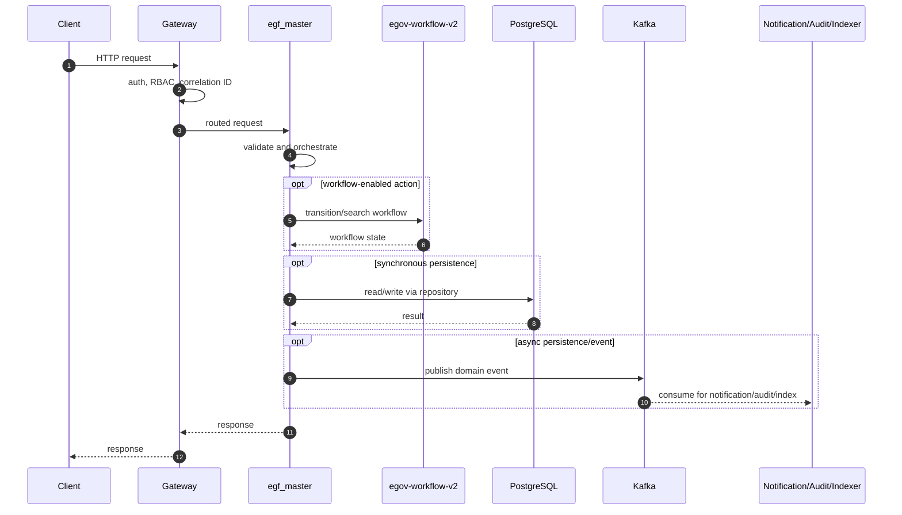
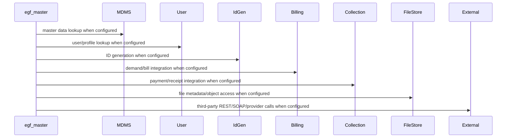

# egf-master

> Generated from repository path `business-services/egf-master`. This page documents detected runtime configuration and source-code structure. Validate deployment-specific values against the environment/Helm chart used outside this repository.

## Purpose

Financial master data service.

## Responsibilities

- Own the `egf-master` business or platform capability within the UPYOG ecosystem.
- Expose synchronous APIs when controllers are present and publish/consume asynchronous events when Kafka configuration is present.
- Persist service-owned state through PostgreSQL/Flyway or delegate persistence through `egov-persister` YAML mappings.
- Integrate with common platform services such as gateway, user, MDMS, workflow, ID generation, localization, billing, collection, notification, audit, indexer, and searcher as configured.

## Features

- Stack: **Java/Spring Boot**
- Java version: **17**
- Spring Boot version: **service-specific**
- HTTP port: **8280**
- Servlet/context path: **/egf-master**
- Detected controllers/API mappings: **66**
- Detected migrations: **53**
- Detected tests: **166** files

## Packages

| Package area | Files | Role |
| --- | --- | --- |
| advice | 1 source file(s) | Package area detected from source tree. |
| annotation | 1 source file(s) | Package area detected from source tree. |
| config | 1 source file(s) | Spring beans, properties, and runtime configuration. |
| constants | 1 source file(s) | Package area detected from source tree. |
| contract | 65 source file(s) | Package area detected from source tree. |
| controller | 22 source file(s) | HTTP endpoints and request/response orchestration. |
| egov | 3 source file(s) | Package area detected from source tree. |
| entity | 49 source file(s) | Database/table mapped domain state. |
| enums | 6 source file(s) | Package area detected from source tree. |
| exception | 5 source file(s) | Custom exceptions and handlers. |
| interceptor | 2 source file(s) | Package area detected from source tree. |
| model | 58 source file(s) | Request, response, DTO, and domain models. |
| queue | 5 source file(s) | Package area detected from source tree. |
| repository | 91 source file(s) | Database or remote-service data access. |
| requests | 44 source file(s) | Package area detected from source tree. |
| service | 22 source file(s) | Business orchestration and domain logic. |
| util | 2 source file(s) | Reusable helpers and cross-cutting functions. |

## Folder Structure

- `business-services/egf-master`: service root.
- `src/main/java`: Java source, package areas listed above when present.
- `src/main/resources`: application configuration, Flyway migrations, persister/indexer/searcher YAML, message resources.
- `src/test`: automated tests when present.
- `migration` or `db/migration`: Node/legacy SQL migrations when present.
- Dockerfiles are listed in the Deployment section.

## Entry Points

- `business-services/egf-master/src/main/java/org/egov/EgfMasterApplication.java`

## APIs

| Method | Endpoint | Controller | Input | Output | Authentication | Exceptions |
| --- | --- | --- | --- | --- | --- | --- |
| POST | /accountcodepurposes/_create | AccountCodePurposeController.java | Request body follows service model/Swagger contract; validation is typically Bean Validation plus service validators. | Response follows DIGIT ResponseInfo pattern or service-specific model. | Gateway-authenticated unless listed in gateway open/mixed whitelist or explicitly anonymous. | Controller/service/repository/custom validation exceptions propagate through tracer/global handlers. |
| POST | /accountcodepurposes/_update | AccountCodePurposeController.java | Request body follows service model/Swagger contract; validation is typically Bean Validation plus service validators. | Response follows DIGIT ResponseInfo pattern or service-specific model. | Gateway-authenticated unless listed in gateway open/mixed whitelist or explicitly anonymous. | Controller/service/repository/custom validation exceptions propagate through tracer/global handlers. |
| POST | /accountcodepurposes/_search | AccountCodePurposeController.java | Request body follows service model/Swagger contract; validation is typically Bean Validation plus service validators. | Response follows DIGIT ResponseInfo pattern or service-specific model. | Gateway-authenticated unless listed in gateway open/mixed whitelist or explicitly anonymous. | Controller/service/repository/custom validation exceptions propagate through tracer/global handlers. |
| POST | /accountdetailkeys/_create | AccountDetailKeyController.java | Request body follows service model/Swagger contract; validation is typically Bean Validation plus service validators. | Response follows DIGIT ResponseInfo pattern or service-specific model. | Gateway-authenticated unless listed in gateway open/mixed whitelist or explicitly anonymous. | Controller/service/repository/custom validation exceptions propagate through tracer/global handlers. |
| POST | /accountdetailkeys/_update | AccountDetailKeyController.java | Request body follows service model/Swagger contract; validation is typically Bean Validation plus service validators. | Response follows DIGIT ResponseInfo pattern or service-specific model. | Gateway-authenticated unless listed in gateway open/mixed whitelist or explicitly anonymous. | Controller/service/repository/custom validation exceptions propagate through tracer/global handlers. |
| POST | /accountdetailkeys/_search | AccountDetailKeyController.java | Request body follows service model/Swagger contract; validation is typically Bean Validation plus service validators. | Response follows DIGIT ResponseInfo pattern or service-specific model. | Gateway-authenticated unless listed in gateway open/mixed whitelist or explicitly anonymous. | Controller/service/repository/custom validation exceptions propagate through tracer/global handlers. |
| POST | /accountdetailtypes/_create | AccountDetailTypeController.java | Request body follows service model/Swagger contract; validation is typically Bean Validation plus service validators. | Response follows DIGIT ResponseInfo pattern or service-specific model. | Gateway-authenticated unless listed in gateway open/mixed whitelist or explicitly anonymous. | Controller/service/repository/custom validation exceptions propagate through tracer/global handlers. |
| POST | /accountdetailtypes/_update | AccountDetailTypeController.java | Request body follows service model/Swagger contract; validation is typically Bean Validation plus service validators. | Response follows DIGIT ResponseInfo pattern or service-specific model. | Gateway-authenticated unless listed in gateway open/mixed whitelist or explicitly anonymous. | Controller/service/repository/custom validation exceptions propagate through tracer/global handlers. |
| POST | /accountdetailtypes/_search | AccountDetailTypeController.java | Request body follows service model/Swagger contract; validation is typically Bean Validation plus service validators. | Response follows DIGIT ResponseInfo pattern or service-specific model. | Gateway-authenticated unless listed in gateway open/mixed whitelist or explicitly anonymous. | Controller/service/repository/custom validation exceptions propagate through tracer/global handlers. |
| POST | /accountentities/_create | AccountEntityController.java | Request body follows service model/Swagger contract; validation is typically Bean Validation plus service validators. | Response follows DIGIT ResponseInfo pattern or service-specific model. | Gateway-authenticated unless listed in gateway open/mixed whitelist or explicitly anonymous. | Controller/service/repository/custom validation exceptions propagate through tracer/global handlers. |
| POST | /accountentities/_update | AccountEntityController.java | Request body follows service model/Swagger contract; validation is typically Bean Validation plus service validators. | Response follows DIGIT ResponseInfo pattern or service-specific model. | Gateway-authenticated unless listed in gateway open/mixed whitelist or explicitly anonymous. | Controller/service/repository/custom validation exceptions propagate through tracer/global handlers. |
| POST | /accountentities/_search | AccountEntityController.java | Request body follows service model/Swagger contract; validation is typically Bean Validation plus service validators. | Response follows DIGIT ResponseInfo pattern or service-specific model. | Gateway-authenticated unless listed in gateway open/mixed whitelist or explicitly anonymous. | Controller/service/repository/custom validation exceptions propagate through tracer/global handlers. |
| POST | /bankaccounts/_create | BankAccountController.java | Request body follows service model/Swagger contract; validation is typically Bean Validation plus service validators. | Response follows DIGIT ResponseInfo pattern or service-specific model. | Gateway-authenticated unless listed in gateway open/mixed whitelist or explicitly anonymous. | Controller/service/repository/custom validation exceptions propagate through tracer/global handlers. |
| POST | /bankaccounts/_update | BankAccountController.java | Request body follows service model/Swagger contract; validation is typically Bean Validation plus service validators. | Response follows DIGIT ResponseInfo pattern or service-specific model. | Gateway-authenticated unless listed in gateway open/mixed whitelist or explicitly anonymous. | Controller/service/repository/custom validation exceptions propagate through tracer/global handlers. |
| POST | /bankaccounts/_search | BankAccountController.java | Request body follows service model/Swagger contract; validation is typically Bean Validation plus service validators. | Response follows DIGIT ResponseInfo pattern or service-specific model. | Gateway-authenticated unless listed in gateway open/mixed whitelist or explicitly anonymous. | Controller/service/repository/custom validation exceptions propagate through tracer/global handlers. |
| POST | /bankbranches/_create | BankBranchController.java | Request body follows service model/Swagger contract; validation is typically Bean Validation plus service validators. | Response follows DIGIT ResponseInfo pattern or service-specific model. | Gateway-authenticated unless listed in gateway open/mixed whitelist or explicitly anonymous. | Controller/service/repository/custom validation exceptions propagate through tracer/global handlers. |
| POST | /bankbranches/_update | BankBranchController.java | Request body follows service model/Swagger contract; validation is typically Bean Validation plus service validators. | Response follows DIGIT ResponseInfo pattern or service-specific model. | Gateway-authenticated unless listed in gateway open/mixed whitelist or explicitly anonymous. | Controller/service/repository/custom validation exceptions propagate through tracer/global handlers. |
| POST | /bankbranches/_search | BankBranchController.java | Request body follows service model/Swagger contract; validation is typically Bean Validation plus service validators. | Response follows DIGIT ResponseInfo pattern or service-specific model. | Gateway-authenticated unless listed in gateway open/mixed whitelist or explicitly anonymous. | Controller/service/repository/custom validation exceptions propagate through tracer/global handlers. |
| POST | /banks/_create | BankController.java | Request body follows service model/Swagger contract; validation is typically Bean Validation plus service validators. | Response follows DIGIT ResponseInfo pattern or service-specific model. | Gateway-authenticated unless listed in gateway open/mixed whitelist or explicitly anonymous. | Controller/service/repository/custom validation exceptions propagate through tracer/global handlers. |
| POST | /banks/_update | BankController.java | Request body follows service model/Swagger contract; validation is typically Bean Validation plus service validators. | Response follows DIGIT ResponseInfo pattern or service-specific model. | Gateway-authenticated unless listed in gateway open/mixed whitelist or explicitly anonymous. | Controller/service/repository/custom validation exceptions propagate through tracer/global handlers. |
| POST | /banks/_search | BankController.java | Request body follows service model/Swagger contract; validation is typically Bean Validation plus service validators. | Response follows DIGIT ResponseInfo pattern or service-specific model. | Gateway-authenticated unless listed in gateway open/mixed whitelist or explicitly anonymous. | Controller/service/repository/custom validation exceptions propagate through tracer/global handlers. |
| POST | /budgetgroups/_create | BudgetGroupController.java | Request body follows service model/Swagger contract; validation is typically Bean Validation plus service validators. | Response follows DIGIT ResponseInfo pattern or service-specific model. | Gateway-authenticated unless listed in gateway open/mixed whitelist or explicitly anonymous. | Controller/service/repository/custom validation exceptions propagate through tracer/global handlers. |
| POST | /budgetgroups/_update | BudgetGroupController.java | Request body follows service model/Swagger contract; validation is typically Bean Validation plus service validators. | Response follows DIGIT ResponseInfo pattern or service-specific model. | Gateway-authenticated unless listed in gateway open/mixed whitelist or explicitly anonymous. | Controller/service/repository/custom validation exceptions propagate through tracer/global handlers. |
| POST | /budgetgroups/_search | BudgetGroupController.java | Request body follows service model/Swagger contract; validation is typically Bean Validation plus service validators. | Response follows DIGIT ResponseInfo pattern or service-specific model. | Gateway-authenticated unless listed in gateway open/mixed whitelist or explicitly anonymous. | Controller/service/repository/custom validation exceptions propagate through tracer/global handlers. |
| POST | /chartofaccounts/_create | ChartOfAccountController.java | Request body follows service model/Swagger contract; validation is typically Bean Validation plus service validators. | Response follows DIGIT ResponseInfo pattern or service-specific model. | Gateway-authenticated unless listed in gateway open/mixed whitelist or explicitly anonymous. | Controller/service/repository/custom validation exceptions propagate through tracer/global handlers. |
| POST | /chartofaccounts/_update | ChartOfAccountController.java | Request body follows service model/Swagger contract; validation is typically Bean Validation plus service validators. | Response follows DIGIT ResponseInfo pattern or service-specific model. | Gateway-authenticated unless listed in gateway open/mixed whitelist or explicitly anonymous. | Controller/service/repository/custom validation exceptions propagate through tracer/global handlers. |
| POST | /chartofaccounts/_search | ChartOfAccountController.java | Request body follows service model/Swagger contract; validation is typically Bean Validation plus service validators. | Response follows DIGIT ResponseInfo pattern or service-specific model. | Gateway-authenticated unless listed in gateway open/mixed whitelist or explicitly anonymous. | Controller/service/repository/custom validation exceptions propagate through tracer/global handlers. |
| POST | /chartofaccountdetails/_create | ChartOfAccountDetailController.java | Request body follows service model/Swagger contract; validation is typically Bean Validation plus service validators. | Response follows DIGIT ResponseInfo pattern or service-specific model. | Gateway-authenticated unless listed in gateway open/mixed whitelist or explicitly anonymous. | Controller/service/repository/custom validation exceptions propagate through tracer/global handlers. |
| POST | /chartofaccountdetails/_update | ChartOfAccountDetailController.java | Request body follows service model/Swagger contract; validation is typically Bean Validation plus service validators. | Response follows DIGIT ResponseInfo pattern or service-specific model. | Gateway-authenticated unless listed in gateway open/mixed whitelist or explicitly anonymous. | Controller/service/repository/custom validation exceptions propagate through tracer/global handlers. |
| POST | /chartofaccountdetails/_search | ChartOfAccountDetailController.java | Request body follows service model/Swagger contract; validation is typically Bean Validation plus service validators. | Response follows DIGIT ResponseInfo pattern or service-specific model. | Gateway-authenticated unless listed in gateway open/mixed whitelist or explicitly anonymous. | Controller/service/repository/custom validation exceptions propagate through tracer/global handlers. |
| POST | /financialconfigurations/_create | FinancialConfigurationController.java | Request body follows service model/Swagger contract; validation is typically Bean Validation plus service validators. | Response follows DIGIT ResponseInfo pattern or service-specific model. | Gateway-authenticated unless listed in gateway open/mixed whitelist or explicitly anonymous. | Controller/service/repository/custom validation exceptions propagate through tracer/global handlers. |
| POST | /financialconfigurations/_update | FinancialConfigurationController.java | Request body follows service model/Swagger contract; validation is typically Bean Validation plus service validators. | Response follows DIGIT ResponseInfo pattern or service-specific model. | Gateway-authenticated unless listed in gateway open/mixed whitelist or explicitly anonymous. | Controller/service/repository/custom validation exceptions propagate through tracer/global handlers. |
| POST | /financialconfigurations/_search | FinancialConfigurationController.java | Request body follows service model/Swagger contract; validation is typically Bean Validation plus service validators. | Response follows DIGIT ResponseInfo pattern or service-specific model. | Gateway-authenticated unless listed in gateway open/mixed whitelist or explicitly anonymous. | Controller/service/repository/custom validation exceptions propagate through tracer/global handlers. |
| POST | /financialstatuses/_create | FinancialStatusController.java | Request body follows service model/Swagger contract; validation is typically Bean Validation plus service validators. | Response follows DIGIT ResponseInfo pattern or service-specific model. | Gateway-authenticated unless listed in gateway open/mixed whitelist or explicitly anonymous. | Controller/service/repository/custom validation exceptions propagate through tracer/global handlers. |
| POST | /financialstatuses/_update | FinancialStatusController.java | Request body follows service model/Swagger contract; validation is typically Bean Validation plus service validators. | Response follows DIGIT ResponseInfo pattern or service-specific model. | Gateway-authenticated unless listed in gateway open/mixed whitelist or explicitly anonymous. | Controller/service/repository/custom validation exceptions propagate through tracer/global handlers. |
| POST | /financialstatuses/_search | FinancialStatusController.java | Request body follows service model/Swagger contract; validation is typically Bean Validation plus service validators. | Response follows DIGIT ResponseInfo pattern or service-specific model. | Gateway-authenticated unless listed in gateway open/mixed whitelist or explicitly anonymous. | Controller/service/repository/custom validation exceptions propagate through tracer/global handlers. |
| POST | /financialyears/_create | FinancialYearController.java | Request body follows service model/Swagger contract; validation is typically Bean Validation plus service validators. | Response follows DIGIT ResponseInfo pattern or service-specific model. | Gateway-authenticated unless listed in gateway open/mixed whitelist or explicitly anonymous. | Controller/service/repository/custom validation exceptions propagate through tracer/global handlers. |
| POST | /financialyears/_update | FinancialYearController.java | Request body follows service model/Swagger contract; validation is typically Bean Validation plus service validators. | Response follows DIGIT ResponseInfo pattern or service-specific model. | Gateway-authenticated unless listed in gateway open/mixed whitelist or explicitly anonymous. | Controller/service/repository/custom validation exceptions propagate through tracer/global handlers. |
| POST | /financialyears/_search | FinancialYearController.java | Request body follows service model/Swagger contract; validation is typically Bean Validation plus service validators. | Response follows DIGIT ResponseInfo pattern or service-specific model. | Gateway-authenticated unless listed in gateway open/mixed whitelist or explicitly anonymous. | Controller/service/repository/custom validation exceptions propagate through tracer/global handlers. |
| POST | /fiscalperiods/_create | FiscalPeriodController.java | Request body follows service model/Swagger contract; validation is typically Bean Validation plus service validators. | Response follows DIGIT ResponseInfo pattern or service-specific model. | Gateway-authenticated unless listed in gateway open/mixed whitelist or explicitly anonymous. | Controller/service/repository/custom validation exceptions propagate through tracer/global handlers. |
| POST | /fiscalperiods/_update | FiscalPeriodController.java | Request body follows service model/Swagger contract; validation is typically Bean Validation plus service validators. | Response follows DIGIT ResponseInfo pattern or service-specific model. | Gateway-authenticated unless listed in gateway open/mixed whitelist or explicitly anonymous. | Controller/service/repository/custom validation exceptions propagate through tracer/global handlers. |
| POST | /fiscalperiods/_search | FiscalPeriodController.java | Request body follows service model/Swagger contract; validation is typically Bean Validation plus service validators. | Response follows DIGIT ResponseInfo pattern or service-specific model. | Gateway-authenticated unless listed in gateway open/mixed whitelist or explicitly anonymous. | Controller/service/repository/custom validation exceptions propagate through tracer/global handlers. |
| POST | /functions/_create | FunctionController.java | Request body follows service model/Swagger contract; validation is typically Bean Validation plus service validators. | Response follows DIGIT ResponseInfo pattern or service-specific model. | Gateway-authenticated unless listed in gateway open/mixed whitelist or explicitly anonymous. | Controller/service/repository/custom validation exceptions propagate through tracer/global handlers. |
| POST | /functions/_update | FunctionController.java | Request body follows service model/Swagger contract; validation is typically Bean Validation plus service validators. | Response follows DIGIT ResponseInfo pattern or service-specific model. | Gateway-authenticated unless listed in gateway open/mixed whitelist or explicitly anonymous. | Controller/service/repository/custom validation exceptions propagate through tracer/global handlers. |
| POST | /functions/_search | FunctionController.java | Request body follows service model/Swagger contract; validation is typically Bean Validation plus service validators. | Response follows DIGIT ResponseInfo pattern or service-specific model. | Gateway-authenticated unless listed in gateway open/mixed whitelist or explicitly anonymous. | Controller/service/repository/custom validation exceptions propagate through tracer/global handlers. |
| POST | /functionaries/_create | FunctionaryController.java | Request body follows service model/Swagger contract; validation is typically Bean Validation plus service validators. | Response follows DIGIT ResponseInfo pattern or service-specific model. | Gateway-authenticated unless listed in gateway open/mixed whitelist or explicitly anonymous. | Controller/service/repository/custom validation exceptions propagate through tracer/global handlers. |
| POST | /functionaries/_update | FunctionaryController.java | Request body follows service model/Swagger contract; validation is typically Bean Validation plus service validators. | Response follows DIGIT ResponseInfo pattern or service-specific model. | Gateway-authenticated unless listed in gateway open/mixed whitelist or explicitly anonymous. | Controller/service/repository/custom validation exceptions propagate through tracer/global handlers. |
| POST | /functionaries/_search | FunctionaryController.java | Request body follows service model/Swagger contract; validation is typically Bean Validation plus service validators. | Response follows DIGIT ResponseInfo pattern or service-specific model. | Gateway-authenticated unless listed in gateway open/mixed whitelist or explicitly anonymous. | Controller/service/repository/custom validation exceptions propagate through tracer/global handlers. |
| POST | /funds/_create | FundController.java | Request body follows service model/Swagger contract; validation is typically Bean Validation plus service validators. | Response follows DIGIT ResponseInfo pattern or service-specific model. | Gateway-authenticated unless listed in gateway open/mixed whitelist or explicitly anonymous. | Controller/service/repository/custom validation exceptions propagate through tracer/global handlers. |
| POST | /funds/_update | FundController.java | Request body follows service model/Swagger contract; validation is typically Bean Validation plus service validators. | Response follows DIGIT ResponseInfo pattern or service-specific model. | Gateway-authenticated unless listed in gateway open/mixed whitelist or explicitly anonymous. | Controller/service/repository/custom validation exceptions propagate through tracer/global handlers. |
| POST | /funds/_search | FundController.java | Request body follows service model/Swagger contract; validation is typically Bean Validation plus service validators. | Response follows DIGIT ResponseInfo pattern or service-specific model. | Gateway-authenticated unless listed in gateway open/mixed whitelist or explicitly anonymous. | Controller/service/repository/custom validation exceptions propagate through tracer/global handlers. |
| POST | /fundsources/_create | FundsourceController.java | Request body follows service model/Swagger contract; validation is typically Bean Validation plus service validators. | Response follows DIGIT ResponseInfo pattern or service-specific model. | Gateway-authenticated unless listed in gateway open/mixed whitelist or explicitly anonymous. | Controller/service/repository/custom validation exceptions propagate through tracer/global handlers. |
| POST | /fundsources/_update | FundsourceController.java | Request body follows service model/Swagger contract; validation is typically Bean Validation plus service validators. | Response follows DIGIT ResponseInfo pattern or service-specific model. | Gateway-authenticated unless listed in gateway open/mixed whitelist or explicitly anonymous. | Controller/service/repository/custom validation exceptions propagate through tracer/global handlers. |
| POST | /fundsources/_search | FundsourceController.java | Request body follows service model/Swagger contract; validation is typically Bean Validation plus service validators. | Response follows DIGIT ResponseInfo pattern or service-specific model. | Gateway-authenticated unless listed in gateway open/mixed whitelist or explicitly anonymous. | Controller/service/repository/custom validation exceptions propagate through tracer/global handlers. |
| POST | /recoverys/_create | RecoveryController.java | Request body follows service model/Swagger contract; validation is typically Bean Validation plus service validators. | Response follows DIGIT ResponseInfo pattern or service-specific model. | Gateway-authenticated unless listed in gateway open/mixed whitelist or explicitly anonymous. | Controller/service/repository/custom validation exceptions propagate through tracer/global handlers. |
| POST | /recoverys/_update | RecoveryController.java | Request body follows service model/Swagger contract; validation is typically Bean Validation plus service validators. | Response follows DIGIT ResponseInfo pattern or service-specific model. | Gateway-authenticated unless listed in gateway open/mixed whitelist or explicitly anonymous. | Controller/service/repository/custom validation exceptions propagate through tracer/global handlers. |
| POST | /recoverys/_search | RecoveryController.java | Request body follows service model/Swagger contract; validation is typically Bean Validation plus service validators. | Response follows DIGIT ResponseInfo pattern or service-specific model. | Gateway-authenticated unless listed in gateway open/mixed whitelist or explicitly anonymous. | Controller/service/repository/custom validation exceptions propagate through tracer/global handlers. |
| POST | /schemes/_create | SchemeController.java | Request body follows service model/Swagger contract; validation is typically Bean Validation plus service validators. | Response follows DIGIT ResponseInfo pattern or service-specific model. | Gateway-authenticated unless listed in gateway open/mixed whitelist or explicitly anonymous. | Controller/service/repository/custom validation exceptions propagate through tracer/global handlers. |
| POST | /schemes/_update | SchemeController.java | Request body follows service model/Swagger contract; validation is typically Bean Validation plus service validators. | Response follows DIGIT ResponseInfo pattern or service-specific model. | Gateway-authenticated unless listed in gateway open/mixed whitelist or explicitly anonymous. | Controller/service/repository/custom validation exceptions propagate through tracer/global handlers. |
| POST | /schemes/_search | SchemeController.java | Request body follows service model/Swagger contract; validation is typically Bean Validation plus service validators. | Response follows DIGIT ResponseInfo pattern or service-specific model. | Gateway-authenticated unless listed in gateway open/mixed whitelist or explicitly anonymous. | Controller/service/repository/custom validation exceptions propagate through tracer/global handlers. |
| POST | /subschemes/_create | SubSchemeController.java | Request body follows service model/Swagger contract; validation is typically Bean Validation plus service validators. | Response follows DIGIT ResponseInfo pattern or service-specific model. | Gateway-authenticated unless listed in gateway open/mixed whitelist or explicitly anonymous. | Controller/service/repository/custom validation exceptions propagate through tracer/global handlers. |
| POST | /subschemes/_update | SubSchemeController.java | Request body follows service model/Swagger contract; validation is typically Bean Validation plus service validators. | Response follows DIGIT ResponseInfo pattern or service-specific model. | Gateway-authenticated unless listed in gateway open/mixed whitelist or explicitly anonymous. | Controller/service/repository/custom validation exceptions propagate through tracer/global handlers. |
| POST | /subschemes/_search | SubSchemeController.java | Request body follows service model/Swagger contract; validation is typically Bean Validation plus service validators. | Response follows DIGIT ResponseInfo pattern or service-specific model. | Gateway-authenticated unless listed in gateway open/mixed whitelist or explicitly anonymous. | Controller/service/repository/custom validation exceptions propagate through tracer/global handlers. |
| POST | /suppliers/_create | SupplierController.java | Request body follows service model/Swagger contract; validation is typically Bean Validation plus service validators. | Response follows DIGIT ResponseInfo pattern or service-specific model. | Gateway-authenticated unless listed in gateway open/mixed whitelist or explicitly anonymous. | Controller/service/repository/custom validation exceptions propagate through tracer/global handlers. |
| POST | /suppliers/_update | SupplierController.java | Request body follows service model/Swagger contract; validation is typically Bean Validation plus service validators. | Response follows DIGIT ResponseInfo pattern or service-specific model. | Gateway-authenticated unless listed in gateway open/mixed whitelist or explicitly anonymous. | Controller/service/repository/custom validation exceptions propagate through tracer/global handlers. |
| POST | /suppliers/_search | SupplierController.java | Request body follows service model/Swagger contract; validation is typically Bean Validation plus service validators. | Response follows DIGIT ResponseInfo pattern or service-specific model. | Gateway-authenticated unless listed in gateway open/mixed whitelist or explicitly anonymous. | Controller/service/repository/custom validation exceptions propagate through tracer/global handlers. |

### API conventions

- Most backend services use DIGIT-style POST endpoints ending in `/_create`, `/_search`, `/_update`, `/_delete`, `/_count`, or `/_plainsearch`.
- Request payloads normally include `RequestInfo`; responses normally include `ResponseInfo` and one or more domain payload arrays/objects.
- Authentication is generally enforced at the gateway. Service-level security varies by service and must be checked before exposing routes directly.

## Business Flow

1. Client or another service reaches this service through Zuul/Spring Cloud Gateway or an internal cluster URL.
2. Gateway validates token state, enriches request headers such as user/correlation information, and performs RBAC checks where configured.
3. Controller validates the request and calls service-layer orchestration.
4. Service layer loads MDMS/configuration, performs domain validation, calls workflow/billing/idgen/user/location/localization/file-store integrations as required, and writes through repositories or Kafka topics.
5. Persistence events are consumed by `egov-persister`; indexing events are consumed by `egov-indexer`; notification events go to SMS/mail/user-event services.
6. The service returns a DIGIT-style response or publishes an asynchronous completion event.

## Database

- **Tables detected from migrations:** EGF_BUDGETGROUP, egeis_egfConfiguration, egeis_egfConfigurationValues, egeis_egfStatus, egf_accountcodepurpose, egf_accountdetailkey, egf_accountdetailtype, egf_accountentitymaster, egf_bank, egf_bankaccount, egf_bankbranch, egf_chartofaccount, egf_chartofaccountdetail, egf_deletedtxn, egf_financialconfiguration, egf_financialconfigurationvalues, egf_financialstatus, egf_financialyear, egf_fiscalperiod, egf_function, egf_functionary, egf_fund, egf_fundsource, egf_recovery, egf_scheme, egf_subscheme, egf_supplier
- **Migration files:** 53
- **Repositories/JDBC classes:** 91
- **Entity/table-mapped classes:** 50

### Migration locations

- `business-services/egf-master/src/main/resources/db/migration`
- `business-services/egf-master/src/main/resources/db/migration/dev`
- `business-services/egf-master/src/main/resources/db/migration/main`
- `business-services/egf-master/src/main/resources/db/migration/qa`
- `business-services/egf-master/src/main/resources/db/migration/seed`

### Repository locations

- `business-services/egf-master/src/main/java/org/egov/common/persistence/repository/ESRepository.java`
- `business-services/egf-master/src/main/java/org/egov/common/persistence/repository/JdbcRepository.java`
- `business-services/egf-master/src/main/java/org/egov/egf/master/domain/repository/AccountCodePurposeESRepository.java`
- `business-services/egf-master/src/main/java/org/egov/egf/master/domain/repository/AccountCodePurposeRepository.java`
- `business-services/egf-master/src/main/java/org/egov/egf/master/domain/repository/AccountDetailKeyESRepository.java`
- `business-services/egf-master/src/main/java/org/egov/egf/master/domain/repository/AccountDetailKeyRepository.java`
- `business-services/egf-master/src/main/java/org/egov/egf/master/domain/repository/AccountDetailTypeESRepository.java`
- `business-services/egf-master/src/main/java/org/egov/egf/master/domain/repository/AccountDetailTypeRepository.java`
- `business-services/egf-master/src/main/java/org/egov/egf/master/domain/repository/AccountEntityESRepository.java`
- `business-services/egf-master/src/main/java/org/egov/egf/master/domain/repository/AccountEntityRepository.java`
- `business-services/egf-master/src/main/java/org/egov/egf/master/domain/repository/BankAccountESRepository.java`
- `business-services/egf-master/src/main/java/org/egov/egf/master/domain/repository/BankAccountRepository.java`
- `business-services/egf-master/src/main/java/org/egov/egf/master/domain/repository/BankBranchESRepository.java`
- `business-services/egf-master/src/main/java/org/egov/egf/master/domain/repository/BankBranchRepository.java`
- `business-services/egf-master/src/main/java/org/egov/egf/master/domain/repository/BankESRepository.java`
- `business-services/egf-master/src/main/java/org/egov/egf/master/domain/repository/BankRepository.java`
- `business-services/egf-master/src/main/java/org/egov/egf/master/domain/repository/BudgetGroupESRepository.java`
- `business-services/egf-master/src/main/java/org/egov/egf/master/domain/repository/BudgetGroupRepository.java`
- `business-services/egf-master/src/main/java/org/egov/egf/master/domain/repository/ChartOfAccountDetailESRepository.java`
- `business-services/egf-master/src/main/java/org/egov/egf/master/domain/repository/ChartOfAccountDetailRepository.java`
- ...and 71 more

### Entity mapping locations

- `business-services/egf-master/src/main/java/org/egov/common/persistence/entity/AuditableEntity.java`
- `business-services/egf-master/src/main/java/org/egov/common/persistence/entity/BaseEntity.java`
- `business-services/egf-master/src/main/java/org/egov/common/persistence/entity/DeletedTransactionEntity.java`
- `business-services/egf-master/src/main/java/org/egov/egf/master/domain/model/AccountEntity.java`
- `business-services/egf-master/src/main/java/org/egov/egf/master/persistence/entity/AccountCodePurposeEntity.java`
- `business-services/egf-master/src/main/java/org/egov/egf/master/persistence/entity/AccountCodePurposeSearchEntity.java`
- `business-services/egf-master/src/main/java/org/egov/egf/master/persistence/entity/AccountDetailKeyEntity.java`
- `business-services/egf-master/src/main/java/org/egov/egf/master/persistence/entity/AccountDetailKeySearchEntity.java`
- `business-services/egf-master/src/main/java/org/egov/egf/master/persistence/entity/AccountDetailTypeEntity.java`
- `business-services/egf-master/src/main/java/org/egov/egf/master/persistence/entity/AccountDetailTypeSearchEntity.java`
- `business-services/egf-master/src/main/java/org/egov/egf/master/persistence/entity/AccountEntityEntity.java`
- `business-services/egf-master/src/main/java/org/egov/egf/master/persistence/entity/AccountEntitySearchEntity.java`
- `business-services/egf-master/src/main/java/org/egov/egf/master/persistence/entity/BankAccountEntity.java`
- `business-services/egf-master/src/main/java/org/egov/egf/master/persistence/entity/BankAccountSearchEntity.java`
- `business-services/egf-master/src/main/java/org/egov/egf/master/persistence/entity/BankBranchEntity.java`
- `business-services/egf-master/src/main/java/org/egov/egf/master/persistence/entity/BankBranchSearchEntity.java`
- `business-services/egf-master/src/main/java/org/egov/egf/master/persistence/entity/BankEntity.java`
- `business-services/egf-master/src/main/java/org/egov/egf/master/persistence/entity/BankSearchEntity.java`
- `business-services/egf-master/src/main/java/org/egov/egf/master/persistence/entity/BudgetGroupEntity.java`
- `business-services/egf-master/src/main/java/org/egov/egf/master/persistence/entity/BudgetGroupSearchEntity.java`
- ...and 30 more

## Kafka

| Kafka/property | Topic or value |
| --- | --- |
| persist.through.kafka | yes |
| kafka.topics.egf.masters.validated.key | <secret-value> |
| spring.kafka.listener.missing-topics-fatal | false |
| kafka.topics.egf.masters.validated.topic | egov.egf.masters.validated.topic |
| kafka.topics.egf.masters.validated.group | egov.egf.masters.validated.group |
| kafka.topics.egf.masters.validated.id | egov.egf.masters.bank.validated.id |
| kafka.topics.egf.masters.completed.topic | egov.egf.masters.completed |
| kafka.topics.egf.masters.completed.group | egov.egf.masters.completed.group |
| kafka.topics.egf.masters.bank.validated.key | <secret-value> |
| kafka.topics.egf.masters.bankbranch.validated.key | <secret-value> |
| kafka.topics.egf.masters.bankaccount.validated.key | <secret-value> |
| kafka.topics.egf.masters.accountcodepurpose.validated.key | <secret-value> |
| kafka.topics.egf.masters.accountdetailkey.validated.key | <secret-value> |
| kafka.topics.egf.masters.accountdetailtype.validated.key | <secret-value> |
| kafka.topics.egf.masters.accountentity.validated.key | <secret-value> |
| kafka.topics.egf.masters.budgetgroup.validated.key | <secret-value> |
| kafka.topics.egf.masters.chartofaccount.validated.key | <secret-value> |
| kafka.topics.egf.masters.chartofaccountdetail.validated.key | <secret-value> |
| kafka.topics.egf.masters.financialyear.validated.key | <secret-value> |
| kafka.topics.egf.masters.fiscalperiod.validated.key | <secret-value> |
| kafka.topics.egf.masters.functionary.validated.key | <secret-value> |
| kafka.topics.egf.masters.function.validated.key | <secret-value> |
| kafka.topics.egf.masters.fund.validated.key | <secret-value> |
| kafka.topics.egf.masters.fundsource.validated.key | <secret-value> |
| kafka.topics.egf.masters.scheme.validated.key | <secret-value> |
| kafka.topics.egf.masters.subscheme.validated.key | <secret-value> |
| kafka.topics.egf.masters.supplier.validated.key | <secret-value> |
| kafka.topics.egf.masters.financialstatus.validated.key | <secret-value> |
| kafka.topics.egf.masters.financialconfiguration.validated.key | <secret-value> |
| kafka.topics.egf.masters.recovery.validated.key | <secret-value> |
| kafka.topics.egf.masters.bank.completed.key | <secret-value> |
| kafka.topics.egf.masters.bankbranch.completed.key | <secret-value> |
| kafka.topics.egf.masters.bankaccount.completed.key | <secret-value> |
| kafka.topics.egf.masters.accountcodepurpose.completed.key | <secret-value> |
| kafka.topics.egf.masters.accountdetailkey.completed.key | <secret-value> |
| kafka.topics.egf.masters.accountdetailtype.completed.key | <secret-value> |
| kafka.topics.egf.masters.accountentity.completed.key | <secret-value> |
| kafka.topics.egf.masters.budgetgroup.completed.key | <secret-value> |
| kafka.topics.egf.masters.chartofaccount.completed.key | <secret-value> |
| kafka.topics.egf.masters.chartofaccountdetail.completed.key | <secret-value> |

### Producers

- `business-services/egf-master/src/main/java/org/egov/EgfMasterApplication.java`
- `business-services/egf-master/src/main/java/org/egov/egf/master/persistence/queue/FinancialProducer.java`

### Consumers

- `business-services/egf-master/src/main/java/org/egov/egf/master/persistence/queue/FinancialMastersListener.java`

### Retry and dead-letter handling

- Standard services rely on Spring Kafka retry/container settings or the platform `tracer` library.
- `egov-persister` has an explicit dead-letter pattern (`egov-persister-deadletter`). Service-specific DLQ topics should be configured in deployment properties if required.

## Redis

- No explicit Redis configuration detected.

Cache strategy, TTLs, and key naming are normally configured in code/properties. When Redis is absent above, the service does not advertise a direct Redis dependency in its checked-in config.

## Workflow

No service-local workflow package was detected. The service may still participate indirectly through central workflow topics or gateway flows.

Typical workflow-enabled services use `WorkflowIntegrator` or call `/egov-wf/process/_transition` with tenant, business service, action, assignee, and audit information. States/actions/transitions are owned centrally by `egov-workflow-v2` business service definitions.

## External Integrations

| Config key | Endpoint/host |
| --- | --- |
| spring.flyway.url | jdbc:postgresql://localhost:5432/egf-master |
| es.host | localhost |
| egf.master.host.url | http://localhost:8280/ |

## Security

- Authentication is primarily gateway-mediated using OAuth/JWT/opaque-token flows and `x-user-info` request enrichment.
- Authorization uses RBAC metadata from `egov-accesscontrol`; endpoint whitelists exist in `zuul`/`gateway` properties.
- Validate whether this service has local security configuration before direct exposure; several services assume gateway isolation.
- Sensitive properties must be supplied through Kubernetes secrets or external config, not committed literal values.

## Configuration

- `business-services/egf-master/src/main/resources/application.properties`

### Key properties

| Property | Value / meaning |
| --- | --- |
| server.port | 8280 |
| server.context-path | /egf-master |
| server.servlet.context-path | /egf-master |
| persist.through.kafka | yes |
| fetch_data_from | db |
| app.timezone | UTC |
| spring.datasource.driver-class-name | org.postgresql.Driver |
| spring.datasource.url | jdbc:postgresql://localhost:5432/egf-master |
| spring.datasource.username | postgres |
| spring.datasource.password | <secret-value> |
| kafka.topics.egf.masters.validated.key | <secret-value> |
| spring.kafka.listener.missing-topics-fatal | false |
| kafka.topics.egf.masters.validated.topic | egov.egf.masters.validated.topic |
| kafka.topics.egf.masters.validated.group | egov.egf.masters.validated.group |
| kafka.topics.egf.masters.validated.id | egov.egf.masters.bank.validated.id |
| kafka.topics.egf.masters.completed.topic | egov.egf.masters.completed |
| kafka.topics.egf.masters.completed.group | egov.egf.masters.completed.group |
| kafka.topics.egf.masters.bank.validated.key | <secret-value> |
| kafka.topics.egf.masters.bankbranch.validated.key | <secret-value> |
| kafka.topics.egf.masters.bankaccount.validated.key | <secret-value> |
| kafka.topics.egf.masters.accountcodepurpose.validated.key | <secret-value> |
| kafka.topics.egf.masters.accountdetailkey.validated.key | <secret-value> |
| kafka.topics.egf.masters.accountdetailtype.validated.key | <secret-value> |
| kafka.topics.egf.masters.accountentity.validated.key | <secret-value> |
| kafka.topics.egf.masters.budgetgroup.validated.key | <secret-value> |
| kafka.topics.egf.masters.chartofaccount.validated.key | <secret-value> |
| kafka.topics.egf.masters.chartofaccountdetail.validated.key | <secret-value> |
| kafka.topics.egf.masters.financialyear.validated.key | <secret-value> |
| kafka.topics.egf.masters.fiscalperiod.validated.key | <secret-value> |
| kafka.topics.egf.masters.functionary.validated.key | <secret-value> |
| kafka.topics.egf.masters.function.validated.key | <secret-value> |
| kafka.topics.egf.masters.fund.validated.key | <secret-value> |
| kafka.topics.egf.masters.fundsource.validated.key | <secret-value> |
| kafka.topics.egf.masters.scheme.validated.key | <secret-value> |
| kafka.topics.egf.masters.subscheme.validated.key | <secret-value> |

## Logging

- Platform services use Spring logging plus `tracer` for correlation IDs and structured exception responses.
- Gateway filters are responsible for request correlation; services should propagate correlation/user headers downstream.
- Audit events are emitted to Kafka/audit-service where configured.

## Exception Handling

- Common pattern: validation errors become `CustomException`/domain exceptions and are rendered by `tracer` or service-specific `GlobalExceptionHandler`.
- Controller-level `@Valid` handles Bean Validation for request models where annotations exist.
- Kafka consumers should be monitored for poison messages and retry loops.

## Testing

- Test files detected: **166**.
- Unit tests typically cover validators, services, query builders, and controllers.
- Integration tests require PostgreSQL, Kafka, Redis, and dependent services or mocks.

## Deployment

- `business-services/egf-master/src/main/resources/db/Dockerfile`

- Most Java services are built as executable JAR containers using Maven and the shared `core-services/build/maven/Dockerfile` pattern.
- Database migrations are packaged separately where `src/main/resources/db/Dockerfile` exists and run Flyway with `DB_URL`, `FLYWAY_USER`, `FLYWAY_PASSWORD`, `FLYWAY_LOCATIONS`, and `SCHEMA_TABLE`.
- Kubernetes/Helm manifests are not checked into this repository; deployment values are managed externally.

## Monitoring

- Health endpoints are usually Spring Actuator-backed, frequently exposed at `/health` because many services set `management.endpoints.web.base-path=/`.
- Gateway has additional OpenTelemetry/Jaeger-related configuration.
- Production deployments should scrape actuator/Prometheus endpoints, Kafka consumer lag, DB pool metrics, and JVM metrics.

## Performance

- Primary bottlenecks are database query complexity, Kafka consumer lag, synchronous inter-service calls, external provider latency, and JVM heap limits.
- Prefer indexed search columns, bounded page sizes, connection pool sizing, Redis for hot reference data, and async publication for slow side effects.
- Check thread pools and Kafka concurrency for write-heavy services.

## Common Problems

- Missing dependent service host property or DNS entry.
- Flyway migration order/table mismatch.
- Kafka topic not created or wrong consumer group.
- Gateway whitelist/RBAC misconfiguration.
- Redis/PostgreSQL connectivity issues.
- Java 17 services run with Java 8 images or legacy Java 8 services run with Java 17 images.

## Improvement Suggestions

- Add/refresh OpenAPI contracts for controllers that lack contract YAML.
- Add integration tests around workflow, billing, collection, and persister events.
- Externalize all secrets and remove defaults from deployment overlays.
- Standardize health, metrics, logging, and correlation-ID propagation.
- Normalize package names and remove duplicate/legacy code where the service has modern equivalents.
