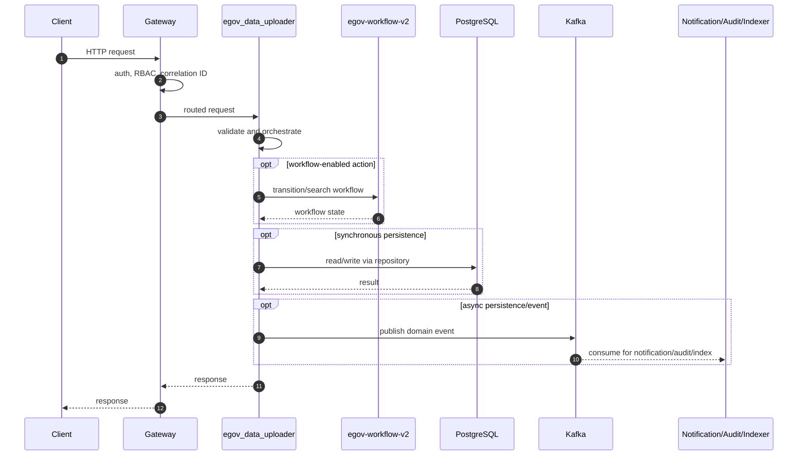
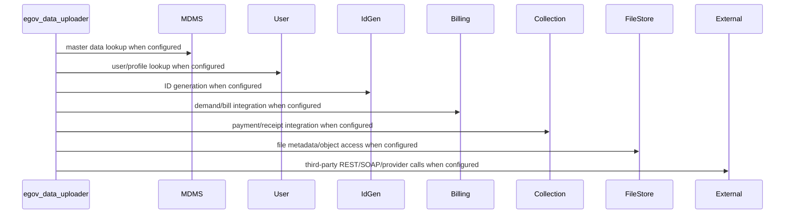

# egov-data-uploader

> Generated from repository path `core-services/egov-data-uploader`. This page documents detected runtime configuration and source-code structure. Validate deployment-specific values against the environment/Helm chart used outside this repository.

## Purpose

Bulk data upload job service.

## Responsibilities

- Own the `egov-data-uploader` business or platform capability within the UPYOG ecosystem.
- Expose synchronous APIs when controllers are present and publish/consume asynchronous events when Kafka configuration is present.
- Persist service-owned state through PostgreSQL/Flyway or delegate persistence through `egov-persister` YAML mappings.
- Integrate with common platform services such as gateway, user, MDMS, workflow, ID generation, localization, billing, collection, notification, audit, indexer, and searcher as configured.

## Features

- Stack: **Java/Spring Boot**
- Java version: **17**
- Spring Boot version: **3.2.2**
- HTTP port: **8082**
- Servlet/context path: **/data-uploader**
- Detected controllers/API mappings: **4**
- Detected migrations: **6**
- Detected tests: **9** files

## Packages

| Package area | Files | Role |
| --- | --- | --- |
| constants | 3 source file(s) | Package area detected from source tree. |
| consumer | 2 source file(s) | Kafka/event consumers. |
| controller | 1 source file(s) | HTTP endpoints and request/response orchestration. |
| egov | 2 source file(s) | Package area detected from source tree. |
| model | 47 source file(s) | Request, response, DTO, and domain models. |
| producer | 1 source file(s) | Kafka/event producers. |
| property | 1 source file(s) | Package area detected from source tree. |
| repository | 4 source file(s) | Database or remote-service data access. |
| service | 5 source file(s) | Business orchestration and domain logic. |
| util | 2 source file(s) | Reusable helpers and cross-cutting functions. |

## Folder Structure

- `core-services/egov-data-uploader`: service root.
- `src/main/java`: Java source, package areas listed above when present.
- `src/main/resources`: application configuration, Flyway migrations, persister/indexer/searcher YAML, message resources.
- `src/test`: automated tests when present.
- `migration` or `db/migration`: Node/legacy SQL migrations when present.
- Dockerfiles are listed in the Deployment section.

## Entry Points

- `core-services/egov-data-uploader/src/main/java/org/egov/DataUploadApplication.java`

## APIs

| Method | Endpoint | Controller | Input | Output | Authentication | Exceptions |
| --- | --- | --- | --- | --- | --- | --- |
| POST | /v1/jobs/_create | DataUploadController.java | Request body follows service model/Swagger contract; validation is typically Bean Validation plus service validators. | Response follows DIGIT ResponseInfo pattern or service-specific model. | Gateway-authenticated unless listed in gateway open/mixed whitelist or explicitly anonymous. | Controller/service/repository/custom validation exceptions propagate through tracer/global handlers. |
| POST | /v1/upload-definitions/_search | DataUploadController.java | Request body follows service model/Swagger contract; validation is typically Bean Validation plus service validators. | Response follows DIGIT ResponseInfo pattern or service-specific model. | Gateway-authenticated unless listed in gateway open/mixed whitelist or explicitly anonymous. | Controller/service/repository/custom validation exceptions propagate through tracer/global handlers. |
| POST | /v1/jobs/_search | DataUploadController.java | Request body follows service model/Swagger contract; validation is typically Bean Validation plus service validators. | Response follows DIGIT ResponseInfo pattern or service-specific model. | Gateway-authenticated unless listed in gateway open/mixed whitelist or explicitly anonymous. | Controller/service/repository/custom validation exceptions propagate through tracer/global handlers. |
| POST | /v1/upload-definitions/_test | DataUploadController.java | Request body follows service model/Swagger contract; validation is typically Bean Validation plus service validators. | Response follows DIGIT ResponseInfo pattern or service-specific model. | Gateway-authenticated unless listed in gateway open/mixed whitelist or explicitly anonymous. | Controller/service/repository/custom validation exceptions propagate through tracer/global handlers. |

### API conventions

- Most backend services use DIGIT-style POST endpoints ending in `/_create`, `/_search`, `/_update`, `/_delete`, `/_count`, or `/_plainsearch`.
- Request payloads normally include `RequestInfo`; responses normally include `ResponseInfo` and one or more domain payload arrays/objects.
- Authentication is generally enforced at the gateway. Service-level security varies by service and must be checked before exposing routes directly.

## Business Flow

1. Client or another service reaches this service through Zuul/Spring Cloud Gateway or an internal cluster URL.
2. Gateway validates token state, enriches request headers such as user/correlation information, and performs RBAC checks where configured.
3. Controller validates the request and calls service-layer orchestration.
4. Service layer loads MDMS/configuration, performs domain validation, calls workflow/billing/idgen/user/location/localization/file-store integrations as required, and writes through repositories or Kafka topics.
5. Persistence events are consumed by `egov-persister`; indexing events are consumed by `egov-indexer`; notification events go to SMS/mail/user-event services.
6. The service returns a DIGIT-style response or publishes an asynchronous completion event.

## Database

- **Tables detected from migrations:** EGDU_UPLOADREGISTRY
- **Migration files:** 6
- **Repositories/JDBC classes:** 2
- **Entity/table-mapped classes:** 0

### Migration locations

- `core-services/egov-data-uploader/src/main/resources/db/migration`
- `core-services/egov-data-uploader/src/main/resources/db/migration/ddl`
- `core-services/egov-data-uploader/src/main/resources/db/migration/main`
- `core-services/egov-data-uploader/src/main/resources/db/migration/seed`

### Repository locations

- `core-services/egov-data-uploader/src/main/java/org/egov/dataupload/repository/DataUploadRepository.java`
- `core-services/egov-data-uploader/src/main/java/org/egov/dataupload/repository/UploadRegistryRepository.java`

### Entity mapping locations

- Not present in this repository or not detected.

## Kafka

| Kafka/property | Topic or value |
| --- | --- |
| egov.uploadJob.update.topic | update-upload-jobs |
| egov.uploadJob.save.topic | save-upload-jobs |
| kafka.topics.dataupload | infra.data.upload |
| kafka.topics.dataupload.key | <secret-value> |
| spring.kafka.bootstrap.servers | localhost:9092 |
| spring.kafka.consumer.value-deserializer | org.egov.dataupload.consumer.HashMapDeserializer |
| spring.kafka.consumer.key-deserializer | <secret-value> |
| spring.kafka.consumer.group-id | data-upload |
| kafka.producer.config.retries_config | 0 |
| kafka.producer.config.batch_size_config | 16384 |
| kafka.producer.config.linger_ms_config | 1 |
| kafka.producer.config.buffer_memory_config | 33554432 |
| spring.kafka.producer.key-serializer | <secret-value> |
| spring.kafka.producer.value-serializer | org.springframework.kafka.support.serializer.JsonSerializer |
| core-services/egov-data-uploader/src/main/resources/config/uploader-persister.yml topic | save-upload-jobs |
| core-services/egov-data-uploader/src/main/resources/config/uploader-persister.yml topic | update-upload-jobs |

### Producers

- `core-services/egov-data-uploader/src/main/java/org/egov/dataupload/producer/DataUploadProducer.java`

### Consumers

- `core-services/egov-data-uploader/src/main/java/org/egov/dataupload/consumer/DataUploadConsumer.java`
- `core-services/egov-data-uploader/src/main/java/org/egov/dataupload/model/ConsumerRequest.java`

### Retry and dead-letter handling

- Standard services rely on Spring Kafka retry/container settings or the platform `tracer` library.
- `egov-persister` has an explicit dead-letter pattern (`egov-persister-deadletter`). Service-specific DLQ topics should be configured in deployment properties if required.

## Redis

- No explicit Redis configuration detected.

Cache strategy, TTLs, and key naming are normally configured in code/properties. When Redis is absent above, the service does not advertise a direct Redis dependency in its checked-in config.

## Workflow

No service-local workflow package was detected. The service may still participate indirectly through central workflow topics or gateway flows.

Typical workflow-enabled services use `WorkflowIntegrator` or call `/egov-wf/process/_transition` with tenant, business service, action, assignee, and audit information. States/actions/transitions are owned centrally by `egov-workflow-v2` business service definitions.

## External Integrations

| Config key | Endpoint/host |
| --- | --- |
| flyway.url | jdbc:postgresql://localhost:5432/dataupload |
| filestore.host | https://dev.digit.org |
| filestore.get.endpoint | /filestore/v1/files/id |
| filestore.post.endpoint | /filestore/v1/files |
| business.module.host | http://localhost:9999 |
| property.host | https://dev.digit.org/ |

## Security

- Authentication is primarily gateway-mediated using OAuth/JWT/opaque-token flows and `x-user-info` request enrichment.
- Authorization uses RBAC metadata from `egov-accesscontrol`; endpoint whitelists exist in `zuul`/`gateway` properties.
- Validate whether this service has local security configuration before direct exposure; several services assume gateway isolation.
- Sensitive properties must be supplied through Kubernetes secrets or external config, not committed literal values.

## Configuration

- `core-services/egov-data-uploader/src/main/resources/application.properties`

### Key properties

| Property | Value / meaning |
| --- | --- |
| spring.datasource.driver-class-name | org.postgresql.Driver |
| spring.datasource.url | jdbc:postgresql://localhost:5432/dataupload |
| spring.datasource.username | postgres |
| spring.datasource.password | <secret-value> |
| server.contextPath | /data-uploader |
| server.port | 8082 |
| flyway.user | postgres |
| flyway.password | <secret-value> |
| flyway.outOfOrder | true |
| flyway.table | data_upload_schema |
| flyway.baseline-on-migrate | true |
| flyway.url | jdbc:postgresql://localhost:5432/dataupload |
| flyway.locations | db/migration/ddl,db/migration/main,db/migration/seed |
| filestore.host | https://dev.digit.org |
| filestore.get.endpoint | /filestore/v1/files/id |
| filestore.post.endpoint | /filestore/v1/files |
| business.module.host | http://localhost:9999 |
| egov.uploadJob.update.topic | update-upload-jobs |
| egov.uploadJob.save.topic | save-upload-jobs |
| response.file.name.prefix | Response- |
| uploadjob.update.progress.size | 10 |
| kafka.topics.dataupload | infra.data.upload |
| kafka.topics.dataupload.key | <secret-value> |
| logging.pattern.console | %clr(%X{CORRELATION_ID:-}) %clr(%d{yyyy-MM-dd HH:mm:ss.SSS}){faint} %clr(${LOG_LEVEL_PATTERN:-%5p}) %clr(${PID:- }){m... |
| upload.json.path | https://raw.githubusercontent.com/egovernments/egov-services/master/core/egov-data-uploader/src/main/resources/proper... |
| internal.file.folder.path | D:\\propertyuploader |
| template.download.prefix | https://raw.githubusercontent.com/egovernments/egov-services/master/core/egov-data-uploader/src/main/resources/upload... |
| property.module.name | property-upload |
| property.host | https://dev.digit.org/ |
| property.create | pt-services-v2/property/_create |
| spring.kafka.bootstrap.servers | localhost:9092 |
| spring.kafka.consumer.value-deserializer | org.egov.dataupload.consumer.HashMapDeserializer |
| spring.kafka.consumer.key-deserializer | org.apache.kafka.common.serialization.StringDeserializer |
| spring.kafka.consumer.group-id | data-upload |
| kafka.producer.config.retries_config | 0 |

## Logging

- Platform services use Spring logging plus `tracer` for correlation IDs and structured exception responses.
- Gateway filters are responsible for request correlation; services should propagate correlation/user headers downstream.
- Audit events are emitted to Kafka/audit-service where configured.

## Exception Handling

- Common pattern: validation errors become `CustomException`/domain exceptions and are rendered by `tracer` or service-specific `GlobalExceptionHandler`.
- Controller-level `@Valid` handles Bean Validation for request models where annotations exist.
- Kafka consumers should be monitored for poison messages and retry loops.

## Testing

- Test files detected: **9**.
- Unit tests typically cover validators, services, query builders, and controllers.
- Integration tests require PostgreSQL, Kafka, Redis, and dependent services or mocks.

## Deployment

- `core-services/egov-data-uploader/src/main/resources/db/Dockerfile`

- Most Java services are built as executable JAR containers using Maven and the shared `core-services/build/maven/Dockerfile` pattern.
- Database migrations are packaged separately where `src/main/resources/db/Dockerfile` exists and run Flyway with `DB_URL`, `FLYWAY_USER`, `FLYWAY_PASSWORD`, `FLYWAY_LOCATIONS`, and `SCHEMA_TABLE`.
- Kubernetes/Helm manifests are not checked into this repository; deployment values are managed externally.

## Monitoring

- Health endpoints are usually Spring Actuator-backed, frequently exposed at `/health` because many services set `management.endpoints.web.base-path=/`.
- Gateway has additional OpenTelemetry/Jaeger-related configuration.
- Production deployments should scrape actuator/Prometheus endpoints, Kafka consumer lag, DB pool metrics, and JVM metrics.

## Performance

- Primary bottlenecks are database query complexity, Kafka consumer lag, synchronous inter-service calls, external provider latency, and JVM heap limits.
- Prefer indexed search columns, bounded page sizes, connection pool sizing, Redis for hot reference data, and async publication for slow side effects.
- Check thread pools and Kafka concurrency for write-heavy services.

## Common Problems

- Missing dependent service host property or DNS entry.
- Flyway migration order/table mismatch.
- Kafka topic not created or wrong consumer group.
- Gateway whitelist/RBAC misconfiguration.
- Redis/PostgreSQL connectivity issues.
- Java 17 services run with Java 8 images or legacy Java 8 services run with Java 17 images.

## Improvement Suggestions

- Add/refresh OpenAPI contracts for controllers that lack contract YAML.
- Add integration tests around workflow, billing, collection, and persister events.
- Externalize all secrets and remove defaults from deployment overlays.
- Standardize health, metrics, logging, and correlation-ID propagation.
- Normalize package names and remove duplicate/legacy code where the service has modern equivalents.
