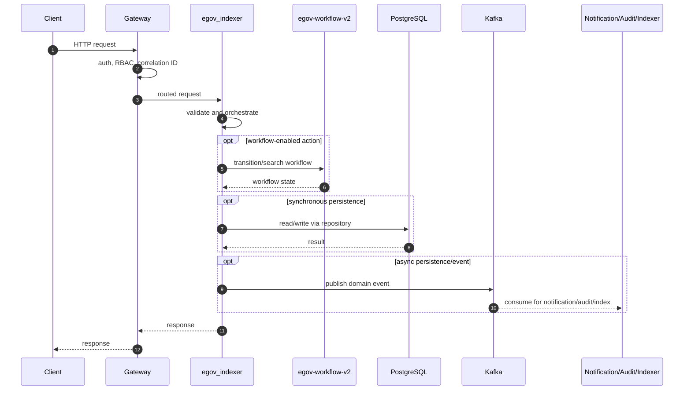
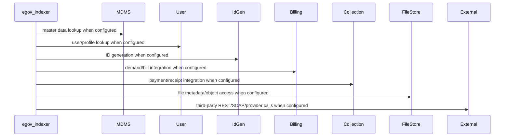

# egov-indexer

> Generated from repository path `core-services/egov-indexer`. This page documents detected runtime configuration and source-code structure. Validate deployment-specific values against the environment/Helm chart used outside this repository.

## Purpose

Kafka-to-Elasticsearch indexing engine driven by indexer YAML definitions.

## Responsibilities

- Own the `egov-indexer` business or platform capability within the UPYOG ecosystem.
- Expose synchronous APIs when controllers are present and publish/consume asynchronous events when Kafka configuration is present.
- Persist service-owned state through PostgreSQL/Flyway or delegate persistence through `egov-persister` YAML mappings.
- Integrate with common platform services such as gateway, user, MDMS, workflow, ID generation, localization, billing, collection, notification, audit, indexer, and searcher as configured.

## Features

- Stack: **Java/Spring Boot**
- Java version: **17**
- Spring Boot version: **service-specific**
- HTTP port: **8095**
- Servlet/context path: **/egov-indexer**
- Detected controllers/API mappings: **3**
- Detected migrations: **2**
- Detected tests: **0** files

## Packages

| Package area | Files | Role |
| --- | --- | --- |
| bpa | 11 source file(s) | Package area detected from source tree. |
| bulkindexer | 1 source file(s) | Package area detected from source tree. |
| config | 8 source file(s) | Spring beans, properties, and runtime configuration. |
| consumer | 6 source file(s) | Kafka/event consumers. |
| contract | 19 source file(s) | Package area detected from source tree. |
| controller | 1 source file(s) | HTTP endpoints and request/response orchestration. |
| egov | 2 source file(s) | Package area detected from source tree. |
| landinfo | 20 source file(s) | Package area detected from source tree. |
| model | 3 source file(s) | Request, response, DTO, and domain models. |
| pgr | 13 source file(s) | Package area detected from source tree. |
| producer | 1 source file(s) | Kafka/event producers. |
| pt | 18 source file(s) | Package area detected from source tree. |
| service | 4 source file(s) | Business orchestration and domain logic. |
| util | 3 source file(s) | Reusable helpers and cross-cutting functions. |
| validator | 1 source file(s) | Input and domain validation. |

## Folder Structure

- `core-services/egov-indexer`: service root.
- `src/main/java`: Java source, package areas listed above when present.
- `src/main/resources`: application configuration, Flyway migrations, persister/indexer/searcher YAML, message resources.
- `src/test`: automated tests when present.
- `migration` or `db/migration`: Node/legacy SQL migrations when present.
- Dockerfiles are listed in the Deployment section.

## Entry Points

- `core-services/egov-indexer/src/main/java/org/egov/IndexerInfraApplication.java`

## APIs

| Method | Endpoint | Controller | Input | Output | Authentication | Exceptions |
| --- | --- | --- | --- | --- | --- | --- |
| POST | /index-operations/{key}/_index | IndexerController.java | Request body follows service model/Swagger contract; validation is typically Bean Validation plus service validators. | Response follows DIGIT ResponseInfo pattern or service-specific model. | Gateway-authenticated unless listed in gateway open/mixed whitelist or explicitly anonymous. | Controller/service/repository/custom validation exceptions propagate through tracer/global handlers. |
| POST | /index-operations/_reindex | IndexerController.java | Request body follows service model/Swagger contract; validation is typically Bean Validation plus service validators. | Response follows DIGIT ResponseInfo pattern or service-specific model. | Gateway-authenticated unless listed in gateway open/mixed whitelist or explicitly anonymous. | Controller/service/repository/custom validation exceptions propagate through tracer/global handlers. |
| POST | /index-operations/_legacyindex | IndexerController.java | Request body follows service model/Swagger contract; validation is typically Bean Validation plus service validators. | Response follows DIGIT ResponseInfo pattern or service-specific model. | Gateway-authenticated unless listed in gateway open/mixed whitelist or explicitly anonymous. | Controller/service/repository/custom validation exceptions propagate through tracer/global handlers. |

### API conventions

- Most backend services use DIGIT-style POST endpoints ending in `/_create`, `/_search`, `/_update`, `/_delete`, `/_count`, or `/_plainsearch`.
- Request payloads normally include `RequestInfo`; responses normally include `ResponseInfo` and one or more domain payload arrays/objects.
- Authentication is generally enforced at the gateway. Service-level security varies by service and must be checked before exposing routes directly.

## Business Flow

1. Client or another service reaches this service through Zuul/Spring Cloud Gateway or an internal cluster URL.
2. Gateway validates token state, enriches request headers such as user/correlation information, and performs RBAC checks where configured.
3. Controller validates the request and calls service-layer orchestration.
4. Service layer loads MDMS/configuration, performs domain validation, calls workflow/billing/idgen/user/location/localization/file-store integrations as required, and writes through repositories or Kafka topics.
5. Persistence events are consumed by `egov-persister`; indexing events are consumed by `egov-indexer`; notification events go to SMS/mail/user-event services.
6. The service returns a DIGIT-style response or publishes an asynchronous completion event.

## Database

- **Tables detected from migrations:** eg_indexer_job
- **Migration files:** 2
- **Repositories/JDBC classes:** 0
- **Entity/table-mapped classes:** 0

### Migration locations

- `core-services/egov-indexer/src/main/resources/db/migration`
- `core-services/egov-indexer/src/main/resources/db/migration/main`

### Repository locations

- Not present in this repository or not detected.

### Entity mapping locations

- Not present in this repository or not detected.

## Kafka

| Kafka/property | Topic or value |
| --- | --- |
| spring.kafka.producer.key-serializer | <secret-value> |
| spring.kafka.producer.value-serializer | org.springframework.kafka.support.serializer.JsonSerializer |
| spring.kafka.listener.missing-topics-fatal | false |
| spring.kafka.bootstrap.servers | localhost:9092 |
| spring.kafka.consumer.group | egov-indexer-consumer-grp |
| spring.kafka.consumer.properties.spring.json.use.type.headers | false |
| indexer.reindex.consumer.group | egov-indexer-reindex-consumer-group |
| indexer.legacyindex.consumer.group | egov-indexer-legacyindex-consumer-group |
| indexer.pgr.customindex.consumer.group | egov-indexer-pgr-customindex-consumer-group |
| indexer.pt.customindex.consumer.group | egov-indexer-pt-customindex-consumer-group |
| egov.indexer.dss.collectionindex.topic | dss-collection-update |
| dss.collectionindex.topic.push.enabled | true |
| topic.push.enabled | true |
| egov.core.reindex.topic.name | egov.core.reindex |
| egov.core.legacyindex.topic.name | egov.core.legacyindex |
| egov.indexer.persister.create.topic | save-index-jobs |
| egov.indexer.persister.update.topic | update-index-jobs |
| egov.indexer.pgr.create.topic.name | save-pgr-index-service |
| egov.indexer.pgr.update.topic.name | update-pgr-index-service |
| egov.indexer.pgr.legacyindex.topic.name | pgr-service-legacyindex |
| pgr.create.topic.name | save-pgr-request |
| pgr.update.topic.name | update-pgr-request |
| pgr.legacy.topic.name | pgr-services-legacyIndex |
| pgr.batch.create.topic.name | save-pgr-request-batch |
| egov.indexer.pt.create.topic.name | save-pt-property |
| egov.indexer.pt.update.topic.name | update-pt-property |
| egov.indexer.pt.legacyindex.topic.name | pt-property-legacyindex |
| egov.indexer.bpa.create.topic.name | save-bpa-buildingplan |
| egov.indexer.bpa.update.topic.name | update-bpa-buildingplan |
| egov.indexer.bpa.update.workflow.topic.name | update-bpa-workflow |
| kafka.topics | save-service-db,update-service-db |
| core-services/egov-indexer/src/main/resources/config/persister.yml topic | save-index-jobs |
| core-services/egov-indexer/src/main/resources/config/persister.yml topic | update-index-jobs |

### Producers

- `core-services/egov-indexer/src/main/java/org/egov/infra/indexer/producer/IndexerProducer.java`

### Consumers

- `core-services/egov-indexer/src/main/java/org/egov/infra/indexer/consumer/config/BPACustomIndexConsumerConfig.java`
- `core-services/egov-indexer/src/main/java/org/egov/infra/indexer/consumer/config/CoreIndexConsumerConfig.java`
- `core-services/egov-indexer/src/main/java/org/egov/infra/indexer/consumer/config/LegacyIndexConsumerConfig.java`
- `core-services/egov-indexer/src/main/java/org/egov/infra/indexer/consumer/config/PGRCustomIndexConsumerConfig.java`
- `core-services/egov-indexer/src/main/java/org/egov/infra/indexer/consumer/config/PTCustomIndexConsumerConfig.java`
- `core-services/egov-indexer/src/main/java/org/egov/infra/indexer/consumer/config/ReindexConsumerConfig.java`

### Retry and dead-letter handling

- Standard services rely on Spring Kafka retry/container settings or the platform `tracer` library.
- `egov-persister` has an explicit dead-letter pattern (`egov-persister-deadletter`). Service-specific DLQ topics should be configured in deployment properties if required.

## Redis

- No explicit Redis configuration detected.

Cache strategy, TTLs, and key naming are normally configured in code/properties. When Redis is absent above, the service does not advertise a direct Redis dependency in its checked-in config.

## Workflow

Workflow integration is indicated by workflow packages/classes or egov-workflow-v2 host configuration.

Typical workflow-enabled services use `WorkflowIntegrator` or call `/egov-wf/process/_transition` with tenant, business service, action, assignee, and audit information. States/actions/transitions are owned centrally by `egov-workflow-v2` business service definitions.

## External Integrations

| Config key | Endpoint/host |
| --- | --- |
| egov.infra.indexer.host | https://dev.digit.org/elasticsearch/ |
| spring.flyway.url | jdbc:postgresql://localhost:5432/devdb |
| egov.indexer.es.host.name | 127.0.0.1 |
| egov.mdms.host | http://egov-mdms-service:8080/ |
| egov.mdms.search.endpoint | egov-mdms-service/v1/_search |
| egov.service.host | https://dev.digit.org/ |
| egov.pt.host | http://pt-services-v2:8080/ |
| egov.pt.search.endpoint | pt-services-v2/property/_search |
| egov.edcr.host | https://dev.digit.org/ |
| egov.edcr.getPlan.endpoint | edcr/rest/dcr/scrutinydetails |
| egov.bpa.host | https://dev.digit.org/ |
| egov.bpa.search.endpoint | bpa-services/v1/bpa/_search |

## Security

- Authentication is primarily gateway-mediated using OAuth/JWT/opaque-token flows and `x-user-info` request enrichment.
- Authorization uses RBAC metadata from `egov-accesscontrol`; endpoint whitelists exist in `zuul`/`gateway` properties.
- Validate whether this service has local security configuration before direct exposure; several services assume gateway isolation.
- Sensitive properties must be supplied through Kubernetes secrets or external config, not committed literal values.

## Configuration

- `core-services/egov-indexer/src/main/resources/application.properties`
- `core-services/egov-indexer/src/main/resources/application.yml`
- `core-services/egov-indexer/src/main/resources/billingservices-indexer.yml`
- `core-services/egov-indexer/src/main/resources/collection-indexer.yml`
- `core-services/egov-indexer/src/main/resources/egov-telemetry-indexer.yml`
- `core-services/egov-indexer/src/main/resources/egov-uploader-indexer.yml`
- `core-services/egov-indexer/src/main/resources/rainmaker-pgr-indexer.yml`
- `core-services/egov-indexer/src/main/resources/rainmaker-pt-indexer.yml`
- `core-services/egov-indexer/src/main/resources/rainmaker-tl-indexer.yml`

### Key properties

| Property | Value / meaning |
| --- | --- |
| server.port | 8095 |
| server.context-path | /egov-indexer |
| server.servlet.context-path | /egov-indexer |
| app.timezone | UTC |
| egov.infra.indexer.host | https://dev.digit.org/elasticsearch/ |
| egov.infra.indexer.name | egov-indexer/index |
| spring.datasource.driver-class-name | org.postgresql.Driver |
| spring.datasource.url | jdbc:postgresql://localhost:5432/devdb |
| spring.datasource.username | postgres |
| spring.datasource.password | <secret-value> |
| spring.flyway.url | jdbc:postgresql://localhost:5432/devdb |
| spring.flyway.user | postgres |
| spring.flyway.password | <secret-value> |
| spring.flyway.baseline-on-migrate | true |
| spring.flyway.outOfOrder | true |
| spring.flyway.locations | classpath:/db/migration/main |
| spring.flyway.enabled | true |
| spring.kafka.producer.key-serializer | org.apache.kafka.common.serialization.StringSerializer |
| spring.kafka.producer.value-serializer | org.springframework.kafka.support.serializer.JsonSerializer |
| spring.kafka.listener.missing-topics-fatal | false |
| spring.kafka.bootstrap.servers | localhost:9092 |
| spring.kafka.consumer.group | egov-indexer-consumer-grp |
| spring.kafka.consumer.properties.spring.json.use.type.headers | false |
| indexer.reindex.consumer.group | egov-indexer-reindex-consumer-group |
| indexer.legacyindex.consumer.group | egov-indexer-legacyindex-consumer-group |
| indexer.pgr.customindex.consumer.group | egov-indexer-pgr-customindex-consumer-group |
| indexer.pt.customindex.consumer.group | egov-indexer-pt-customindex-consumer-group |
| egov.indexer.dss.collectionindex.topic | dss-collection-update |
| dss.collectionindex.topic.push.enabled | true |
| topic.push.enabled | true |
| egov.core.reindex.topic.name | egov.core.reindex |
| egov.core.legacyindex.topic.name | egov.core.legacyindex |
| egov.indexer.persister.create.topic | save-index-jobs |
| egov.indexer.persister.update.topic | update-index-jobs |
| egov.indexer.pgr.create.topic.name | save-pgr-index-service |

## Logging

- Platform services use Spring logging plus `tracer` for correlation IDs and structured exception responses.
- Gateway filters are responsible for request correlation; services should propagate correlation/user headers downstream.
- Audit events are emitted to Kafka/audit-service where configured.

## Exception Handling

- Common pattern: validation errors become `CustomException`/domain exceptions and are rendered by `tracer` or service-specific `GlobalExceptionHandler`.
- Controller-level `@Valid` handles Bean Validation for request models where annotations exist.
- Kafka consumers should be monitored for poison messages and retry loops.

## Testing

- Test files detected: **0**.
- Unit tests typically cover validators, services, query builders, and controllers.
- Integration tests require PostgreSQL, Kafka, Redis, and dependent services or mocks.

## Deployment

- `core-services/egov-indexer/src/main/resources/db/Dockerfile`

- Most Java services are built as executable JAR containers using Maven and the shared `core-services/build/maven/Dockerfile` pattern.
- Database migrations are packaged separately where `src/main/resources/db/Dockerfile` exists and run Flyway with `DB_URL`, `FLYWAY_USER`, `FLYWAY_PASSWORD`, `FLYWAY_LOCATIONS`, and `SCHEMA_TABLE`.
- Kubernetes/Helm manifests are not checked into this repository; deployment values are managed externally.

## Monitoring

- Health endpoints are usually Spring Actuator-backed, frequently exposed at `/health` because many services set `management.endpoints.web.base-path=/`.
- Gateway has additional OpenTelemetry/Jaeger-related configuration.
- Production deployments should scrape actuator/Prometheus endpoints, Kafka consumer lag, DB pool metrics, and JVM metrics.

## Performance

- Primary bottlenecks are database query complexity, Kafka consumer lag, synchronous inter-service calls, external provider latency, and JVM heap limits.
- Prefer indexed search columns, bounded page sizes, connection pool sizing, Redis for hot reference data, and async publication for slow side effects.
- Check thread pools and Kafka concurrency for write-heavy services.

## Common Problems

- Missing dependent service host property or DNS entry.
- Flyway migration order/table mismatch.
- Kafka topic not created or wrong consumer group.
- Gateway whitelist/RBAC misconfiguration.
- Redis/PostgreSQL connectivity issues.
- Java 17 services run with Java 8 images or legacy Java 8 services run with Java 17 images.

## Improvement Suggestions

- Add/refresh OpenAPI contracts for controllers that lack contract YAML.
- Add integration tests around workflow, billing, collection, and persister events.
- Externalize all secrets and remove defaults from deployment overlays.
- Standardize health, metrics, logging, and correlation-ID propagation.
- Normalize package names and remove duplicate/legacy code where the service has modern equivalents.
