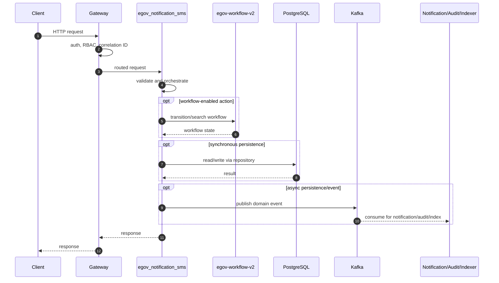
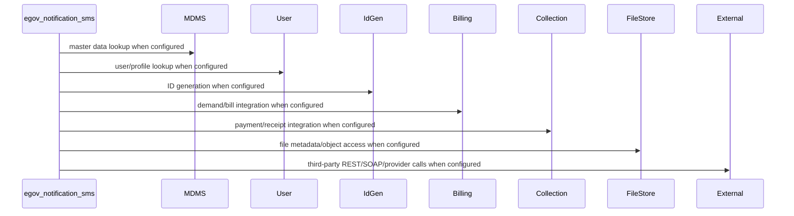

# egov-notification-sms

> Generated from repository path `core-services/egov-notification-sms`. This page documents detected runtime configuration and source-code structure. Validate deployment-specific values against the environment/Helm chart used outside this repository.

## Purpose

Kafka consumer for SMS notification delivery.

## Responsibilities

- Own the `egov-notification-sms` business or platform capability within the UPYOG ecosystem.
- Expose synchronous APIs when controllers are present and publish/consume asynchronous events when Kafka configuration is present.
- Persist service-owned state through PostgreSQL/Flyway or delegate persistence through `egov-persister` YAML mappings.
- Integrate with common platform services such as gateway, user, MDMS, workflow, ID generation, localization, billing, collection, notification, audit, indexer, and searcher as configured.

## Features

- Stack: **Java/Spring Boot**
- Java version: **17**
- Spring Boot version: **3.2.2**
- HTTP port: **8080**
- Servlet/context path: **/notification-sms**
- Detected controllers/API mappings: **2**
- Detected migrations: **0**
- Detected tests: **0** files

## Packages

| Package area | Files | Role |
| --- | --- | --- |
| config | 4 source file(s) | Spring beans, properties, and runtime configuration. |
| consumer | 2 source file(s) | Kafka/event consumers. |
| contract | 2 source file(s) | Package area detected from source tree. |
| controller | 2 source file(s) | HTTP endpoints and request/response orchestration. |
| impl | 4 source file(s) | Package area detected from source tree. |
| model | 4 source file(s) | Request, response, DTO, and domain models. |
| service | 3 source file(s) | Business orchestration and domain logic. |
| sms | 1 source file(s) | Package area detected from source tree. |

## Folder Structure

- `core-services/egov-notification-sms`: service root.
- `src/main/java`: Java source, package areas listed above when present.
- `src/main/resources`: application configuration, Flyway migrations, persister/indexer/searcher YAML, message resources.
- `src/test`: automated tests when present.
- `migration` or `db/migration`: Node/legacy SQL migrations when present.
- Dockerfiles are listed in the Deployment section.

## Entry Points

- `core-services/egov-notification-sms/src/main/java/org/egov/web/notification/sms/EgovNotificationSmsApplication.java`

## APIs

| Method | Endpoint | Controller | Input | Output | Authentication | Exceptions |
| --- | --- | --- | --- | --- | --- | --- |
| GET | /smsbounce/callback | CallbackAPI.java | Request body follows service model/Swagger contract; validation is typically Bean Validation plus service validators. | Response follows DIGIT ResponseInfo pattern or service-specific model. | Gateway-authenticated unless listed in gateway open/mixed whitelist or explicitly anonymous. | Controller/service/repository/custom validation exceptions propagate through tracer/global handlers. |
| GET | /otp | TestController.java | Request body follows service model/Swagger contract; validation is typically Bean Validation plus service validators. | Response follows DIGIT ResponseInfo pattern or service-specific model. | Gateway-authenticated unless listed in gateway open/mixed whitelist or explicitly anonymous. | Controller/service/repository/custom validation exceptions propagate through tracer/global handlers. |

### API conventions

- Most backend services use DIGIT-style POST endpoints ending in `/_create`, `/_search`, `/_update`, `/_delete`, `/_count`, or `/_plainsearch`.
- Request payloads normally include `RequestInfo`; responses normally include `ResponseInfo` and one or more domain payload arrays/objects.
- Authentication is generally enforced at the gateway. Service-level security varies by service and must be checked before exposing routes directly.

## Business Flow

1. Client or another service reaches this service through Zuul/Spring Cloud Gateway or an internal cluster URL.
2. Gateway validates token state, enriches request headers such as user/correlation information, and performs RBAC checks where configured.
3. Controller validates the request and calls service-layer orchestration.
4. Service layer loads MDMS/configuration, performs domain validation, calls workflow/billing/idgen/user/location/localization/file-store integrations as required, and writes through repositories or Kafka topics.
5. Persistence events are consumed by `egov-persister`; indexing events are consumed by `egov-indexer`; notification events go to SMS/mail/user-event services.
6. The service returns a DIGIT-style response or publishes an asynchronous completion event.

## Database

- **Tables detected from migrations:** None detected; persistence may be managed by another service, YAML, or legacy schema.
- **Migration files:** 0
- **Repositories/JDBC classes:** 0
- **Entity/table-mapped classes:** 0

### Migration locations

- Not present in this repository or not detected.

### Repository locations

- Not present in this repository or not detected.

### Entity mapping locations

- Not present in this repository or not detected.

## Kafka

| Kafka/property | Topic or value |
| --- | --- |
| spring.kafka.consumer.auto_commit | true |
| spring.kafka.consumer.auto_commit_interval | 100 |
| spring.kafka.consumer.session_timeout_ms_config | 15000 |
| spring.kafka.consumer.auto_offset_reset | earliest |
| tracer.kafkaMessageLoggingEnabled | true |
| tracer.errorsTopic | notification-sms-deadletter |
| spring.kafka.bootstrap-servers | localhost:9092 |
| spring.kafka.consumer.properties.spring.json.use.type.headers | false |
| kafka.topics.notification.sms.name | egov.core.notification.sms |
| kafka.topics.notification.sms.id | notification.sms |
| kafka.topics.notification.sms.group | sms-group1 |
| kafka.topics.sms.bounce | egov.core.notification.sms.bounce |
| kafka.topics.backup.sms |  |
| kafka.topics.expiry.sms | egov.core.sms.expiry |
| kafka.topics.error.sms | egov.core.sms.error |
| kafka.config.bootstrap_server_config | localhost:9092 |
| spring.kafka.consumer.group-id | sms |
| spring.kafka.consumer.key-deserializer | <secret-value> |
| spring.kafka.consumer.value-deserializer | org.springframework.kafka.support.serializer.ErrorHandlingDeserializer |
| spring.kafka.consumer.properties.spring.deserializer.value.delegate.class | org.egov.tracer.kafka.deserializer.HashMapDeserializer |
| spring.kafka.producer.key-serializer | <secret-value> |
| spring.kafka.producer.value-serializer | org.springframework.kafka.support.serializer.JsonSerializer |
| spring.kafka.consumer.properties.spring.json.trusted.packages | org.egov |
| spring.kafka.consumer.properties.spring.json.type.mapping | smsRequest:org.egov.web.notification.sms.consumer.contract.SMSRequest |
| spring.kafka.listener.missing-topics-fatal | false |

### Producers

- `core-services/egov-notification-sms/src/main/java/org/egov/web/notification/sms/config/Producer.java`
- `core-services/egov-notification-sms/src/main/java/org/egov/web/notification/sms/consumer/SmsNotificationListener.java`

### Consumers

- `core-services/egov-notification-sms/src/main/java/org/egov/web/notification/sms/config/ReportListener.java`
- `core-services/egov-notification-sms/src/main/java/org/egov/web/notification/sms/consumer/KafkaListenerLoggingAspect.java`
- `core-services/egov-notification-sms/src/main/java/org/egov/web/notification/sms/consumer/SmsNotificationListener.java`

### Retry and dead-letter handling

- Standard services rely on Spring Kafka retry/container settings or the platform `tracer` library.
- `egov-persister` has an explicit dead-letter pattern (`egov-persister-deadletter`). Service-specific DLQ topics should be configured in deployment properties if required.

## Redis

- No explicit Redis configuration detected.

Cache strategy, TTLs, and key naming are normally configured in code/properties. When Redis is absent above, the service does not advertise a direct Redis dependency in its checked-in config.

## Workflow

No service-local workflow package was detected. The service may still participate indirectly through central workflow topics or gateway flows.

Typical workflow-enabled services use `WorkflowIntegrator` or call `/egov-wf/process/_transition` with tenant, business service, action, assignee, and audit information. States/actions/transitions are owned centrally by `egov-workflow-v2` business service definitions.

## External Integrations

| Config key | Endpoint/host |
| --- | --- |
| sms.provider.url | https://smsgw.sms.gov.in/failsafe/MLink |
| sms.url.dont_encode_url | true |

## Security

- Authentication is primarily gateway-mediated using OAuth/JWT/opaque-token flows and `x-user-info` request enrichment.
- Authorization uses RBAC metadata from `egov-accesscontrol`; endpoint whitelists exist in `zuul`/`gateway` properties.
- Validate whether this service has local security configuration before direct exposure; several services assume gateway isolation.
- Sensitive properties must be supplied through Kubernetes secrets or external config, not committed literal values.

## Configuration

- `core-services/egov-notification-sms/src/main/resources/application.properties`

### Key properties

| Property | Value / meaning |
| --- | --- |
| server.servlet.context-path | /notification-sms |
| server.context.path | /notification-sms |
| server.port | 8080 |
| sms.provider.class | NIC |
| sms.provider.requestType | POST |
| sms.provider.url | https://smsgw.sms.gov.in/failsafe/MLink |
| sms.provider.contentType | application/json |
| sms.provider.username | iupyo.sms |
| sms.provider.password | <secret-value> |
| sms.verify.response | true |
| sms.print.response | true |
| sms.verify.responseContains | "success":true |
| sms.verify.ssl | true |
| sms.senderid | UPYOG |
| sms.mobile.prefix |  |
| sms.sender.secure.key | value |
| sms.blacklist.numbers | 9999X,5* |
| sms.whitelist.numbers |  |
| sms.success.codes | 200,201,202 |
| sms.error.codes |  |
| sms.verify.certificate | true |
| sms.msg.append | "" |
| sms.provider.entityid | 1201160648389652723 |
| sms.default.tmplid | 1 |
| sms.debug.msggateway | true |
| sms.enabled | true |
| sms.config.map | <secret-value> |
| sms.category.map | {'mtype': {'*': 'abc', 'OTP': 'def'}} |
| sms.extra.config.map | {'extraParam': 'abc'} |
| sms.url.dont_encode_url | true |
| spring.kafka.consumer.auto_commit | true |
| spring.kafka.consumer.auto_commit_interval | 100 |
| spring.kafka.consumer.session_timeout_ms_config | 15000 |
| spring.kafka.consumer.auto_offset_reset | earliest |
| tracer.kafkaMessageLoggingEnabled | true |

## Logging

- Platform services use Spring logging plus `tracer` for correlation IDs and structured exception responses.
- Gateway filters are responsible for request correlation; services should propagate correlation/user headers downstream.
- Audit events are emitted to Kafka/audit-service where configured.

## Exception Handling

- Common pattern: validation errors become `CustomException`/domain exceptions and are rendered by `tracer` or service-specific `GlobalExceptionHandler`.
- Controller-level `@Valid` handles Bean Validation for request models where annotations exist.
- Kafka consumers should be monitored for poison messages and retry loops.

## Testing

- Test files detected: **0**.
- Unit tests typically cover validators, services, query builders, and controllers.
- Integration tests require PostgreSQL, Kafka, Redis, and dependent services or mocks.

## Deployment

- Not present in this repository or not detected.

- Most Java services are built as executable JAR containers using Maven and the shared `core-services/build/maven/Dockerfile` pattern.
- Database migrations are packaged separately where `src/main/resources/db/Dockerfile` exists and run Flyway with `DB_URL`, `FLYWAY_USER`, `FLYWAY_PASSWORD`, `FLYWAY_LOCATIONS`, and `SCHEMA_TABLE`.
- Kubernetes/Helm manifests are not checked into this repository; deployment values are managed externally.

## Monitoring

- Health endpoints are usually Spring Actuator-backed, frequently exposed at `/health` because many services set `management.endpoints.web.base-path=/`.
- Gateway has additional OpenTelemetry/Jaeger-related configuration.
- Production deployments should scrape actuator/Prometheus endpoints, Kafka consumer lag, DB pool metrics, and JVM metrics.

## Performance

- Primary bottlenecks are database query complexity, Kafka consumer lag, synchronous inter-service calls, external provider latency, and JVM heap limits.
- Prefer indexed search columns, bounded page sizes, connection pool sizing, Redis for hot reference data, and async publication for slow side effects.
- Check thread pools and Kafka concurrency for write-heavy services.

## Common Problems

- Missing dependent service host property or DNS entry.
- Flyway migration order/table mismatch.
- Kafka topic not created or wrong consumer group.
- Gateway whitelist/RBAC misconfiguration.
- Redis/PostgreSQL connectivity issues.
- Java 17 services run with Java 8 images or legacy Java 8 services run with Java 17 images.

## Improvement Suggestions

- Add/refresh OpenAPI contracts for controllers that lack contract YAML.
- Add integration tests around workflow, billing, collection, and persister events.
- Externalize all secrets and remove defaults from deployment overlays.
- Standardize health, metrics, logging, and correlation-ID propagation.
- Normalize package names and remove duplicate/legacy code where the service has modern equivalents.
