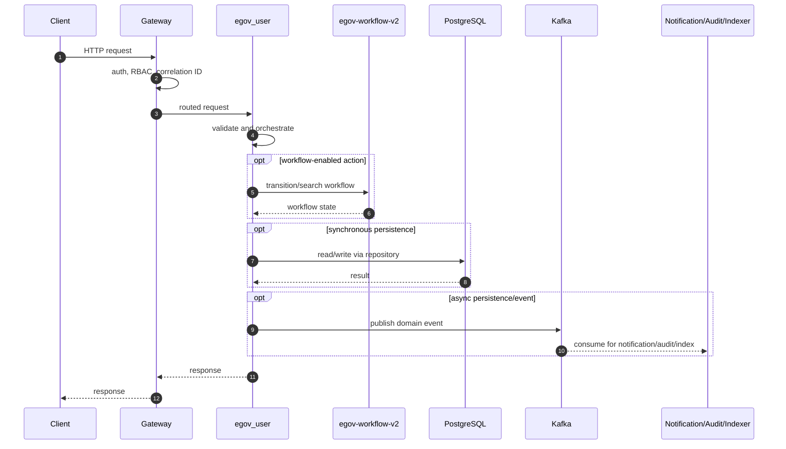
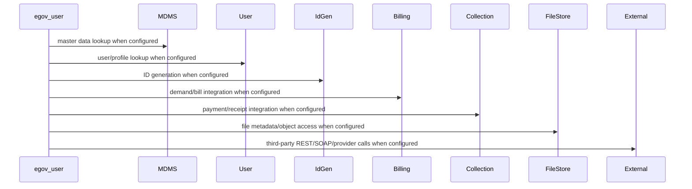

# egov-user

> Generated from repository path `core-services/egov-user`. This page documents detected runtime configuration and source-code structure. Validate deployment-specific values against the environment/Helm chart used outside this repository.

## Purpose

User, citizen, employee, OAuth token, profile, and password management service.

## Responsibilities

- Own the `egov-user` business or platform capability within the UPYOG ecosystem.
- Expose synchronous APIs when controllers are present and publish/consume asynchronous events when Kafka configuration is present.
- Persist service-owned state through PostgreSQL/Flyway or delegate persistence through `egov-persister` YAML mappings.
- Integrate with common platform services such as gateway, user, MDMS, workflow, ID generation, localization, billing, collection, notification, audit, indexer, and searcher as configured.

## Features

- Stack: **Java/Spring Boot**
- Java version: **17**
- Spring Boot version: **service-specific**
- HTTP port: **8081**
- Servlet/context path: **/user**
- Detected controllers/API mappings: **20**
- Detected migrations: **107**
- Detected tests: **88** files

## Packages

| Package area | Files | Role |
| --- | --- | --- |
| auth | 4 source file(s) | Package area detected from source tree. |
| authproviders | 2 source file(s) | Package area detected from source tree. |
| builder | 3 source file(s) | Package area detected from source tree. |
| config | 3 source file(s) | Spring beans, properties, and runtime configuration. |
| contract | 20 source file(s) | Package area detected from source tree. |
| controller | 5 source file(s) | HTTP endpoints and request/response orchestration. |
| custom | 4 source file(s) | Package area detected from source tree. |
| dto | 7 source file(s) | Package area detected from source tree. |
| enums | 5 source file(s) | Package area detected from source tree. |
| errorhandlers | 3 source file(s) | Package area detected from source tree. |
| errors | 19 source file(s) | Package area detected from source tree. |
| exception | 19 source file(s) | Custom exceptions and handlers. |
| factory | 1 source file(s) | Package area detected from source tree. |
| mapper | 8 source file(s) | DTO/entity conversion. |
| model | 19 source file(s) | Request, response, DTO, and domain models. |
| repository | 7 source file(s) | Database or remote-service data access. |
| security | 4 source file(s) | Authentication, authorization, filters, and token handling. |
| service | 4 source file(s) | Business orchestration and domain logic. |
| user | 1 source file(s) | Package area detected from source tree. |
| util | 4 source file(s) | Reusable helpers and cross-cutting functions. |

## Folder Structure

- `core-services/egov-user`: service root.
- `src/main/java`: Java source, package areas listed above when present.
- `src/main/resources`: application configuration, Flyway migrations, persister/indexer/searcher YAML, message resources.
- `src/test`: automated tests when present.
- `migration` or `db/migration`: Node/legacy SQL migrations when present.
- Dockerfiles are listed in the Deployment section.

## Entry Points

- `core-services/egov-user/src/main/java/org/egov/user/EgovUserApplication.java`

## APIs

| Method | Endpoint | Controller | Input | Output | Authentication | Exceptions |
| --- | --- | --- | --- | --- | --- | --- |
| POST | /oauth/token | CustomAuthenticationController.java | Request body follows service model/Swagger contract; validation is typically Bean Validation plus service validators. | Response follows DIGIT ResponseInfo pattern or service-specific model. | Gateway-authenticated unless listed in gateway open/mixed whitelist or explicitly anonymous. | Controller/service/repository/custom validation exceptions propagate through tracer/global handlers. |
| POST | /oauth/introspect | CustomAuthenticationController.java | Request body follows service model/Swagger contract; validation is typically Bean Validation plus service validators. | Response follows DIGIT ResponseInfo pattern or service-specific model. | Gateway-authenticated unless listed in gateway open/mixed whitelist or explicitly anonymous. | Controller/service/repository/custom validation exceptions propagate through tracer/global handlers. |
| POST | /oauth/revoke | CustomAuthenticationController.java | Request body follows service model/Swagger contract; validation is typically Bean Validation plus service validators. | Response follows DIGIT ResponseInfo pattern or service-specific model. | Gateway-authenticated unless listed in gateway open/mixed whitelist or explicitly anonymous. | Controller/service/repository/custom validation exceptions propagate through tracer/global handlers. |
| POST | /_logout | LogoutController.java | Request body follows service model/Swagger contract; validation is typically Bean Validation plus service validators. | Response follows DIGIT ResponseInfo pattern or service-specific model. | Gateway-authenticated unless listed in gateway open/mixed whitelist or explicitly anonymous. | Controller/service/repository/custom validation exceptions propagate through tracer/global handlers. |
| POST | /password/_update | PasswordController.java | Request body follows service model/Swagger contract; validation is typically Bean Validation plus service validators. | Response follows DIGIT ResponseInfo pattern or service-specific model. | Gateway-authenticated unless listed in gateway open/mixed whitelist or explicitly anonymous. | Controller/service/repository/custom validation exceptions propagate through tracer/global handlers. |
| POST | /password/nologin/_update | PasswordController.java | Request body follows service model/Swagger contract; validation is typically Bean Validation plus service validators. | Response follows DIGIT ResponseInfo pattern or service-specific model. | Gateway-authenticated unless listed in gateway open/mixed whitelist or explicitly anonymous. | Controller/service/repository/custom validation exceptions propagate through tracer/global handlers. |
| POST | /citizen/_create | UserController.java | Request body follows service model/Swagger contract; validation is typically Bean Validation plus service validators. | Response follows DIGIT ResponseInfo pattern or service-specific model. | Gateway-authenticated unless listed in gateway open/mixed whitelist or explicitly anonymous. | Controller/service/repository/custom validation exceptions propagate through tracer/global handlers. |
| POST | /users/_createnovalidate | UserController.java | Request body follows service model/Swagger contract; validation is typically Bean Validation plus service validators. | Response follows DIGIT ResponseInfo pattern or service-specific model. | Gateway-authenticated unless listed in gateway open/mixed whitelist or explicitly anonymous. | Controller/service/repository/custom validation exceptions propagate through tracer/global handlers. |
| POST | /_search | UserController.java | Request body follows service model/Swagger contract; validation is typically Bean Validation plus service validators. | Response follows DIGIT ResponseInfo pattern or service-specific model. | Gateway-authenticated unless listed in gateway open/mixed whitelist or explicitly anonymous. | Controller/service/repository/custom validation exceptions propagate through tracer/global handlers. |
| POST | /v1/_search | UserController.java | Request body follows service model/Swagger contract; validation is typically Bean Validation plus service validators. | Response follows DIGIT ResponseInfo pattern or service-specific model. | Gateway-authenticated unless listed in gateway open/mixed whitelist or explicitly anonymous. | Controller/service/repository/custom validation exceptions propagate through tracer/global handlers. |
| POST | /_details | UserController.java | Request body follows service model/Swagger contract; validation is typically Bean Validation plus service validators. | Response follows DIGIT ResponseInfo pattern or service-specific model. | Gateway-authenticated unless listed in gateway open/mixed whitelist or explicitly anonymous. | Controller/service/repository/custom validation exceptions propagate through tracer/global handlers. |
| POST | /users/_updatenovalidate | UserController.java | Request body follows service model/Swagger contract; validation is typically Bean Validation plus service validators. | Response follows DIGIT ResponseInfo pattern or service-specific model. | Gateway-authenticated unless listed in gateway open/mixed whitelist or explicitly anonymous. | Controller/service/repository/custom validation exceptions propagate through tracer/global handlers. |
| POST | /profile/_update | UserController.java | Request body follows service model/Swagger contract; validation is typically Bean Validation plus service validators. | Response follows DIGIT ResponseInfo pattern or service-specific model. | Gateway-authenticated unless listed in gateway open/mixed whitelist or explicitly anonymous. | Controller/service/repository/custom validation exceptions propagate through tracer/global handlers. |
| POST | /digilocker/oauth/token | UserController.java | Request body follows service model/Swagger contract; validation is typically Bean Validation plus service validators. | Response follows DIGIT ResponseInfo pattern or service-specific model. | Gateway-authenticated unless listed in gateway open/mixed whitelist or explicitly anonymous. | Controller/service/repository/custom validation exceptions propagate through tracer/global handlers. |
| POST | /_createAddress | UserController.java | Request body follows service model/Swagger contract; validation is typically Bean Validation plus service validators. | Response follows DIGIT ResponseInfo pattern or service-specific model. | Gateway-authenticated unless listed in gateway open/mixed whitelist or explicitly anonymous. | Controller/service/repository/custom validation exceptions propagate through tracer/global handlers. |
| POST | /_getAddress | UserController.java | Request body follows service model/Swagger contract; validation is typically Bean Validation plus service validators. | Response follows DIGIT ResponseInfo pattern or service-specific model. | Gateway-authenticated unless listed in gateway open/mixed whitelist or explicitly anonymous. | Controller/service/repository/custom validation exceptions propagate through tracer/global handlers. |
| POST | /_updateAddress | UserController.java | Request body follows service model/Swagger contract; validation is typically Bean Validation plus service validators. | Response follows DIGIT ResponseInfo pattern or service-specific model. | Gateway-authenticated unless listed in gateway open/mixed whitelist or explicitly anonymous. | Controller/service/repository/custom validation exceptions propagate through tracer/global handlers. |
| POST | /users/v2/_create | UserController.java | Request body follows service model/Swagger contract; validation is typically Bean Validation plus service validators. | Response follows DIGIT ResponseInfo pattern or service-specific model. | Gateway-authenticated unless listed in gateway open/mixed whitelist or explicitly anonymous. | Controller/service/repository/custom validation exceptions propagate through tracer/global handlers. |
| POST | /users/v2/_update | UserController.java | Request body follows service model/Swagger contract; validation is typically Bean Validation plus service validators. | Response follows DIGIT ResponseInfo pattern or service-specific model. | Gateway-authenticated unless listed in gateway open/mixed whitelist or explicitly anonymous. | Controller/service/repository/custom validation exceptions propagate through tracer/global handlers. |
| POST | /users/v2/_search | UserController.java | Request body follows service model/Swagger contract; validation is typically Bean Validation plus service validators. | Response follows DIGIT ResponseInfo pattern or service-specific model. | Gateway-authenticated unless listed in gateway open/mixed whitelist or explicitly anonymous. | Controller/service/repository/custom validation exceptions propagate through tracer/global handlers. |

### API conventions

- Most backend services use DIGIT-style POST endpoints ending in `/_create`, `/_search`, `/_update`, `/_delete`, `/_count`, or `/_plainsearch`.
- Request payloads normally include `RequestInfo`; responses normally include `ResponseInfo` and one or more domain payload arrays/objects.
- Authentication is generally enforced at the gateway. Service-level security varies by service and must be checked before exposing routes directly.

## Business Flow

1. Client or another service reaches this service through Zuul/Spring Cloud Gateway or an internal cluster URL.
2. Gateway validates token state, enriches request headers such as user/correlation information, and performs RBAC checks where configured.
3. Controller validates the request and calls service-layer orchestration.
4. Service layer loads MDMS/configuration, performs domain validation, calls workflow/billing/idgen/user/location/localization/file-store integrations as required, and writes through repositories or Kafka topics.
5. Persistence events are consumed by `egov-persister`; indexing events are consumed by `egov-indexer`; notification events go to SMS/mail/user-event services.
6. The service returns a DIGIT-style response or publishes an asynchronous completion event.

## Database

- **Tables detected from migrations:** eg_address, eg_role, eg_user, eg_user_address, eg_user_audit_table, eg_user_login_failed_attempts, eg_userrole, eg_userrole_v1
- **Migration files:** 107
- **Repositories/JDBC classes:** 7
- **Entity/table-mapped classes:** 0

### Migration locations

- `core-services/egov-user/src/main/resources/db/migration`
- `core-services/egov-user/src/main/resources/db/migration/ddl`
- `core-services/egov-user/src/main/resources/db/migration/dev`
- `core-services/egov-user/src/main/resources/db/migration/qa`
- `core-services/egov-user/src/main/resources/db/migration/seed`
- `core-services/egov-user/src/main/resources/db/migration/test`

### Repository locations

- `core-services/egov-user/src/main/java/org/egov/user/persistence/repository/ActionRestRepository.java`
- `core-services/egov-user/src/main/java/org/egov/user/persistence/repository/AddressRepository.java`
- `core-services/egov-user/src/main/java/org/egov/user/persistence/repository/AuditRepository.java`
- `core-services/egov-user/src/main/java/org/egov/user/persistence/repository/FileStoreRepository.java`
- `core-services/egov-user/src/main/java/org/egov/user/persistence/repository/OtpRepository.java`
- `core-services/egov-user/src/main/java/org/egov/user/persistence/repository/RoleRepository.java`
- `core-services/egov-user/src/main/java/org/egov/user/persistence/repository/UserRepository.java`

### Entity mapping locations

- Not present in this repository or not detected.

## Kafka

| Kafka/property | Topic or value |
| --- | --- |
| tracer.errors.sendToKafka | false |
| kafka.topic.audit | audit_data |
| kafka.topics.notification.mail.name | egov.core.notification.email |
| kafka.topics.notification.sms.topic.name | egov.core.notification.sms |
| kafka.config.bootstrap_server_config | localhost:9092 |
| spring.kafka.producer.key-serializer | <secret-value> |
| spring.kafka.producer.value-serializer | org.springframework.kafka.support.serializer.JsonSerializer |
| spring.kafka.producer.retries | 10 |

### Producers

- `core-services/egov-user/src/main/java/org/egov/user/domain/service/utils/NotificationUtil.java`

### Consumers

- Not present in this repository or not detected.

### Retry and dead-letter handling

- Standard services rely on Spring Kafka retry/container settings or the platform `tracer` library.
- `egov-persister` has an explicit dead-letter pattern (`egov-persister-deadletter`). Service-specific DLQ topics should be configured in deployment properties if required.

## Redis

| Redis property | Value |
| --- | --- |
| spring.redis.host | localhost |
| spring.redis.port | 6379 |

Cache strategy, TTLs, and key naming are normally configured in code/properties. When Redis is absent above, the service does not advertise a direct Redis dependency in its checked-in config.

## Workflow

No service-local workflow package was detected. The service may still participate indirectly through central workflow topics or gateway flows.

Typical workflow-enabled services use `WorkflowIntegrator` or call `/egov-wf/process/_transition` with tenant, business service, action, assignee, and audit information. States/actions/transitions are owned centrally by `egov-workflow-v2` business service definitions.

## External Integrations

| Config key | Endpoint/host |
| --- | --- |
| spring.redis.host | localhost |
| flyway.url | jdbc:postgresql://localhost:5432/devdb |
| egov.otp.host | http://localhost:8089/ |
| egov.services.accesscontrol.host | https://upyog-sandbox.niua.org/ |
| egov.filestore.host | http://localhost:8083/ |
| mdms.host | http://localhost:8082/ |
| egov.user.host | http://egov-user.egov:8080/ |
| requester.service.host | https://dev.digit.org/ |
| requester.service.endpoint | requester-services-dx/digilocker/details |
| egov.enc.host | http://localhost:8083/ |
| egov.enc.encrypt.endpoint | egov-enc-service/crypto/v1/_encrypt |
| egov.enc.decrypt.endpoint | egov-enc-service/crypto/v1/_decrypt |
| egov.mdms.host | http://localhost:8082/ |
| egov.mdms.search.endpoint | egov-mdms-service/v1/_search |
| egov.localization.host | https://upyog-sandbox.niua.org/ |
| egov.localization.search.endpoint | localization/messages/v1/_search |

## Security

- Authentication is primarily gateway-mediated using OAuth/JWT/opaque-token flows and `x-user-info` request enrichment.
- Authorization uses RBAC metadata from `egov-accesscontrol`; endpoint whitelists exist in `zuul`/`gateway` properties.
- Validate whether this service has local security configuration before direct exposure; several services assume gateway isolation.
- Sensitive properties must be supplied through Kubernetes secrets or external config, not committed literal values.

## Configuration

- `core-services/egov-user/src/main/resources/application.properties`

### Key properties

| Property | Value / meaning |
| --- | --- |
| server.servlet.context-path | /user |
| server.port | 8081 |
| app.timezone | UTC |
| jwt.token.optimize-size | <secret-value> |
| oauth2.token.format | <secret-value> |
| spring.redis.host | localhost |
| spring.redis.port | 6379 |
| spring.datasource.driver-class-name | org.postgresql.Driver |
| spring.datasource.url | jdbc:postgresql://localhost:5432/upyog |
| spring.datasource.username | postgres |
| spring.datasource.password | <secret-value> |
| flyway.enabled | true |
| flyway.user | postgres |
| flyway.password | <secret-value> |
| flyway.outOfOrder | true |
| flyway.table | egov_user_schema_version |
| flyway.baseline-on-migrate | true |
| flyway.url | jdbc:postgresql://localhost:5432/devdb |
| flyway.locations | db/migration/ddl,db/migration/seed,db/migration/dev |
| flyway.out-of-order | true |
| flyway.ignore-missing-migrations | true |
| egov.user.search.default.size | 10 |
| egov.otp.host | http://localhost:8089/ |
| egov.services.otp.search_otp | otp/v1/_search |
| egov.services.otp.validate_otp | otp/v1/_validate |
| egov.services.accesscontrol.host | https://upyog-sandbox.niua.org/ |
| egov.services.accesscontrol.action_search | access/v1/actions/_search |
| egov.filestore.host | http://localhost:8083/ |
| egov.filestore.path | filestore/v1/files/url |
| mdms.roles.filter | [?(@.code IN [$code])] |
| mdms.roles.masterName | roles |
| mdms.roles.moduleName | ACCESSCONTROL-ROLES |
| mdms.host | http://localhost:8082/ |
| mdms.path | egov-mdms-service/v1/_search |
| citizen.login.password.otp.enabled | <secret-value> |

## Logging

- Platform services use Spring logging plus `tracer` for correlation IDs and structured exception responses.
- Gateway filters are responsible for request correlation; services should propagate correlation/user headers downstream.
- Audit events are emitted to Kafka/audit-service where configured.

## Exception Handling

- Common pattern: validation errors become `CustomException`/domain exceptions and are rendered by `tracer` or service-specific `GlobalExceptionHandler`.
- Controller-level `@Valid` handles Bean Validation for request models where annotations exist.
- Kafka consumers should be monitored for poison messages and retry loops.

## Testing

- Test files detected: **88**.
- Unit tests typically cover validators, services, query builders, and controllers.
- Integration tests require PostgreSQL, Kafka, Redis, and dependent services or mocks.

## Deployment

- `core-services/egov-user/src/main/resources/db/Dockerfile`

- Most Java services are built as executable JAR containers using Maven and the shared `core-services/build/maven/Dockerfile` pattern.
- Database migrations are packaged separately where `src/main/resources/db/Dockerfile` exists and run Flyway with `DB_URL`, `FLYWAY_USER`, `FLYWAY_PASSWORD`, `FLYWAY_LOCATIONS`, and `SCHEMA_TABLE`.
- Kubernetes/Helm manifests are not checked into this repository; deployment values are managed externally.

## Monitoring

- Health endpoints are usually Spring Actuator-backed, frequently exposed at `/health` because many services set `management.endpoints.web.base-path=/`.
- Gateway has additional OpenTelemetry/Jaeger-related configuration.
- Production deployments should scrape actuator/Prometheus endpoints, Kafka consumer lag, DB pool metrics, and JVM metrics.

## Performance

- Primary bottlenecks are database query complexity, Kafka consumer lag, synchronous inter-service calls, external provider latency, and JVM heap limits.
- Prefer indexed search columns, bounded page sizes, connection pool sizing, Redis for hot reference data, and async publication for slow side effects.
- Check thread pools and Kafka concurrency for write-heavy services.

## Common Problems

- Missing dependent service host property or DNS entry.
- Flyway migration order/table mismatch.
- Kafka topic not created or wrong consumer group.
- Gateway whitelist/RBAC misconfiguration.
- Redis/PostgreSQL connectivity issues.
- Java 17 services run with Java 8 images or legacy Java 8 services run with Java 17 images.

## Improvement Suggestions

- Add/refresh OpenAPI contracts for controllers that lack contract YAML.
- Add integration tests around workflow, billing, collection, and persister events.
- Externalize all secrets and remove defaults from deployment overlays.
- Standardize health, metrics, logging, and correlation-ID propagation.
- Normalize package names and remove duplicate/legacy code where the service has modern equivalents.
