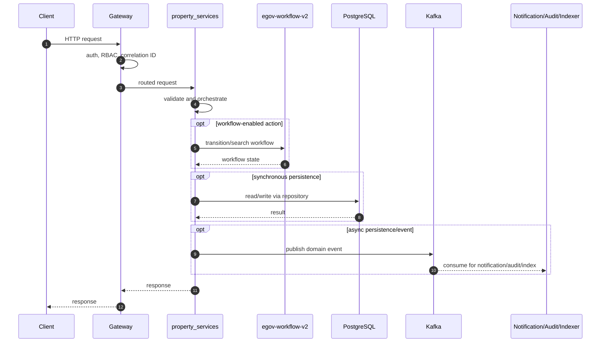
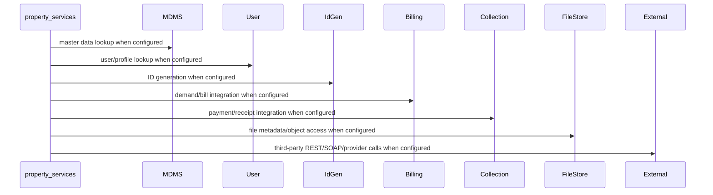

# property-services

> Generated from repository path `municipal-services/property-services`. This page documents detected runtime configuration and source-code structure. Validate deployment-specific values against the environment/Helm chart used outside this repository.

## Purpose

Property registry, assessment, and mutation service.

## Responsibilities

- Own the `property-services` business or platform capability within the UPYOG ecosystem.
- Expose synchronous APIs when controllers are present and publish/consume asynchronous events when Kafka configuration is present.
- Persist service-owned state through PostgreSQL/Flyway or delegate persistence through `egov-persister` YAML mappings.
- Integrate with common platform services such as gateway, user, MDMS, workflow, ID generation, localization, billing, collection, notification, audit, indexer, and searcher as configured.

## Features

- Stack: **Java/Spring Boot**
- Java version: **17**
- Spring Boot version: **3.2.2**
- HTTP port: **8280**
- Servlet/context path: **/property-services**
- Detected controllers/API mappings: **13**
- Detected migrations: **21**
- Detected tests: **4** files

## Packages

| Package area | Files | Role |
| --- | --- | --- |
| builder | 4 source file(s) | Package area detected from source tree. |
| collection | 7 source file(s) | Package area detected from source tree. |
| config | 1 source file(s) | Spring beans, properties, and runtime configuration. |
| consumer | 5 source file(s) | Kafka/event consumers. |
| contracts | 18 source file(s) | Package area detected from source tree. |
| controller | 2 source file(s) | HTTP endpoints and request/response orchestration. |
| enums | 9 source file(s) | Package area detected from source tree. |
| event | 8 source file(s) | Package area detected from source tree. |
| mapper | 9 source file(s) | DTO/entity conversion. |
| model | 18 source file(s) | Request, response, DTO, and domain models. |
| oldproperty | 35 source file(s) | Package area detected from source tree. |
| producer | 2 source file(s) | Kafka/event producers. |
| pt | 1 source file(s) | Package area detected from source tree. |
| repository | 5 source file(s) | Database or remote-service data access. |
| service | 19 source file(s) | Business orchestration and domain logic. |
| transaction | 4 source file(s) | Package area detected from source tree. |
| user | 4 source file(s) | Package area detected from source tree. |
| util | 10 source file(s) | Reusable helpers and cross-cutting functions. |
| validator | 3 source file(s) | Input and domain validation. |
| workflow | 7 source file(s) | Workflow transition/search integration and state handling. |

## Folder Structure

- `municipal-services/property-services`: service root.
- `src/main/java`: Java source, package areas listed above when present.
- `src/main/resources`: application configuration, Flyway migrations, persister/indexer/searcher YAML, message resources.
- `src/test`: automated tests when present.
- `migration` or `db/migration`: Node/legacy SQL migrations when present.
- Dockerfiles are listed in the Deployment section.

## Entry Points

- `municipal-services/property-services/src/main/java/org/egov/pt/PropertyApplication.java`

## APIs

| Method | Endpoint | Controller | Input | Output | Authentication | Exceptions |
| --- | --- | --- | --- | --- | --- | --- |
| POST | /assessment/_create | AssessmentController.java | Request body follows service model/Swagger contract; validation is typically Bean Validation plus service validators. | Response follows DIGIT ResponseInfo pattern or service-specific model. | Gateway-authenticated unless listed in gateway open/mixed whitelist or explicitly anonymous. | Controller/service/repository/custom validation exceptions propagate through tracer/global handlers. |
| POST | /assessment/_update | AssessmentController.java | Request body follows service model/Swagger contract; validation is typically Bean Validation plus service validators. | Response follows DIGIT ResponseInfo pattern or service-specific model. | Gateway-authenticated unless listed in gateway open/mixed whitelist or explicitly anonymous. | Controller/service/repository/custom validation exceptions propagate through tracer/global handlers. |
| POST | /assessment/_search | AssessmentController.java | Request body follows service model/Swagger contract; validation is typically Bean Validation plus service validators. | Response follows DIGIT ResponseInfo pattern or service-specific model. | Gateway-authenticated unless listed in gateway open/mixed whitelist or explicitly anonymous. | Controller/service/repository/custom validation exceptions propagate through tracer/global handlers. |
| POST | /assessment/_plainsearch | AssessmentController.java | Request body follows service model/Swagger contract; validation is typically Bean Validation plus service validators. | Response follows DIGIT ResponseInfo pattern or service-specific model. | Gateway-authenticated unless listed in gateway open/mixed whitelist or explicitly anonymous. | Controller/service/repository/custom validation exceptions propagate through tracer/global handlers. |
| POST | /property/_create | PropertyController.java | Request body follows service model/Swagger contract; validation is typically Bean Validation plus service validators. | Response follows DIGIT ResponseInfo pattern or service-specific model. | Gateway-authenticated unless listed in gateway open/mixed whitelist or explicitly anonymous. | Controller/service/repository/custom validation exceptions propagate through tracer/global handlers. |
| POST | /property/_update | PropertyController.java | Request body follows service model/Swagger contract; validation is typically Bean Validation plus service validators. | Response follows DIGIT ResponseInfo pattern or service-specific model. | Gateway-authenticated unless listed in gateway open/mixed whitelist or explicitly anonymous. | Controller/service/repository/custom validation exceptions propagate through tracer/global handlers. |
| POST | /property/_search | PropertyController.java | Request body follows service model/Swagger contract; validation is typically Bean Validation plus service validators. | Response follows DIGIT ResponseInfo pattern or service-specific model. | Gateway-authenticated unless listed in gateway open/mixed whitelist or explicitly anonymous. | Controller/service/repository/custom validation exceptions propagate through tracer/global handlers. |
| POST | /property/_migration | PropertyController.java | Request body follows service model/Swagger contract; validation is typically Bean Validation plus service validators. | Response follows DIGIT ResponseInfo pattern or service-specific model. | Gateway-authenticated unless listed in gateway open/mixed whitelist or explicitly anonymous. | Controller/service/repository/custom validation exceptions propagate through tracer/global handlers. |
| POST | /property/_plainsearch | PropertyController.java | Request body follows service model/Swagger contract; validation is typically Bean Validation plus service validators. | Response follows DIGIT ResponseInfo pattern or service-specific model. | Gateway-authenticated unless listed in gateway open/mixed whitelist or explicitly anonymous. | Controller/service/repository/custom validation exceptions propagate through tracer/global handlers. |
| POST | /property/_cancel | PropertyController.java | Request body follows service model/Swagger contract; validation is typically Bean Validation plus service validators. | Response follows DIGIT ResponseInfo pattern or service-specific model. | Gateway-authenticated unless listed in gateway open/mixed whitelist or explicitly anonymous. | Controller/service/repository/custom validation exceptions propagate through tracer/global handlers. |
| POST | /property/_addAlternateNumber | PropertyController.java | Request body follows service model/Swagger contract; validation is typically Bean Validation plus service validators. | Response follows DIGIT ResponseInfo pattern or service-specific model. | Gateway-authenticated unless listed in gateway open/mixed whitelist or explicitly anonymous. | Controller/service/repository/custom validation exceptions propagate through tracer/global handlers. |
| POST | /property/fuzzy/_search | PropertyController.java | Request body follows service model/Swagger contract; validation is typically Bean Validation plus service validators. | Response follows DIGIT ResponseInfo pattern or service-specific model. | Gateway-authenticated unless listed in gateway open/mixed whitelist or explicitly anonymous. | Controller/service/repository/custom validation exceptions propagate through tracer/global handlers. |
| POST | /property/_encryptOldData | PropertyController.java | Request body follows service model/Swagger contract; validation is typically Bean Validation plus service validators. | Response follows DIGIT ResponseInfo pattern or service-specific model. | Gateway-authenticated unless listed in gateway open/mixed whitelist or explicitly anonymous. | Controller/service/repository/custom validation exceptions propagate through tracer/global handlers. |

### API conventions

- Most backend services use DIGIT-style POST endpoints ending in `/_create`, `/_search`, `/_update`, `/_delete`, `/_count`, or `/_plainsearch`.
- Request payloads normally include `RequestInfo`; responses normally include `ResponseInfo` and one or more domain payload arrays/objects.
- Authentication is generally enforced at the gateway. Service-level security varies by service and must be checked before exposing routes directly.

## Business Flow

1. Client or another service reaches this service through Zuul/Spring Cloud Gateway or an internal cluster URL.
2. Gateway validates token state, enriches request headers such as user/correlation information, and performs RBAC checks where configured.
3. Controller validates the request and calls service-layer orchestration.
4. Service layer loads MDMS/configuration, performs domain validation, calls workflow/billing/idgen/user/location/localization/file-store integrations as required, and writes through repositories or Kafka topics.
5. Persistence events are consumed by `egov-persister`; indexing events are consumed by `egov-indexer`; notification events go to SMS/mail/user-event services.
6. The service returns a DIGIT-style response or publishes an asynchronous completion event.

## Database

- **Tables detected from migrations:** eg_pt_address, eg_pt_alternatenumbers, eg_pt_asmt_assessment, eg_pt_asmt_assessment_audit, eg_pt_asmt_document, eg_pt_asmt_unitusage, eg_pt_asmt_unitusage_audit, eg_pt_document, eg_pt_enc_audit, eg_pt_id_enc_audit, eg_pt_institution, eg_pt_owner, eg_pt_property, eg_pt_property_audit, eg_pt_property_migration, eg_pt_unit
- **Migration files:** 21
- **Repositories/JDBC classes:** 7
- **Entity/table-mapped classes:** 0

### Migration locations

- `municipal-services/property-services/src/main/resources/db/migration`
- `municipal-services/property-services/src/main/resources/db/migration/main`
- `municipal-services/property-services/src/main/resources/db/migration/seed`

### Repository locations

- `municipal-services/property-services/src/main/java/org/egov/pt/repository/AssessmentRepository.java`
- `municipal-services/property-services/src/main/java/org/egov/pt/repository/ElasticSearchRepository.java`
- `municipal-services/property-services/src/main/java/org/egov/pt/repository/IdGenRepository.java`
- `municipal-services/property-services/src/main/java/org/egov/pt/repository/PropertyRepository.java`
- `municipal-services/property-services/src/main/java/org/egov/pt/repository/ServiceRequestRepository.java`
- `municipal-services/property-services/src/main/java/org/egov/pt/service/MigrationService.java`
- `municipal-services/property-services/src/main/java/org/egov/pt/repository/builder/AssessmentQueryBuilder.java`

### Entity mapping locations

- Not present in this repository or not detected.

## Kafka

| Kafka/property | Topic or value |
| --- | --- |
| kafka.config.bootstrap_server_config | localhost:9092 |
| spring.kafka.consumer.value-deserializer | org.egov.tracer.kafka.deserializer.HashMapDeserializer |
| spring.kafka.consumer.key-deserializer | <secret-value> |
| spring.kafka.consumer.group-id | egov-location |
| spring.kafka.producer.key-serializer | <secret-value> |
| spring.kafka.producer.value-serializer | org.springframework.kafka.support.serializer.JsonSerializer |
| spring.kafka.consumer.properties.spring.json.use.type.headers | false |
| spring.kafka.listener.missing-topics-fatal | false |
| kafka.consumer.config.auto_commit | true |
| kafka.consumer.config.auto_commit_interval | 100 |
| kafka.consumer.config.session_timeout | 15000 |
| kafka.consumer.config.auto_offset_reset | earliest |
| kafka.producer.config.retries_config | 0 |
| kafka.producer.config.batch_size_config | 16384 |
| kafka.producer.config.linger_ms_config | 1 |
| kafka.producer.config.buffer_memory_config | 33554432 |
| persister.save.property.topic | save-property-registry |
| persister.update.property.topic | update-property-registry |
| persister.update.document.topic | update-property-doc-registry |
| persister.save.property.fuzzy.topic | save-property-fuzzy-data |
| persister.cancel.property.topic | cancel-property-registry |
| persister.cancel.property.assessment.topic | cancel-property-assessment |
| egov.pt.assessment.create.topic | save-pt-assessment |
| egov.pt.assessment.update.topic | update-pt-assessment |
| kafka.topics.receipt.create | egov.collection.payment-create |
| kafka.topics.receipt.create.pattern | ((^[a-zA-Z]+-)?egov.collection.payment-create) |
| persister.migration.batch.count.topic | migartion-batch-count |
| kafka.topics.notification.sms | egov.core.notification.sms |
| kafka.topics.notification.email | egov.core.notification.email |
| kafka.topics.notification.fullpayment | egov.collection.receipt-create |
| kafka.topics.notification.pg.save.txns | update-pg-txns |
| egov.usr.events.create.topic | persist-user-events-async |
| kafka.topics.filestore | PDF_GEN_CREATE |
| property.oldDataEncryptionStatus.topic | pt-enc-audit |
| persister.update.property.oldData.topic | update-property-encryption |
| persister.update.property.audit.oldData.topic | update-property-audit-enc |
| pt.kafka.notification.topic.pattern | ((^[a-zA-Z]+-)?save-pt-assessment\|(^[a-zA-Z]+-)?update-pt-assessment\|(^[a-zA-Z]+-)?save-property-registry\|(^[a-zA-Z]+-)?update-property-registry) |
| municipal-services/property-services/src/main/resources/assessment-persister.yml topic | save-pt-assessment |
| municipal-services/property-services/src/main/resources/assessment-persister.yml topic | update-pt-assessment |
| municipal-services/property-services/src/main/resources/assessment-persister.yml topic | save-pt-assessment |

### Producers

- `municipal-services/property-services/src/main/java/org/egov/pt/producer/PropertyProducer.java`
- `municipal-services/property-services/src/main/java/org/egov/pt/producer/SenderConfig.java`

### Consumers

- `municipal-services/property-services/src/main/java/org/egov/pt/consumer/FileStoreConsumer.java`
- `municipal-services/property-services/src/main/java/org/egov/pt/consumer/NotificationConsumer.java`
- `municipal-services/property-services/src/main/java/org/egov/pt/consumer/ReceiptConsumer.java`
- `municipal-services/property-services/src/main/java/org/egov/pt/consumer/ReceiptConsumerSaveTax.java`

### Retry and dead-letter handling

- Standard services rely on Spring Kafka retry/container settings or the platform `tracer` library.
- `egov-persister` has an explicit dead-letter pattern (`egov-persister-deadletter`). Service-specific DLQ topics should be configured in deployment properties if required.

## Redis

- No explicit Redis configuration detected.

Cache strategy, TTLs, and key naming are normally configured in code/properties. When Redis is absent above, the service does not advertise a direct Redis dependency in its checked-in config.

## Workflow

Workflow integration is indicated by workflow packages/classes or egov-workflow-v2 host configuration.

Typical workflow-enabled services use `WorkflowIntegrator` or call `/egov-wf/process/_transition` with tenant, business service, action, assignee, and audit information. States/actions/transitions are owned centrally by `egov-workflow-v2` business service definitions.

## External Integrations

| Config key | Endpoint/host |
| --- | --- |
| spring.flyway.url | jdbc:postgresql://localhost:5432/postgres |
| egov.idgen.host | https://stateb.digit.org/ |
| workflow.host | http://egov-workflow-v2:8080/ |
| egov.user.host | http://localhost:8084/ |
| egov.location.host | https://stateb.digit.org/ |
| egov.location.endpoint | boundarys/_search |
| egov.calculation.host | http://pt-calculator-v2:8080/ |
| egov.calculation.endpoint | _calculate |
| egov.calculation.mutation.endpoint | mutation/_calculate |
| egov.localization.host | https://stateb.digit.org/ |
| egov.localization.search.endpoint | _search |
| mdms.v2.host | http://localhost:8084/ |
| mdms.v2.search.endpoint | mdms-v2/v1/_search |
| egov.enc.host | http://egov-enc-service:8080/ |
| egov.enc.encrypt.endpoint | egov-enc-service/crypto/v1/_encrypt |
| egov.enc.decypt.endpoint | egov-enc-service/crypto/v1/_decrypt |
| egbs.host | http://billing-service:8080/ |
| egbs.fetchbill.endpoint | billing-service/bill/v2/_fetchbill |
| notification.url | https://dev.digit.org/citizen/property-tax |
| egov.ui.app.host.map | {"in":"https://central-instance.digit.org/","in.statea":"https://statea.digit.org/","pb":"https://qa.digit.org/"} |
| egov.url.shortner.host | http://egov-url-shortening:8080/ |
| egov.url.shortner.endpoint | eus/shortener |
| egov.pt-services-v2.host | https://dev.digit.org/ |
| elasticsearch.host | http://localhost:9200/ |
| elasticsearch.search.endpoint | _search |

## Security

- Authentication is primarily gateway-mediated using OAuth/JWT/opaque-token flows and `x-user-info` request enrichment.
- Authorization uses RBAC metadata from `egov-accesscontrol`; endpoint whitelists exist in `zuul`/`gateway` properties.
- Validate whether this service has local security configuration before direct exposure; several services assume gateway isolation.
- Sensitive properties must be supplied through Kubernetes secrets or external config, not committed literal values.

## Configuration

- `municipal-services/property-services/src/main/resources/application.properties`
- `municipal-services/property-services/src/main/resources/assessment-persister.yml`

### Key properties

| Property | Value / meaning |
| --- | --- |
| tracer.errors.provideExceptionInDetails | false |
| server.contextPath | /property-services |
| server.servlet.context-path | /property-services |
| server.port | 8280 |
| app.timezone | UTC |
| spring.datasource.driver-class-name | org.postgresql.Driver |
| spring.datasource.url | jdbc:postgresql://localhost:5432/postgres |
| spring.datasource.username | postgres |
| spring.datasource.password | <secret-value> |
| spring.flyway.url | jdbc:postgresql://localhost:5432/postgres |
| spring.flyway.user | postgres |
| spring.flyway.password | <secret-value> |
| spring.flyway.table | public |
| spring.flyway.baseline-on-migrate | true |
| spring.flyway.outOfOrder | true |
| spring.flyway.locations | classpath:db/migration/main |
| spring.flyway.enabled | false |
| kafka.config.bootstrap_server_config | localhost:9092 |
| spring.kafka.consumer.value-deserializer | org.egov.tracer.kafka.deserializer.HashMapDeserializer |
| spring.kafka.consumer.key-deserializer | org.apache.kafka.common.serialization.StringDeserializer |
| spring.kafka.consumer.group-id | egov-location |
| spring.kafka.producer.key-serializer | org.apache.kafka.common.serialization.StringSerializer |
| spring.kafka.producer.value-serializer | org.springframework.kafka.support.serializer.JsonSerializer |
| spring.kafka.consumer.properties.spring.json.use.type.headers | false |
| spring.kafka.listener.missing-topics-fatal | false |
| kafka.consumer.config.auto_commit | true |
| kafka.consumer.config.auto_commit_interval | 100 |
| kafka.consumer.config.session_timeout | 15000 |
| kafka.consumer.config.auto_offset_reset | earliest |
| kafka.producer.config.retries_config | 0 |
| kafka.producer.config.batch_size_config | 16384 |
| kafka.producer.config.linger_ms_config | 1 |
| kafka.producer.config.buffer_memory_config | 33554432 |
| persister.save.property.topic | save-property-registry |
| persister.update.property.topic | update-property-registry |

## Logging

- Platform services use Spring logging plus `tracer` for correlation IDs and structured exception responses.
- Gateway filters are responsible for request correlation; services should propagate correlation/user headers downstream.
- Audit events are emitted to Kafka/audit-service where configured.

## Exception Handling

- Common pattern: validation errors become `CustomException`/domain exceptions and are rendered by `tracer` or service-specific `GlobalExceptionHandler`.
- Controller-level `@Valid` handles Bean Validation for request models where annotations exist.
- Kafka consumers should be monitored for poison messages and retry loops.

## Testing

- Test files detected: **4**.
- Unit tests typically cover validators, services, query builders, and controllers.
- Integration tests require PostgreSQL, Kafka, Redis, and dependent services or mocks.

## Deployment

- `municipal-services/property-services/src/main/resources/db/Dockerfile`

- Most Java services are built as executable JAR containers using Maven and the shared `core-services/build/maven/Dockerfile` pattern.
- Database migrations are packaged separately where `src/main/resources/db/Dockerfile` exists and run Flyway with `DB_URL`, `FLYWAY_USER`, `FLYWAY_PASSWORD`, `FLYWAY_LOCATIONS`, and `SCHEMA_TABLE`.
- Kubernetes/Helm manifests are not checked into this repository; deployment values are managed externally.

## Monitoring

- Health endpoints are usually Spring Actuator-backed, frequently exposed at `/health` because many services set `management.endpoints.web.base-path=/`.
- Gateway has additional OpenTelemetry/Jaeger-related configuration.
- Production deployments should scrape actuator/Prometheus endpoints, Kafka consumer lag, DB pool metrics, and JVM metrics.

## Performance

- Primary bottlenecks are database query complexity, Kafka consumer lag, synchronous inter-service calls, external provider latency, and JVM heap limits.
- Prefer indexed search columns, bounded page sizes, connection pool sizing, Redis for hot reference data, and async publication for slow side effects.
- Check thread pools and Kafka concurrency for write-heavy services.

## Common Problems

- Missing dependent service host property or DNS entry.
- Flyway migration order/table mismatch.
- Kafka topic not created or wrong consumer group.
- Gateway whitelist/RBAC misconfiguration.
- Redis/PostgreSQL connectivity issues.
- Java 17 services run with Java 8 images or legacy Java 8 services run with Java 17 images.

## Improvement Suggestions

- Add/refresh OpenAPI contracts for controllers that lack contract YAML.
- Add integration tests around workflow, billing, collection, and persister events.
- Externalize all secrets and remove defaults from deployment overlays.
- Standardize health, metrics, logging, and correlation-ID propagation.
- Normalize package names and remove duplicate/legacy code where the service has modern equivalents.
