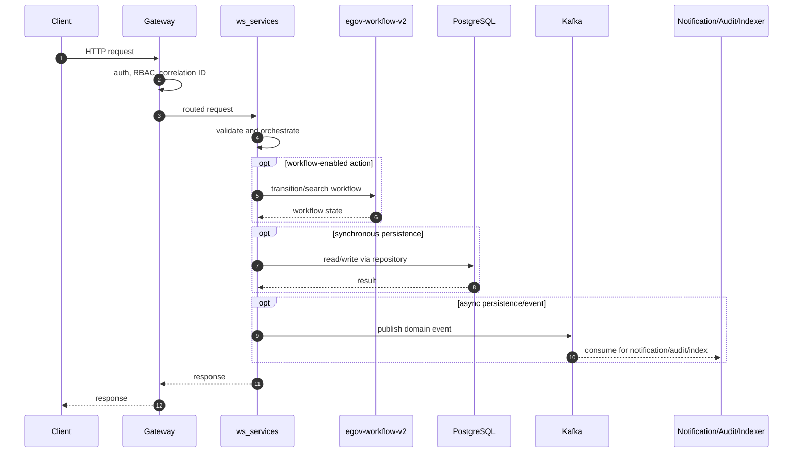
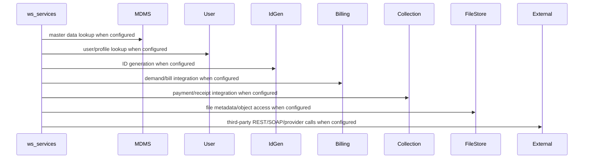

# ws-services

> Generated from repository path `municipal-services/ws-services`. This page documents detected runtime configuration and source-code structure. Validate deployment-specific values against the environment/Helm chart used outside this repository.

## Purpose

Water connection lifecycle and workflow service.

## Responsibilities

- Own the `ws-services` business or platform capability within the UPYOG ecosystem.
- Expose synchronous APIs when controllers are present and publish/consume asynchronous events when Kafka configuration is present.
- Persist service-owned state through PostgreSQL/Flyway or delegate persistence through `egov-persister` YAML mappings.
- Integrate with common platform services such as gateway, user, MDMS, workflow, ID generation, localization, billing, collection, notification, audit, indexer, and searcher as configured.

## Features

- Stack: **Java/Spring Boot**
- Java version: **17**
- Spring Boot version: **3.2.2**
- HTTP port: **8090**
- Servlet/context path: **/ws-services**
- Detected controllers/API mappings: **5**
- Detected migrations: **22**
- Detected tests: **0** files

## Packages

| Package area | Files | Role |
| --- | --- | --- |
| builder | 1 source file(s) | Package area detected from source tree. |
| collection | 9 source file(s) | Package area detected from source tree. |
| config | 1 source file(s) | Spring beans, properties, and runtime configuration. |
| constants | 1 source file(s) | Package area detected from source tree. |
| consumer | 5 source file(s) | Kafka/event consumers. |
| controller | 1 source file(s) | HTTP endpoints and request/response orchestration. |
| enums | 7 source file(s) | Package area detected from source tree. |
| idgen | 4 source file(s) | Package area detected from source tree. |
| mapper | 3 source file(s) | DTO/entity conversion. |
| model | 54 source file(s) | Request, response, DTO, and domain models. |
| producer | 1 source file(s) | Kafka/event producers. |
| repository | 4 source file(s) | Database or remote-service data access. |
| service | 17 source file(s) | Business orchestration and domain logic. |
| users | 4 source file(s) | Package area detected from source tree. |
| util | 5 source file(s) | Reusable helpers and cross-cutting functions. |
| validator | 4 source file(s) | Input and domain validation. |
| waterconnection | 1 source file(s) | Package area detected from source tree. |
| workflow | 9 source file(s) | Workflow transition/search integration and state handling. |

## Folder Structure

- `municipal-services/ws-services`: service root.
- `src/main/java`: Java source, package areas listed above when present.
- `src/main/resources`: application configuration, Flyway migrations, persister/indexer/searcher YAML, message resources.
- `src/test`: automated tests when present.
- `migration` or `db/migration`: Node/legacy SQL migrations when present.
- Dockerfiles are listed in the Deployment section.

## Entry Points

- `municipal-services/ws-services/src/main/java/org/egov/waterconnection/WaterConnectionApplication.java`

## APIs

| Method | Endpoint | Controller | Input | Output | Authentication | Exceptions |
| --- | --- | --- | --- | --- | --- | --- |
| POST | /wc/_create | WaterController.java | Request body follows service model/Swagger contract; validation is typically Bean Validation plus service validators. | Response follows DIGIT ResponseInfo pattern or service-specific model. | Gateway-authenticated unless listed in gateway open/mixed whitelist or explicitly anonymous. | Controller/service/repository/custom validation exceptions propagate through tracer/global handlers. |
| POST | /wc/_search | WaterController.java | Request body follows service model/Swagger contract; validation is typically Bean Validation plus service validators. | Response follows DIGIT ResponseInfo pattern or service-specific model. | Gateway-authenticated unless listed in gateway open/mixed whitelist or explicitly anonymous. | Controller/service/repository/custom validation exceptions propagate through tracer/global handlers. |
| POST | /wc/_update | WaterController.java | Request body follows service model/Swagger contract; validation is typically Bean Validation plus service validators. | Response follows DIGIT ResponseInfo pattern or service-specific model. | Gateway-authenticated unless listed in gateway open/mixed whitelist or explicitly anonymous. | Controller/service/repository/custom validation exceptions propagate through tracer/global handlers. |
| POST | /wc/_plainsearch | WaterController.java | Request body follows service model/Swagger contract; validation is typically Bean Validation plus service validators. | Response follows DIGIT ResponseInfo pattern or service-specific model. | Gateway-authenticated unless listed in gateway open/mixed whitelist or explicitly anonymous. | Controller/service/repository/custom validation exceptions propagate through tracer/global handlers. |
| POST | /wc/_encryptOldData | WaterController.java | Request body follows service model/Swagger contract; validation is typically Bean Validation plus service validators. | Response follows DIGIT ResponseInfo pattern or service-specific model. | Gateway-authenticated unless listed in gateway open/mixed whitelist or explicitly anonymous. | Controller/service/repository/custom validation exceptions propagate through tracer/global handlers. |

### API conventions

- Most backend services use DIGIT-style POST endpoints ending in `/_create`, `/_search`, `/_update`, `/_delete`, `/_count`, or `/_plainsearch`.
- Request payloads normally include `RequestInfo`; responses normally include `ResponseInfo` and one or more domain payload arrays/objects.
- Authentication is generally enforced at the gateway. Service-level security varies by service and must be checked before exposing routes directly.

## Business Flow

1. Client or another service reaches this service through Zuul/Spring Cloud Gateway or an internal cluster URL.
2. Gateway validates token state, enriches request headers such as user/correlation information, and performs RBAC checks where configured.
3. Controller validates the request and calls service-layer orchestration.
4. Service layer loads MDMS/configuration, performs domain validation, calls workflow/billing/idgen/user/location/localization/file-store integrations as required, and writes through repositories or Kafka topics.
5. Persistence events are consumed by `egov-persister`; indexing events are consumed by `egov-indexer`; notification events go to SMS/mail/user-event services.
6. The service returns a DIGIT-style response or publishes an asynchronous completion event.

## Database

- **Tables detected from migrations:** eg_ws_applicationdocument, eg_ws_connection, eg_ws_connection_audit, eg_ws_connectionholder, eg_ws_enc_audit, eg_ws_id_enc_audit, eg_ws_plumberinfo, eg_ws_roadcuttinginfo, eg_ws_service, eg_ws_service_audit
- **Migration files:** 22
- **Repositories/JDBC classes:** 3
- **Entity/table-mapped classes:** 0

### Migration locations

- `municipal-services/ws-services/src/main/resources/db/migration`
- `municipal-services/ws-services/src/main/resources/db/migration/ddl`

### Repository locations

- `municipal-services/ws-services/src/main/java/org/egov/waterconnection/repository/IdGenRepository.java`
- `municipal-services/ws-services/src/main/java/org/egov/waterconnection/repository/ServiceRequestRepository.java`
- `municipal-services/ws-services/src/main/java/org/egov/waterconnection/repository/WaterDaoImpl.java`

### Entity mapping locations

- Not present in this repository or not detected.

## Kafka

| Kafka/property | Topic or value |
| --- | --- |
| kafka.config.bootstrap_server_config | localhost:9092 |
| spring.kafka.consumer.value-deserializer | org.egov.tracer.kafka.deserializer.HashMapDeserializer |
| spring.kafka.consumer.key-deserializer | <secret-value> |
| spring.kafka.consumer.properties.spring.json.use.type.headers | false |
| spring.kafka.consumer.group-id | egov-ws-services |
| spring.kafka.producer.key-serializer | <secret-value> |
| spring.kafka.producer.value-serializer | org.springframework.kafka.support.serializer.JsonSerializer |
| kafka.consumer.config.auto_commit | true |
| kafka.consumer.config.auto_commit_interval | 100 |
| kafka.consumer.config.session_timeout | 15000 |
| kafka.consumer.config.auto_offset_reset | earliest |
| kafka.producer.config.retries_config | 0 |
| kafka.producer.config.batch_size_config | 16384 |
| kafka.producer.config.linger_ms_config | 1 |
| kafka.producer.config.buffer_memory_config | 33554432 |
| egov.waterservice.createwaterconnection.topic | save-ws-connection |
| egov.waterservice.updatewaterconnection.topic | update-ws-connection |
| egov.waterservice.updatewaterconnection.workflow.topic | update-ws-workflow |
| egov.waterservice.savefilestoreIds.topic | save-ws-filestoreids |
| ws.meterreading.create.topic | create-meter-reading |
| ws.meterreading.create.topic.pattern | ((^[a-zA-Z]+-)?create-meter-reading) |
| ws.editnotification.topic | editnotification |
| ws.consume.filestoreids.topic | ws-filestoreids-process |
| kafka.topics.notification.sms | egov.core.notification.sms |
| egov.usr.events.create.topic | persist-user-events-async |
| kafka.topics.notification.email | egov.core.notification.email |
| kafka.topics.receipt.create | egov.collection.payment-create |
| egov.receipt.businessservice.topic | WS.ONE_TIME_FEE |
| spring.kafka.listener.missing-topics-fatal | false |
| ws.kafka.consumer.topic.pattern | ((^[a-zA-Z]+-)?save-ws-connection\|(^[a-zA-Z]+-)?update-ws-connection\|(^[a-zA-Z]+-)?update-ws-workflow) |
| ws.kafka.edit.notification.topic.pattern | ((^[a-zA-Z]+-)?editnotification) |
| ws.kafka.filestore.topic.pattern | ((^[a-zA-Z]+-)?ws-filestoreids-process) |
| kafka.topics.receipt.topic.pattern | ((^[a-zA-Z]+-)?egov.collection.payment-create) |
| egov.receipt.disconnection.businessservice.topic | WS |
| egov.receipt.reconnection.businessservice.topic | WSReconnection |
| egov.water.connection.document.access.audit.kafka.topic | egov-document-access |
| egov.waterservice.oldDataEncryptionStatus.topic | ws-enc-audit |
| egov.waterservice.update.oldData.topic | update-ws-encryption |

### Producers

- `municipal-services/ws-services/src/main/java/org/egov/waterconnection/producer/WaterConnectionProducer.java`

### Consumers

- `municipal-services/ws-services/src/main/java/org/egov/waterconnection/consumer/EditWorkFlowNotificationConsumer.java`
- `municipal-services/ws-services/src/main/java/org/egov/waterconnection/consumer/FileStoreIdsConsumer.java`
- `municipal-services/ws-services/src/main/java/org/egov/waterconnection/consumer/MeterReadingConsumer.java`
- `municipal-services/ws-services/src/main/java/org/egov/waterconnection/consumer/ReceiptConsumer.java`
- `municipal-services/ws-services/src/main/java/org/egov/waterconnection/consumer/WorkflowNotificationConsumer.java`

### Retry and dead-letter handling

- Standard services rely on Spring Kafka retry/container settings or the platform `tracer` library.
- `egov-persister` has an explicit dead-letter pattern (`egov-persister-deadletter`). Service-specific DLQ topics should be configured in deployment properties if required.

## Redis

- No explicit Redis configuration detected.

Cache strategy, TTLs, and key naming are normally configured in code/properties. When Redis is absent above, the service does not advertise a direct Redis dependency in its checked-in config.

## Workflow

Workflow integration is indicated by workflow packages/classes or egov-workflow-v2 host configuration.

Typical workflow-enabled services use `WorkflowIntegrator` or call `/egov-wf/process/_transition` with tenant, business service, action, assignee, and audit information. States/actions/transitions are owned centrally by `egov-workflow-v2` business service definitions.

## External Integrations

| Config key | Endpoint/host |
| --- | --- |
| egov.property.service.host | https://dev.digit.org/ |
| egov.property.createendpoint | property-services/property/_create |
| egov.property.searchendpoint | property-services/property/_search |
| egov.mdms.host | http://localhost:8094/ |
| egov.mdms.search.endpoint | egov-mdms-service/v1/_search |
| egov.billing.service.host | http://billing-service.egov:8080/ |
| egov.demand.createendpoint | billing-service-v1/demand/_create |
| egov.fetch.bill.endpoint | billing-service/bill/v2/_fetchbill |
| spring.flyway.url | jdbc:postgresql://localhost:5433/water |
| egov.idgen.host | http://localhost:8088/ |
| notification.url | https://dev.digit.org/ |
| egov.localization.host | https://dev.digit.org/ |
| egov.localization.search.endpoint | _search |
| egov.user.host | http://localhost:8081/ |
| egov.ws.calculation.host | http://localhost:8083/ |
| egov.ws.calculation.endpoint | ws-calculator/waterCalculator/_calculate |
| egov.ws.estimate.endpoint | ws-calculator/waterCalculator/_estimate |
| ws.meterreading.create.endpoint | ws-calculator/meterConnection/_create |
| egov.pdfservice.host | http://pdf-service:8080/ |
| egov.filestore.host | http://egov-filestore:8080/ |
| egov.shortener.url | egov-url-shortening/shortener |
| egov.collection.host | http://collection-services.egov:8080/ |
| egov.ui.app.host.map | {"in":"https://central-instance.digit.org/","in.statea":"https://statea.digit.org/","pb":"https://dev.digit.org/"} |
| egov.url.shortner.host | http://egov-url-shortening.egov:8080/ |

## Security

- Authentication is primarily gateway-mediated using OAuth/JWT/opaque-token flows and `x-user-info` request enrichment.
- Authorization uses RBAC metadata from `egov-accesscontrol`; endpoint whitelists exist in `zuul`/`gateway` properties.
- Validate whether this service has local security configuration before direct exposure; several services assume gateway isolation.
- Sensitive properties must be supplied through Kubernetes secrets or external config, not committed literal values.

## Configuration

- `municipal-services/ws-services/src/main/resources/application.properties`

### Key properties

| Property | Value / meaning |
| --- | --- |
| server.port | 8090 |
| server.context-path | /ws-services |
| server.servlet.context-path | /ws-services |
| app.timezone | UTC |
| spring.datasource.driver-class-name | org.postgresql.Driver |
| spring.datasource.url | jdbc:postgresql://localhost:5433/water |
| spring.datasource.username | postgres |
| spring.datasource.password | <secret-value> |
| egov.property.service.host | https://dev.digit.org/ |
| egov.property.createendpoint | property-services/property/_create |
| egov.property.searchendpoint | property-services/property/_search |
| egov.mdms.host | http://localhost:8094/ |
| egov.mdms.search.endpoint | egov-mdms-service/v1/_search |
| kafka.config.bootstrap_server_config | localhost:9092 |
| spring.kafka.consumer.value-deserializer | org.egov.tracer.kafka.deserializer.HashMapDeserializer |
| spring.kafka.consumer.key-deserializer | org.apache.kafka.common.serialization.StringDeserializer |
| spring.kafka.consumer.properties.spring.json.use.type.headers | false |
| spring.kafka.consumer.group-id | egov-ws-services |
| spring.kafka.producer.key-serializer | org.apache.kafka.common.serialization.StringSerializer |
| spring.kafka.producer.value-serializer | org.springframework.kafka.support.serializer.JsonSerializer |
| kafka.consumer.config.auto_commit | true |
| kafka.consumer.config.auto_commit_interval | 100 |
| kafka.consumer.config.session_timeout | 15000 |
| kafka.consumer.config.auto_offset_reset | earliest |
| kafka.producer.config.retries_config | 0 |
| kafka.producer.config.batch_size_config | 16384 |
| kafka.producer.config.linger_ms_config | 1 |
| kafka.producer.config.buffer_memory_config | 33554432 |
| egov.waterservice.createwaterconnection.topic | save-ws-connection |
| egov.waterservice.updatewaterconnection.topic | update-ws-connection |
| egov.waterservice.updatewaterconnection.workflow.topic | update-ws-workflow |
| egov.waterservice.savefilestoreIds.topic | save-ws-filestoreids |
| ws.meterreading.create.topic | create-meter-reading |
| ws.meterreading.create.topic.pattern | ((^[a-zA-Z]+-)?create-meter-reading) |
| ws.editnotification.topic | editnotification |

## Logging

- Platform services use Spring logging plus `tracer` for correlation IDs and structured exception responses.
- Gateway filters are responsible for request correlation; services should propagate correlation/user headers downstream.
- Audit events are emitted to Kafka/audit-service where configured.

## Exception Handling

- Common pattern: validation errors become `CustomException`/domain exceptions and are rendered by `tracer` or service-specific `GlobalExceptionHandler`.
- Controller-level `@Valid` handles Bean Validation for request models where annotations exist.
- Kafka consumers should be monitored for poison messages and retry loops.

## Testing

- Test files detected: **0**.
- Unit tests typically cover validators, services, query builders, and controllers.
- Integration tests require PostgreSQL, Kafka, Redis, and dependent services or mocks.

## Deployment

- `municipal-services/ws-services/src/main/resources/db/Dockerfile`

- Most Java services are built as executable JAR containers using Maven and the shared `core-services/build/maven/Dockerfile` pattern.
- Database migrations are packaged separately where `src/main/resources/db/Dockerfile` exists and run Flyway with `DB_URL`, `FLYWAY_USER`, `FLYWAY_PASSWORD`, `FLYWAY_LOCATIONS`, and `SCHEMA_TABLE`.
- Kubernetes/Helm manifests are not checked into this repository; deployment values are managed externally.

## Monitoring

- Health endpoints are usually Spring Actuator-backed, frequently exposed at `/health` because many services set `management.endpoints.web.base-path=/`.
- Gateway has additional OpenTelemetry/Jaeger-related configuration.
- Production deployments should scrape actuator/Prometheus endpoints, Kafka consumer lag, DB pool metrics, and JVM metrics.

## Performance

- Primary bottlenecks are database query complexity, Kafka consumer lag, synchronous inter-service calls, external provider latency, and JVM heap limits.
- Prefer indexed search columns, bounded page sizes, connection pool sizing, Redis for hot reference data, and async publication for slow side effects.
- Check thread pools and Kafka concurrency for write-heavy services.

## Common Problems

- Missing dependent service host property or DNS entry.
- Flyway migration order/table mismatch.
- Kafka topic not created or wrong consumer group.
- Gateway whitelist/RBAC misconfiguration.
- Redis/PostgreSQL connectivity issues.
- Java 17 services run with Java 8 images or legacy Java 8 services run with Java 17 images.

## Improvement Suggestions

- Add/refresh OpenAPI contracts for controllers that lack contract YAML.
- Add integration tests around workflow, billing, collection, and persister events.
- Externalize all secrets and remove defaults from deployment overlays.
- Standardize health, metrics, logging, and correlation-ID propagation.
- Normalize package names and remove duplicate/legacy code where the service has modern equivalents.
