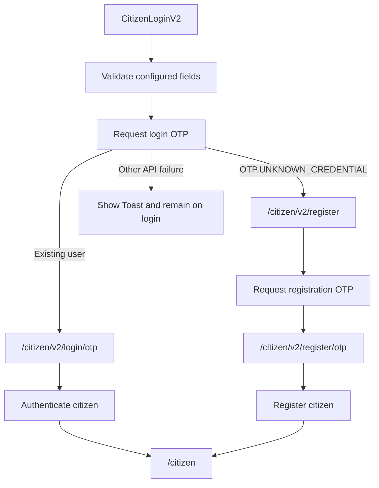

# V2 Onboarding Implementation

## Overview

V2 onboarding provides configuration-driven Citizen and Employee authentication screens while preserving the existing V1 components and business APIs.

The `isConfigBased` prop is passed from `frontend/upyog-ui/web/src/App.js` through `DigitUI`, `DigitApp`, `CitizenApp`, `EmployeeApp`, and protected module routing. The route components default the flag to `false`, so callers that do not enable V2 retain the legacy flow. The current web application explicitly enables V2 at its bootstrap boundary.

V2 changes presentation, route selection, and continuation guards. Authentication still uses the existing `Digit.UserService`, DigiLocker service, tenant sources, localization service, and session keys so authenticated modules remain backward-compatible.

## Architecture

| Area | Main implementation |
| --- | --- |
| Feature entry | `frontend/upyog-ui/web/src/App.js` |
| Flag propagation | `modules/core/src/Module.js`, `modules/core/src/App.js` |
| Citizen routing | `pages/citizen/index.js`, `pages/citizen/onboardingRoutes.js` |
| Citizen orchestration | `pages/citizen/V2OnboardingFlow.js` |
| Shared Citizen auth APIs | `pages/citizen/Login/citizenAuth.js` |
| Employee routing | `pages/employee/index.js`, `pages/employee/employeeAuthRoutes.js` |
| Employee orchestration | `pages/employee/EmployeeV2AuthFlow.js` |
| Configuration/layout | `pages/onboarding/OnboardingLayout.js`, `OnboardingContext.js` |
| Configured forms | `OnboardingForm.js`, `ConfigurableForm.js`, `OnboardingField.js` |
| Step adapters | `LoginV2.js`, `RegisterV2.js`, `OtpV2.js` |
| Responsive styling | `packages/css/src/v2/` |
| Runtime theme | `packages/libraries/src/theme/` |

`OnboardingLayout` creates an `OnboardingProvider`, loads the selected MDMS module/master and logo configuration, renders the configured visual shell, and exposes the active route through React Router's `Outlet`.

`OnboardingForm` selects `config.steps[step]`, resolves built-in language and tenant sources, and renders `ConfigurableForm`. Missing steps remain on their V2 URL and display:

```text
Configuration missing for <step> step.
```

## Citizen routing

All paths below include the `/upyog-ui` application prefix.

| Purpose | V1 | V2 |
| --- | --- | --- |
| Entry | `/citizen/select-language` | `/citizen/v2/login` |
| Login | `/citizen/login` | `/citizen/v2/login` |
| Register | `/citizen/register/*` | `/citizen/v2/register` |
| Login OTP | `/citizen/login/otp` | `/citizen/v2/login/otp` |
| Register OTP | `/citizen/register/otp` | `/citizen/v2/register/otp` |
| Authenticated entry | `/citizen` | `/citizen` |

`getCitizenOnboardingPaths(isConfigBased)` is the source of truth for entry, login, registration, and OTP destinations. When V2 is enabled, legacy onboarding URLs redirect with `replace`; DigiLocker query parameters are preserved when its callback lands on the legacy login route.

## Citizen flow



The login request branches to registration only for the backend's explicit `OTP.UNKNOWN_CREDENTIAL` code. Network errors and other API failures do not change flows.

### Shared continuation context

`OnboardingProvider` stores non-sensitive V2 continuation data under `CITIZEN.V2.ONBOARDING`. Password and OTP field names are excluded from persistence.

The context contains:

- `mobileNumber`
- `city`: the selected tenant object
- `location`: accepted when a future configuration supplies a separate location
- flow markers such as `_otpSent`, `_otpFlow`, and `_registrationAllowed`

The current MDMS contract uses the selected `city` as the canonical location. `V2OnboardingFlow` resolves `location || city`, so it does not persist a duplicate `location` object when both concepts refer to the same tenant.

### Register guard

`CitizenRegisterV2` requires:

- a mobile number;
- a selected city code;
- a resolved location;
- `_registrationAllowed === true`, set only after the login API confirms the user is unregistered.

Invalid access returns to `/upyog-ui/citizen/v2/login` with `replace`.

### OTP guard

`CitizenOtpV2` accepts only `login` and `register` flows. It also requires matching `_otpSent` and `_otpFlow` markers plus the login context. A manually entered, stale, or mismatched OTP URL redirects to V2 login with `replace`. OTP values themselves remain in live form state and are not persisted.

## Citizen alternate login

`CitizenLoginV2.onSecondaryAction` is reserved for alternate authentication, currently DigiLocker. It opens the shared `DigiLockerConsentModal` and then starts the existing DigiLocker authorization flow.

Registration is not a secondary action. It is selected only by the primary login flow after the backend reports that the mobile number is not registered.

`RegisterV2` exposes only its primary submission callback and does not accept `onSecondaryAction`.

## Employee routing

| Purpose | V1 | V2 |
| --- | --- | --- |
| Login | `/upyog-ui/employee/user/login` | `/upyog-ui/employee/user/v2/login` |
| Forgot password | `/upyog-ui/employee/user/forgot-password` | `/upyog-ui/employee/user/v2/forgot-password` |
| Change password | `/upyog-ui/employee/user/change-password` | `/upyog-ui/employee/user/v2/change-password` |

`getEmployeeAuthPaths(isConfigBased)` derives all three destinations. `AppModules` uses its version-aware login destination for unauthenticated protected routes. When V2 is active, direct legacy authentication links redirect to their V2 equivalents while preserving router state and query parameters.

Employee V2 reset context is stored under `EMPLOYEE.V2.ONBOARDING`. Forgot password stores the submitted mobile number and selected city after the reset OTP API succeeds, then navigates to the clean V2 change-password URL. Direct change-password access without this context returns to V2 forgot-password.

On successful password change, the user is returned to the version-aware login path.

## Employee configuration

Employee V2 uses:

```text
moduleName: EMPLOYEE_ONBOARDING
masterName: OnboardingConfig
steps: login, forgot-password, change-password
```

All three routes use `OnboardingLayout`. If a step is temporarily absent from MDMS, the requested V2 URL remains active and the shared missing-configuration state is shown. V1 components are not used as fallbacks.

## Configuration structure

Citizen uses `CITIZEN_ONBOARDING.OnboardingConfig`; Employee uses `EMPLOYEE_ONBOARDING.OnboardingConfig`.

The provider selects the first master result and exposes:

- `content` and `common` presentation configuration;
- `getStepConfig(step)` for `config.steps[step]`;
- shared form data and update functions;
- logo data;
- loading, API error, and retry state.

`OnboardingLayout` owns full-page configuration API failures and renders a retry fallback. `OnboardingForm` owns step loading and missing-step states. `ConfigurableForm` owns configured fields, validation, focus ordering, primary/secondary buttons, resend timing, and inline field errors.

When no fields exist, the primary action is hidden, secondary actions remain available, and a dynamic MDMS message identifies the requested step.

## Redirect behavior

| Scenario | Behavior |
| --- | --- |
| Unknown application URL | Redirect to the active Citizen entry |
| Unauthenticated Citizen base path in V2 | Redirect to Citizen V2 login |
| Unauthenticated Employee module | Redirect to version-aware Employee login and preserve `from` |
| Legacy Citizen onboarding URL in V2 | Redirect to V2 login |
| Legacy Employee auth URL in V2 | Redirect to the matching V2 auth route |
| Invalid Register/OTP context | Redirect to the V2 entry with `replace` |
| Employee V2 missing reset context | Redirect to V2 forgot-password |
| Citizen OTP success | Persist the standard session and reload `/upyog-ui/citizen` |
| Employee password reset success | Redirect to Employee V2 login |
| Logout | Existing `UserService.logout` clears storage; the Employee legacy language URL is normalized by V2 routing on reload |
| Session expiry/protected access | `AppModules` redirects through `getEmployeeAuthPaths(isConfigBased)` |

## V1/V2 decision table

| User type | `isConfigBased` | Authentication UI | Configuration source |
| --- | --- | --- | --- |
| Citizen | `false` | Existing language/location/Login routes | Existing V1 configuration |
| Citizen | `true` | Citizen V2 Login/Register/OTP | `CITIZEN_ONBOARDING.OnboardingConfig` |
| Employee | `false` | Existing Login/Forgot/Change Password | Existing V1 configuration |
| Employee | `true` | Employee V2 Login/Forgot/Change Password | `EMPLOYEE_ONBOARDING.OnboardingConfig` |

## Error and fallback handling

- Field validation is displayed below the relevant input. The first invalid configured field receives the parent `error` class, scroll, and focus.
- Cross-field password mismatch is reported inline on `confirmPassword`.
- Authentication, OTP, registration, password-reset, and resend API failures use Toast.
- Only explicit OTP business codes are used to branch between login and registration.
- An onboarding configuration API failure replaces the full layout with a retry surface.
- A missing step shows the shared lightweight missing-configuration state without leaving V2.
- Invalid continuation routes redirect with `replace` so stale URLs do not remain in browser history.

## Development guidelines

- Keep the `isConfigBased` decision at routing boundaries; do not mix V1 and V2 components on one auth route.
- Use `getCitizenOnboardingPaths` and `getEmployeeAuthPaths` instead of hardcoded login destinations.
- Reuse `Digit.UserService` and shared authentication helpers rather than duplicating request contracts.
- Reserve Citizen `onSecondaryAction` for alternate authentication; never use it for registration.
- Keep Register and OTP routes guarded by the minimum context required by their APIs.
- Do not persist OTP or password values.
- Use Toast for API failures and inline messages for field validation.
- Keep onboarding styles scoped beneath `.upyog-ui` to avoid changing V1 pages.
- Keep missing configuration inside V2; never silently render the legacy page.
- Add comments for routing, guards, and non-obvious authentication branching, not for self-explanatory JSX.

## Testing checklist

### Citizen V1

- Disable V2 and verify language, location, login, registration, OTP, DigiLocker, logout, and protected-module redirects.
- Verify existing deep links still open their legacy components.

### Citizen V2

- Open `/upyog-ui/citizen/v2/login` directly and refresh it.
- Submit empty fields and verify the first configured error receives focus.
- Verify an existing user reaches login OTP and successful OTP opens `/upyog-ui/citizen`.
- Verify `OTP.UNKNOWN_CREDENTIAL` reaches Register.
- Verify network/server OTP errors show Toast and remain on Login.
- Verify registration OTP and successful registration.
- Open Register and both OTP URLs without context and verify replacement redirects to Login.
- Refresh valid Register and OTP routes and verify non-sensitive context continuity.
- Verify DigiLocker consent, callback success, cancellation, and API failure.
- Change language at runtime and verify configured labels update.

### Employee V1

- Disable V2 and verify Login, Forgot Password, Change Password, logout, and protected-module redirects.

### Employee V2

- Verify Login, Forgot Password, and Change Password at their `/user/v2/*` URLs.
- Verify a protected module redirects to V2 Login and returns to its original `from` path.
- Verify invalid direct Change Password access returns to V2 Forgot Password.
- Verify reset OTP resend, inline password mismatch, API Toast failures, and successful reset.
- Verify refresh and browser Back/Forward behavior throughout reset.
- Remove each Employee MDMS step in turn and verify its V2 URL shows the missing-config message.
- Verify legacy Employee auth URLs redirect to their V2 equivalents.
- Verify logout returns to the active V2 authentication experience after routing normalization.

## Known limitations / future work

- Employee V2 step availability depends on `EMPLOYEE_ONBOARDING.OnboardingConfig`; the missing-step state is intentional until all tenant configurations are deployed.
- DigiLocker's OAuth redirect URI is currently the existing fixed service contract in `citizenAuth.js`. Environment-specific callback changes must remain synchronized with the DigiLocker provider configuration.
- The web bootstrap currently enables V2 explicitly. A runtime rollout toggle can replace that literal when tenant-by-tenant activation is required.
