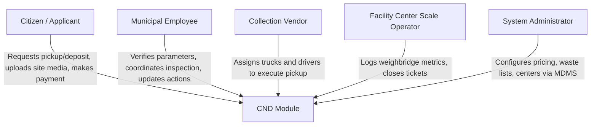
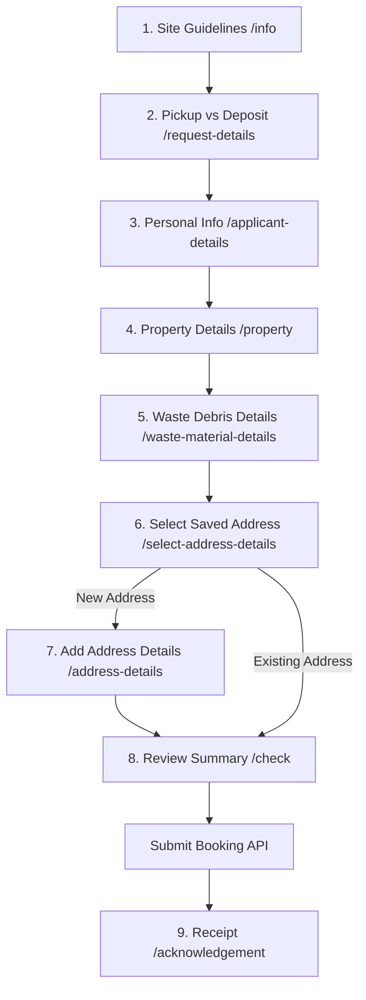
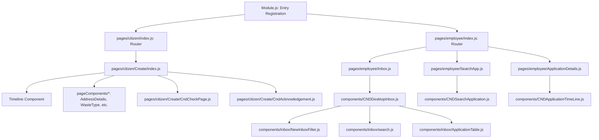
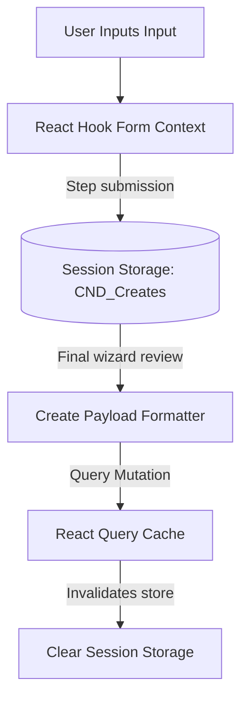

# UPYOG UI
UPYOG (Urban Platform for deliverY of Online Governance) is India's largest platform for governance services. Visit [UPYOG documentation portal](https://upyog-docs.gitbook.io/upyog-v-1.0/) for more details.


This repository contains source code for web implementation of the Construction & Demolition UI modules with dependencies and libraries.


#### Starting local server
1. To run server locally first change directory to **web** subdirectory
1. In the project run **yarn install** to install node modules and dependencies
1. Run **yarn start:dev** to start the local server


#### Updating modules
To update the modules run *install-dep.sh* script this will pull all the updates from *micro-ui-internals* subfolder


###### Dependencies and their references
1. https://www.npmjs.com/package/react-query
2. https://react-redux.js.org/
3. https://react-hook-form.com/
4. https://www.npmjs.com/package/react-table
5. https://www.npmjs.com/package/react-time-picker
6. https://reactrouter.com/web/guides/quick-start
7. https://recharts.org/


#### License
UPYOG Source Code is open sources under License [UPYOG CODE, COPYRIGHT AND CONTRIBUTION LICENSE TERMS](https://upyog.niua.org/employee/Upyog%20Code%20and%20Copyright%20License_v1.pdf)


# Construction & Demolition Waste Management (CND) Frontend Module
## Technical Handbook & Contributor Guide

This repository contains the micro-frontend user interface for the **Construction & Demolition Waste Management (CND)** module, built for the digital governance ecosystem. It provides municipal bodies with a structured workflow to schedule, monitor, and record the disposal of Construction and Demolition (C&D) waste.

---

## Table of Contents
1. [System Overview & Stakeholder Model](#1-system-overview--stakeholder-model)
2. [Architectural Design & Platform Integration](#2-architectural-design--platform-integration)
3. [Core Workflows & Sequence Maps](#3-core-workflows--sequence-maps)
4. [Folder Structure & Codebase Navigation](#4-folder-structure--codebase-navigation)
5. [Component Hierarchy & Relationships](#5-component-hierarchy--relationships)
6. [Routing Directory](#6-routing-directory)
7. [State Management & Data Lifecycle](#7-state-management--data-lifecycle)
8. [APIs, Services & Payload Schemas](#8-apis-services--payload-schemas)
9. [Validation & Input Constraints](#9-validation--input-constraints)
10. [Configuration Profile (MDMS, Constants)](#10-configuration-profile-mdms-constants)
11. [Build, Run & Development Instructions](#11-build-run--development-instructions)
12. [Troubleshooting & Diagnostics](#12-troubleshooting--diagnostics)
13. [Future Extension Guidelines](#13-future-extension-guidelines)

---

## 1. System Overview & Stakeholder Model

Debris from construction, renovation, and demolition projects represents a significant logistical and environmental challenge for urban local bodies (ULBs). The CND module digitizes the collection and transport of this waste through two primary citizen requests:
* **Request for Pickup:** The citizen schedules garbage collection at their property location.
* **Direct Self-Deposit:** The citizen schedules transport of debris to an authorized facility center.

### Stakeholders & Access Roles



* **Citizen (`CITIZEN`):** Creates pickup bookings or self-deposit reservations, selects location coordinates, estimates waste weight, uploads stack/site photographs, checks request progress, and downloads official PDF receipts.
* **Municipal Employees (`EMPLOYEE` / `CND_APPROVER`):** Monitor incoming bookings via a unified Inbox, review uploaded site documents, verify property dimensions, and execute workflow transitions.
* **Collection Vendors & Drivers (`CND_VENDOR`):** Assign garbage trucks, verify stack volumes on-site, and mark pickups as collected.
* **Facility Scale Operators (`CND_OPERATOR`):** Control disposal weighbridges. They register the final weight scale values of waste received at the disposal plant before resolving records.
* **System Administrators:** Maintain lookup configurations, including municipal garbage collection pricing, waste categories, and active disposal sites.

---

## 2. Architectural Design & Platform Integration

The CND module is compiled as an independent micro-frontend package inside a monorepo workspace. It dynamically registers its entry points, layout blocks, and sub-routing with the core portal shell.

### Dynamic Package Alias Resolution

```mermaid
graph TD
    subgraph Core Shell app
        Root[web / Root Portal] -->|Bootstraps| Core[micro-ui-internals / core]
    end
    subgraph Feature Modules
        Core -->|Imports dynamically| CND[cnd-ui / modules / cnd]
        Core -->|Imports dynamically| Bills[modules / bills]
        Core -->|Imports dynamically| Reports[modules / reports]
    end
    subgraph Shared Libraries
        CND -->|UI Primitives| Components[@nudmcdgnpm/digit-ui-react-components]
        CND -->|Base Utilities & Services| Libraries[@nudmcdgnpm/digit-ui-libraries]
    end
    subgraph Backend Services
        CND -->|Transactions API| CndService[/cnd-service]
        CND -->|Metadata lookup| MDMSService[/egov-mdms-service]
        CND -->|Workflow actions| WFService[/egov-workflow-v2]
    end
```

### Monorepo Workspaces & Package Resolution
Package dependencies are defined in the workspace root [package.json](file:.../frontend/cnd-ui/web/package.json). 

At build-time, [vite.config.js](file:.../frontend/cnd-ui/web/vite.config.js) dynamically scans active workspaces and maps import namespaces (e.g. `@nudmcdgnpm/upyog-ui-module-cnd`) to local source code folders under `micro-ui-internals/packages/`. This allows live updates and hot module replacement (HMR) to propagate across libraries and modules during local development.

---

## 3. Core Workflows & Sequence Maps

### 3.1 Citizen Application Step Wizard

The citizen application flow is configured as a sequential page list in [config.js](file:.../frontend/cnd-ui/web/micro-ui-internals/packages/modules/cnd/src/config/config.js).



### 3.2 Employee Review & Vendor Assignment

```mermaid
sequenceDiagram
    autonumber
    actor Employee as Municipal Employee
    participant Inbox as Inbox Search Dashboard
    participant Details as Details Page
    participant WF as Workflow Service
    participant Vendor as Vendor Dispatcher

    Employee->>Inbox: Access CND Inbox Page
    Inbox->>Inbox: Apply Filters (Status, Locality, Mobile)
    Employee->>Details: Click Application ID
    Details->>Employee: Display uploaded documents and waste weight details
    Employee->>Details: Select action (Approve / Forward)
    Details->>WF: Call Update API (Transition Workflow State)
    WF-->>Details: Transition status to PENDING_DISPATCH
    Employee->>Details: Allocate Vendor & Pickup Vehicle
    Details->>Vendor: Call Update API with Vendor ID & vehicle details
```

### 3.3 Disposal Weight Logging & Ticket Closure

```mermaid
sequenceDiagram
    autonumber
    actor OP as Facility Operator
    participant Details as Facility Details Screen
    participant Scale as Weighbridge Scale
    participant Service as CND Service

    OP->>Details: Search booking ID
    Details->>Scale: Capture truck tare/net weight
    OP->>Details: Enter final processed weight
    OP->>Details: Submit 'DISPOSE' action
    Details->>Service: Call CND update API with weight & dispose status
    Service-->>Details: Success (Status transition to DISPOSED)
```

---

## 4. Folder Structure & Codebase Navigation

The CND package structure under [packages/modules/cnd/src/](file:.../frontend/cnd-ui/web/micro-ui-internals/packages/modules/cnd/src) follows standard micro-frontend layout conventions:

```text
packages/modules/cnd/src/
├── components/          # Reusable UI overlays and search templates
│   ├── inbox/           # Inbox specific filter, search form, and list tables
│   │   ├── ApplicationCard.js
│   │   ├── ApplicationTable.js
│   │   ├── NewInboxFilter.js
│   │   ├── SortBy.js
│   │   └── search.js
│   ├── BookingPopup.js
│   ├── CNDApplicationTimeLine.js
│   ├── CNDCard.js
│   ├── CNDDesktopInbox.js
│   ├── CNDSearchApplication.js
│   ├── CNDVendorCard.js
│   ├── Caption.js
│   ├── EnhancedReport.js
│   ├── ExistingBookingDetails.js
│   ├── LocationDetails.js
│   └── LocationPopup.js
├── config/              # Dynamic router tables and inbox columns
│   ├── config.js        # Main citizen wizard path map
│   ├── editConfig.js    # Fields allowed to edit by officers
│   ├── facilityCentreConfig.js # Facility details configuration
│   └── inbox-table-config.js   # Table header structure
├── pageComponents/      # Individual wizard steps rendered inside the workflow
│   ├── Address.js
│   ├── AddressDetails.js
│   ├── CndRequirementDetails.js
│   ├── DisposeDetails.js
│   ├── MultiSelectDropdown.js
│   ├── PickupArrivalDetails.js
│   ├── PropertyNature.js
│   ├── RequestPickup.js
│   ├── WasteType.js
│   └── WasteTypeTable.js
├── pages/               # Entry path wrappers & sub-routing definitions
│   ├── citizen/         # Application, checklist, and my-requests routing
│   └── employee/        # Inbox, search directory, and facility routing
├── utils/               # PDF structures, global style lists, data parsers
│   ├── cndAcknowledgementData.js
│   ├── cndStyles.js
│   └── index.js
└── Module.js            # Entry export, bootstrapping registry components
```

### Responsibilities of Key Directories

* **`components/`**: Layout blocks used inside employee/citizen routing. Contains components like `CNDSearchApplication` and overlay popups.
* **`config/`**: JSON configurations mapping route segments to rendering components. Includes column parameters for the employee inbox.
* **`pageComponents/`**: Custom inputs loaded dynamically in the wizard steps. They interact with React Hook Form controls and save values to session storage.
* **`pages/`**: Defines URL path mappings. Routes paths under `/citizen` or `/employee` to rendering components.
* **`utils/`**: Core utilities, including PDF print layouts and the global inline CSS stylesheet [cndStyles.js](file: .../frontend/cnd-ui/web/micro-ui-internals/packages/modules/cnd/src/utils/cndStyles.js).

---

## 5. Component Hierarchy & Relationships

This chart illustrates how UI components wrap and render child components within the application:



---

## 6. Routing Directory

Routes are registered dynamically in the sub-app wrapper.

### Citizen Portal Routing ([pages/citizen/index.js](file: .../frontend/cnd-ui/web/micro-ui-internals/packages/modules/cnd/src/pages/citizen/index.js))

| Route Path | Component Name | Role / Function |
| :--- | :--- | :--- |
| `/cnd-ui/citizen/cnd/apply/*` | `CndCreate` | Wizard entry point handling multi-screen forms |
| `/cnd-ui/citizen/cnd/my-request` | `MyRequests` | List of submitted requests associated with the citizen |
| `/cnd-ui/citizen/cnd/my-requests/:applicationNumber/:tenantId` | `CndApplicationDetails` | Citizen view of application status details and timelines |
| `/cnd-ui/citizen/cnd/cnd-vendor` | `CNDVendorCard` | Desktop card containing quick-links for vendor operations |
| `/cnd-ui/citizen/cnd/inbox` | `Inbox` | Assigned inbox list viewed by authorized vendors |

### Employee Console Routing ([pages/employee/index.js](file: .../frontend/cnd-ui/web/micro-ui-internals/packages/modules/cnd/src/pages/employee/index.js))

| Route Path | Component Name | Role / Function |
| :--- | :--- | :--- |
| `/cnd-ui/employee/cnd/inbox` | `Inbox` | Dynamic Inbox dashboard showing pending requests |
| `/cnd-ui/employee/cnd/apply/*` | `CndCreate` | Allows employees to create requests on behalf of citizens |
| `/cnd-ui/employee/cnd/application-details/:id` | `ApplicationDetails` | Application review, file download, and action submission |
| `/cnd-ui/employee/cnd/applicationsearch/application-details/:id` | `ApplicationDetails` | Target detail page accessed from the Search Dashboard |
| `/cnd-ui/employee/cnd/cnd-service/edit/:id` | `EditCreate` | Action page to update property and waste details |
| `/cnd-ui/employee/cnd/cnd-service/facility-centre/:id` | `FacilityCentreCreationDetails` | Facility center detail configuration and logging page |
| `/cnd-ui/employee/cnd/CNDApplicationReport` | `EnhancedReport` | CND module analytics and activity report generator |

---

## 7. State Management & Data Lifecycle

The CND module uses a hybrid state model combining **React Hook Form**, **Session Storage**, and **React Query** caches.



### State Management Strategy

1. **React Hook Form (RHF):** Manages component-level validations and field bindings within active form steps.
2. **Session Storage (`CND_Creates`):** Form values are stored in session storage as users navigate between wizard pages, preventing data loss on page refreshes.
3. **React Query:** Manages network request caching and mutations, wrapped in custom hooks.
4. **State Cleanup:** Session storage is cleared in the API `onSuccess` callback once a booking is successfully submitted.

### Custom React Query Hooks
Custom Hooks are stored in [packages/libraries/src/hooks/cnd/](file:.../frontend/cnd-ui/web/micro-ui-internals/packages/libraries/src/hooks/cnd):
* `useCndCreateApi`: Handles booking creation requests.
* `useCndSearchApplication`: Queries applications.
* `useCndApplicationDetails`: Fetches details of a single request.
* `useCndApplicationAction`: Triggers workflow actions.
* `useVendorSearch`: Looks up registered vendor agencies.
* `useVehiclesSearch`: Queries active waste vehicles.

---

## 8. APIs, Services & Payload Schemas

API routes are registered in the global URLs database:

```mermaid
graph LR
    API[Client API Call] --> Create[/cnd-service/v1/_create]
    API --> Search[/cnd-service/v1/_search]
    API --> Update[/cnd-service/v1/_update]
    API --> Vendor[/vendor/v1/_search]
    API --> Vehicle[/vehicle/v1/_search]
```

### API Mappings ([urls.js](file:.../frontend/cnd-ui/web/micro-ui-internals/packages/libraries/src/services/atoms/urls.js))
* `Urls.cnd.create`: `/cnd-service/v1/_create` (POST)
* `Urls.cnd.search`: `/cnd-service/v1/_search` (POST)
* `Urls.cnd.update`: `/cnd-service/v1/_update` (POST)
* `Urls.vendorSearch`: `/vendor/v1/_search` (POST)
* `Urls.vehicleSearch`: `/vehicle/v1/_search` (POST)

### Request Payload Structure (`cndPayload`)
Payload formatting is defined in [utils/index.js](file: .../frontend/cnd-ui/web/micro-ui-internals/packages/modules/cnd/src/utils/index.js#L38-L124). Below is the JSON structure sent to `/cnd-service/v1/_create`:

```json
{
  "cndApplication": {
    "tenantId": "pb.amritsar",
    "applicationType": "REQUEST_FOR_PICKUP",
    "applicationStatus": "BOOKING_CREATED",
    "propertyType": "RESIDENTIAL",
    "totalWasteQuantity": 12.5,
    "typeOfConstruction": "NEW_CONSTRUCTION",
    "constructionFromDate": "2026-06-12",
    "constructionToDate": "2026-07-12",
    "requestedPickupDate": "2026-06-15",
    "wasteTypeDetails": [
      {
        "wasteType": "CONCRETE",
        "quantity": 0,
        "enteredByUserType": "CITIZEN"
      }
    ],
    "applicantDetail": {
      "nameOfApplicant": "John Doe",
      "mobileNumber": "9876543210",
      "alternateMobileNumber": "9876543211",
      "emailId": "john.doe@example.com"
    },
    "addressDetail": {
      "houseNumber": "123",
      "addressLine1": "Main Sector Road",
      "locality": "Sector 17",
      "city": "Amritsar",
      "pinCode": "143001"
    },
    "workflow": {
      "action": "APPLY",
      "businessService": "cnd",
      "moduleName": "cnd-service"
    }
  }
}
```

---

## 9. Configuration Profile (MDMS, Constants)

### 9.1 MDMS Setup
lookup parameters loaded via `/egov-mdms-service/v1/_search`:
* **Module Code:** `cnd-service`
* **WasteType:** Debris categories (Concrete, Wood, Bituminous, Brick).
* **PropertyType:** Building usage types (Commercial, Industrial, Residential).
* **FacilityCenters:** List of official disposal center names, capacities, and map coordinates.

### 10.2 Module Constants (`CND_VARIABLES`)
Configured in [utils/index.js](file:.../upyog_recent/frontend/cnd-ui/web/micro-ui-internals/packages/modules/cnd/src/utils/index.js#L14-L22):
* `MODULE`: `"MODULE_CND"`
* `NEXT`: `"COMMON_NEXT"`
* `MDMS_MASTER`: `"cnd-service"`
* `SITE_MEDIA_PHOTO`: `"siteMediaPhoto"`
* `SITE_STACK_PHOTO`: `"siteStack"`

---

## 10. Build, Run & Development Instructions

Ensure node version is `v22.x` or higher.

### 1. Install Dependencies
Run `yarn install` from the `web` root directory to link workspace packages:
```bash
cd web
yarn install
```

### 2. Start Local Development Server
Starts the dev server using the configuration in `vite.config.js`:
```bash
yarn start
```
By default, the server runs at `http://localhost:3000/cnd-ui/citizen`.

### 3. Build Production Bundle
Generates optimized, minified production assets:
```bash
yarn build
```
Compiled assets are saved to the `web/build` folder.

---

## 11. Troubleshooting & Diagnostics

### 11.1 Local API Routing / CORS Failures
* **Symptom:** API requests time out or return connection errors (e.g. `ERR_CONNECTION_REFUSED`).
* **Root Cause:** The Vite development proxy target is misconfigured or the backend service is offline.
* **Solution:** Verify the proxy target configurations in [setupProxy.js](file:///c:/Users/Admin/Desktop/upyog_recent/frontend/cnd-ui/web/src/setupProxy.js) and that environment variables match the target API server.

### 11.2 Missing Data in Dropdowns
* **Symptom:** Dropdowns for options like locality or waste types are empty.
* **Root Cause:** MDMS configuration data failed to load or is not configured for the tenant.
* **Solution:** Check the network console to verify `/egov-mdms-service/v1/_search` returned a valid response. Confirm MDMS configurations are seeded for the active tenant ID.

### 11.3 Route Redirection Loop / Blank Screen
* **Symptom:** Accessing the dashboard displays a blank page or redirects endlessly.
* **Root Cause:** Wildcard path routing is misconfigured in the app entry point.
* **Solution:** Verify routing setups in [App.js](file:///c:/Users/Admin/Desktop/upyog_recent/frontend/cnd-ui/web/micro-ui-internals/packages/modules/core/src/App.js) to ensure fallback routes match the citizen portal URL.

---

## 12. Future Extension Guidelines

### 12.1 Adding Wizard Steps
1. Register the step route, component name, and next navigation path in [config.js](file:.../frontend/cnd-ui/web/micro-ui-internals/packages/modules/cnd/src/config/config.js).
2. Create the step form component under `pageComponents/` and register it in [Module.js](file:.../frontend/cnd-ui/web/micro-ui-internals/packages/modules/cnd/src/Module.js).
3. Bind form inputs to the central state context using RHF register configurations.

### 12.2 Customizing Workflow Transitions
1. Register new action transitions in the backend workflow engine.
2. Map new action labels and input parameters inside `CNDActionModal.js` within the shared template directory.

### 12.3 Creating Custom Reports
1. Register the report name in your configuration settings.
2. Import the layout component and render it using the dynamic reports routing wrapper inside `pages/employee/index.js`.
