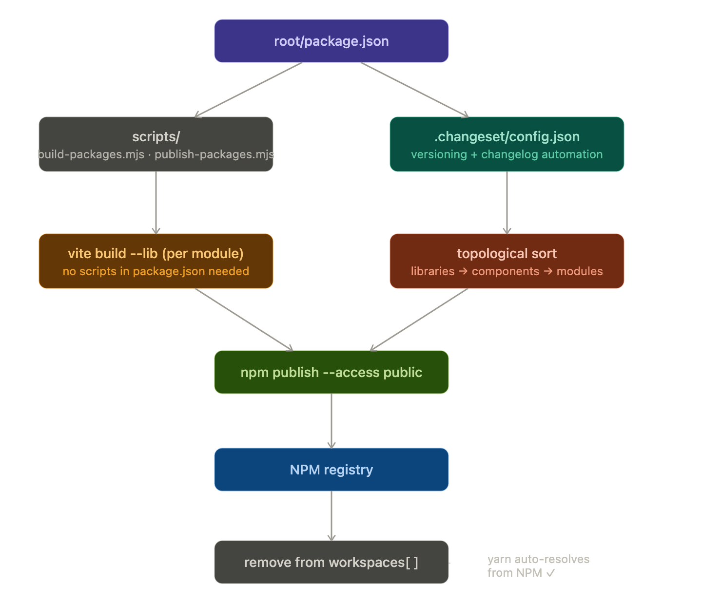

# UPYOG UI — Centralized Package Publishing Pipeline

> **Author:** Shivank Shukla

> **Team:** Internal Tech Team
> **Created:** April 2026
 
## Why This Was Built
 
Before the Vite upgrade (React 17 → 19, Node 14 → 22, CRA/Webpack → Vite), each module had its own `build` and `prepublish` scripts inside its `package.json` using `microbundle-crl`. To publish a module to NPM, a developer had to:
 
1. Go into the module folder
2. Run `yarn install` and `yarn build` manually
3. Run `npm publish --access public`
4. Manually remove the module from the root `workspaces[]`

This was error-prone, slow, inconsistent across 25+ modules, and required every developer to understand the internal build tooling of each package.
 
After the Vite upgrade, all individual module build scripts were removed because Vite resolves workspace packages directly from `src/` — no `dist/` is needed for local development or the main app build. This made local dev and the Docker build significantly faster (32 min → 4 min 28 sec), but broke the NPM publish flow entirely since NPM consumers need compiled `dist/` output.
 
This pipeline was built to solve that — a single centralized system that any developer can use to build and publish any module to NPM without touching individual `package.json` files, without breaking local development, and without any manual steps.




---


## How It Works
 
### The Core Problem It Solves
 
Vite in workspace mode resolves `@upyog/upyog-ui-module-ads` via the `"source": "src/Module.js"` field in the module's `package.json` — pointing directly to source code. This is what makes `yarn start` and `yarn build` fast.
 
But NPM consumers downloading the published package need compiled JavaScript in `dist/`. If `main` pointed to `dist/index.js` in the real `package.json`, local Vite resolution would break.
 
The solution: the build script compiles each module's source into `dist/` using Vite's library mode, and the publish script writes a **separate `package.json` inside `dist/`** pointing to the compiled files — and publishes from that folder. The real `package.json` in the module root is **never modified**.
 
```
What Vite workspace sees:   "main": "src/Module.js"    → fast local dev ✓
What NPM registry receives: "main": "index.js"         → compiled dist/ ✓
```
 
### Script Overview
 
| Script | File | Purpose |
|---|---|---|
| `packages:build` | `scripts/package-builder.mjs` | Builds one or more modules using Vite lib mode |
| `packages:publish` | `scripts/package-publisher.mjs` | Publishes built modules to NPM |
| `packages:release` | `scripts/release.mjs` | Runs build then publish in one command |
 
---
 
## Usage
 
### Build a module
```bash
yarn packages:build ads
yarn packages:build ads chb
yarn packages:build              # builds all modules
```
 
### Publish a module
```bash
yarn packages:publish ads
yarn packages:publish ads chb
yarn packages:publish            # publishes all (skips already-published versions)
```
 
### Build + Publish in one shot
```bash
yarn packages:release ads
yarn packages:release ads chb pt tl
yarn packages:release            # full release of all modules
```
 
---
 
## Full Publish Workflow (Step by Step)
 
When you make changes to a module and want to publish it:
 
```bash
# 1. Make your changes in the module src/
 
# 2. Bump the version in the module's package.json
#    e.g. 3.10.0 → 3.10.1
 
# 3. Make sure the module is in root workspaces[] (required for build to find it)
 
# 4. Build and publish
yarn packages:release ads
 
# 5. Verify it's live on NPM
npm view @upyog/upyog-ui-module-ads version
 
# 6. Remove the module from root workspaces[] in package.json
 
# 7. Update the version in root dependencies to match the new published version
 
# 8. Run yarn install — yarn will now pull the module from NPM instead of local src
yarn install
 
# 9. Start the app — module is now served from NPM
yarn start
```
 
---
 
## Important Rules
 
**Module must be in `workspaces[]` to build** — the build script discovers modules via the root `package.json` workspaces array. If a module is not listed, it will not be found.
 
**Always build before publish** — `packages:publish` looks for a `dist/` folder. If it doesn't exist, the module is skipped with a warning. Use `packages:release` to do both in one step.
 
**Publish is idempotent** — if a version is already published on NPM, it is automatically skipped. Safe to re-run.
 
**Never modify individual `package.json` files** — the pipeline reads `"source"` for the entry point and handles everything else. No `scripts`, `main`, `module`, or `files` fields need to be added to module `package.json` files.
 
**Peer dependencies are externalized automatically** — anything listed in a module's `peerDependencies`, and any `@upyog/*` or `@nudmcdgnpm/*` package, is excluded from the compiled bundle. Consumers provide these themselves.
 
---
 
## Adding a New Module
 
No changes to the pipeline are needed. Just:
 
1. Create the module under `micro-ui-internals/packages/modules/<name>/`
2. Add it to `workspaces[]` in root `package.json`
3. Ensure `"source": "src/Module.js"` (or equivalent entry) is in the module's `package.json`
4. Run `yarn packages:release <name>`
---
 
## Files
 
```
scripts/
├── package-builder.mjs     — Vite lib build for all or specific modules
├── package-publisher.mjs   — NPM publish from dist/ with patched manifest
└── release.mjs             — Orchestrates builder + publisher with shared args
```
 