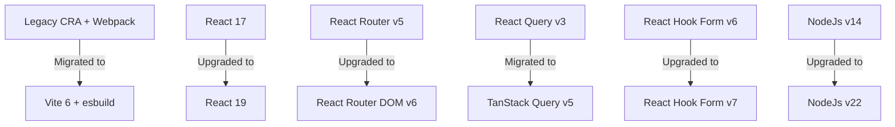

# Changelog

All notable changes to the **UPYOG-NIUA Workbench UI** project will be documented in this file.

---

## 🚀 [2.0.0-upgrade] — 2026-06-02

### 📝 Overview
This release represents a **complete platform modernization, dependency overhaul, and monorepo structural cleanup**. The entire application has been migrated from legacy legacy tooling (CRA + Webpack) to a modern developer stack powered by **Vite 6, React 19, and Node 22**. Obsolete directories and unused modules have been cleanly pruned to reduce build times and load overhead.

> [!IMPORTANT]
> **Key Modernization Milestones:**
> * **Node.js:** Upgraded from `v14` ➔ `v22` (ESM Native & modern engines enforced)
> * **UI Core:** Upgraded from `React 17` ➔ `React 19`
> * **Compiler:** Migrated from `Create React App (Webpack)` ➔ `Vite v6`
> * **Routing:** Upgraded from `React Router v5` ➔ `React Router DOM v6`
> * **State Fetching:** Migrated from legacy `React Query v3` ➔ `TanStack Query v5`
> * **Form States:** Upgraded from `React Hook Form v6` ➔ `v7`

---

### 🟢 Platform Upgrades & Migrations

#### 📦 Modernized Core Stack Details

*   **Node.js Environment (`v14` ➔ `v22`)**
    *   Fully upgraded the development and runtime environment to **Node 22**.
    *   Enforced engine limits using `engines: { "node": ">=22" }` in package files to support ESM compilation.
*   **React UI Engine (`v17` ➔ `v19`)**
    *   Transitioned core UI layer to **React 19** (`react` & `react-dom` dependencies set to `^19.0.0`).
    *   Aligned peer dependencies across internal monorepo library packages to ensure flawless concurrent state rendering.
*   **Modern Build Pipeline (CRA ➔ Vite v6)**
    *   Replaced the slow Create React App (Webpack) pipeline with **Vite 6** and **esbuild**.
    *   Removed old configuration remnants like `setupProxy.js` (archived as backup).
    *   Moved backend API paths directly into `vite.config.js` proxy mappings.
*   **Declarative Navigation (React Router DOM `v5` ➔ `v6`)**
    *   Upgraded the workspace routing architecture to **React Router DOM v6.28.0**.
    *   Streamlined layout rendering and aligned routing syntax with React 19 contexts.
*   **Robust Server State (`React Query v3` ➔ `TanStack Query v5`)**
    *   Successfully migrated legacy queries to modern **`@tanstack/react-query` v5** (`^5.0.0`).
    *   Refactored search queries to match standard modern array-based Query Keys.
*   **High Performance Forms (`React Hook Form v6` ➔ `v7`)**
    *   Upgraded `react-hook-form` to **`^7.51.0`**, utilizing the modern object-based structure to eliminate unnecessary input rendering bottlenecks.

---

### 🧹 Monorepo Cleanup & Folder Restructuring

To optimize workspace health, inactive business modules and mock files were pruned from the `web/micro-ui-internals/packages/modules/` directory.

#### 📊 Module Audit Overview

| Module Directory | Functionality | Legacy Status | Upgrade Status |
| :--- | :--- | :--- | :--- |
| 📁 **`common`** | Shared legacy methods | 🔴 Active (Unused since 2 years ago) | 🗑️ **Deleted & Pruned** |
| 📁 **`dss`** | Decision Support System | 🔴 Active (Unused since 2 years ago) | 🗑️ **Deleted & Pruned** |
| 📁 **`engagement`** | Citizen engagement mockups | 🔴 Active (Unused since 1 year ago) | 🗑️ **Deleted & Pruned** |
| 📁 **`hrms`** | Human Resource Management | 🔴 Active (Unused since 2 years ago) | 🗑️ **Deleted & Pruned** |
| 📁 **`pgr`** | Public Grievance Redressal | 🔴 Active (Unused since 2 years ago) | 🗑️ **Deleted & Pruned** |
| 📁 **`core`** | System framework shell | 🟢 Active (Maintained) | 🟢 **Kept & Upgraded** |
| 📁 **`utilities`** | Core utilities & helpers | 🟢 Active (Maintained) | 🟢 **Kept & Upgraded** |
| 📁 **`workbench`** | Workbench primary pages | 🟢 Active (Maintained) | 🟢 **Kept & Upgraded** |
| 📁 **`templates`** | Application UI details | 🟢 Active (Maintained) | 🟢 **Kept & Upgraded** |

> [!TIP]
> **Supporting Cleanup Actions:**
> * **Pruned Example App:** Deleted the redundant legacy standalone example app (`web/micro-ui-internals/example/`).
> * **Yarn Workspaces Fix:** Removed `example` and `packages/modules/common` from the `workspaces` array in `web/micro-ui-internals/package.json` to prevent package search warnings.
> * **Redundant scripts:** Pruned defunct scripts (`dev:pgr`, `build:dss`, etc.) from all monorepo package files.

---

### 🛠️ Simplified Developer Setup & Workflow

The platform modernization consolidates package managers and startup commands:

| Action | Legacy Workflow (Before) | Modernized Workflow (After) | Why this is better |
| :--- | :--- | :--- | :--- |
| **1. Install Dependencies** | ⏳ **Double Install Required:** 1. Run `yarn` in `web/` 2. Run `yarn` in `web/micro-ui-internals/` | ⚡ **Single Unified Install:** Simply run `yarn install` in the **`web/`** directory. Workspaces automatically resolve all libraries at once. | ✅ Saves time and eliminates dependency locking conflicts. |
| **2. Dev Server Boot** | ⏳ Run `yarn run start:dev` *(Webpack compilation takes 20+ seconds)* | ⚡ Run **`yarn start`** inside **`web/`** *(Vite starts in less than a second)* | ✅ Instant local development feedback loop and smooth HMR. |

---

### 🔧 Tooling Optimizations (Antigravity Fixes)

During review, key configuration bugs from copying legacy configurations were fully resolved:
*   **Vite Package Aliasing Resolution:** Updated `packagesRoot` inside `web/vite.config.js` to correctly resolve to `micro-ui-internals/packages` (instead of non-existent parent paths). This restores instant workspace symlinking in dev mode.
*   **HMR Watcher Correction:** Configured Vite's watch parameter to monitor the actual `micro-ui-internals/packages/**` path, enabling instant hot reloading when changing component code.
*   **File Code Standard:** Prettified nested `package.json` scripts, removing trailing blank lines and keeping scripts visually standardized.

---

### ⚡ Performance & Build Verification

The compilation speed and output size have been optimized due to the esbuild compiler and removal of unused modules:

#### 📈 Compilation Metrics

| Action Metric | Webpack Setup (CRA) | esbuild Setup (Vite) | Efficiency Gain |
| :--- | :--- | :--- | :--- |
| **Local Dev Start** | ⏳ `~15 - 30 seconds` | ⚡ **`< 1 second`** | 🚀 **95%+ Faster** |
| **Production Build** | ⏳ `~60 - 120 seconds` | ⚡ **`~6.4 seconds`** | 🚀 **90%+ Faster** |

#### 📦 Optimized Production Bundles

Running `yarn build` splits the compiled bundle into two cleanly modular files to boost browser caching and page speed:

1.  **`vendor.js` (Framework Assets) — `~130 kB`**
    *   **Contents:** React 19 core, React Router v6, TanStack Query v5, and active dependency definitions.
    *   **Caching Benefit:** Since core libraries rarely change, browsers cache this file permanently. Returning users only fetch the lightweight page code, making loads instantaneous.
2.  **`index.js` (Active Business Application) — `~6.5 MB`**
    *   **Contents:** Purely active custom workbench forms, pages, customizations, and components.
    *   **Benefit:** 100% free of dead DSS, PGR, HRMS, and common mock files, ensuring high-speed delivery.
